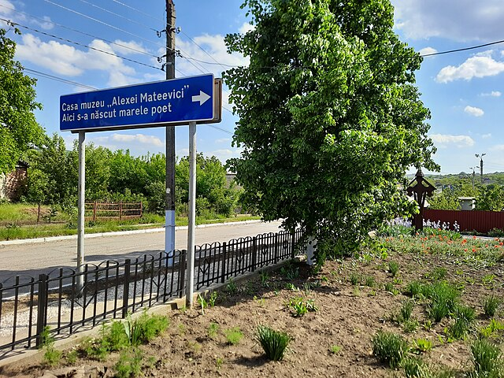
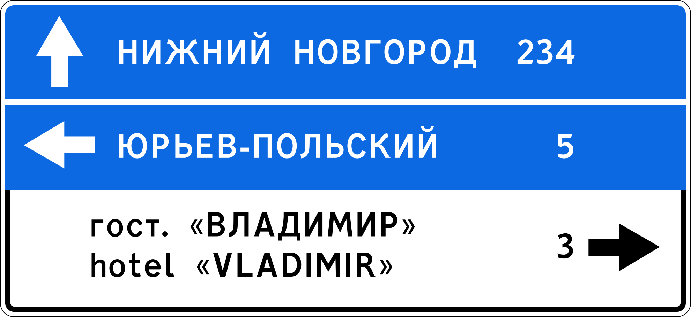
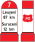
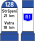
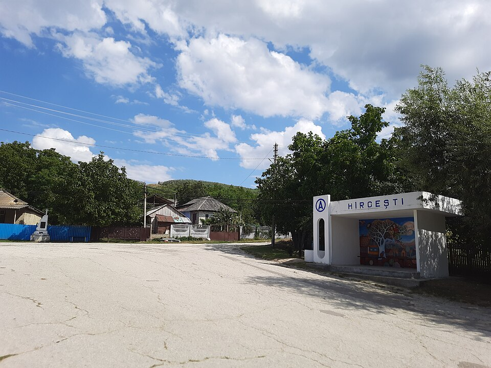
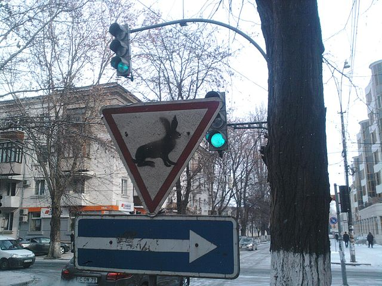

    <h2 class="section-title">{}</h2>
    <ul class="rule-list">
        <li>2023年11月の時点では公式カバレッジは無い</li>
        <li>ドメインは.md</li>
        <li>公用語はルーマニア語</li>
    </ul>
    {}

{}
{}
{}
{}語が使用されている。
{}

{}
{}と同様の形のボラードがある。
{}

{}
{}北東のような、トタンや銀色の屋根がある家のデザイン{}。
{}

{}
赤い逆▽のゆずれ（YIELD）標識が{}と違い太くない{}？
{}

{}
{}