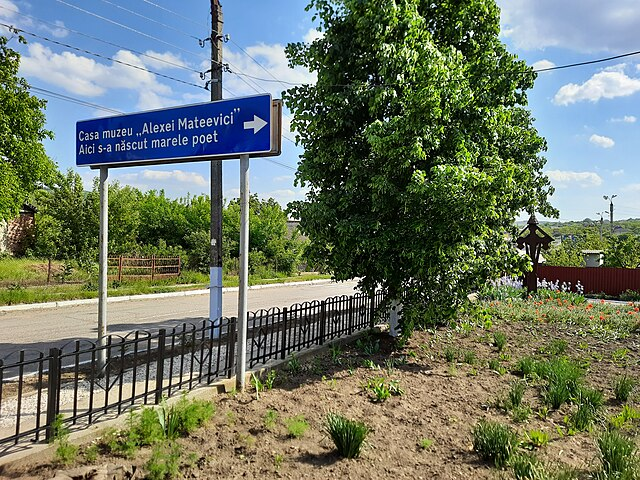
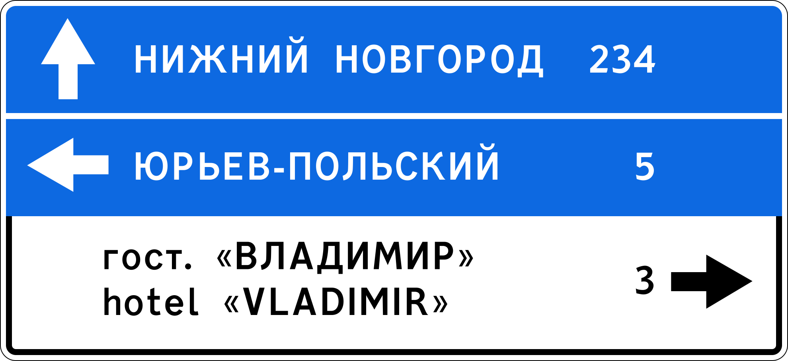
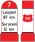
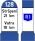
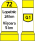
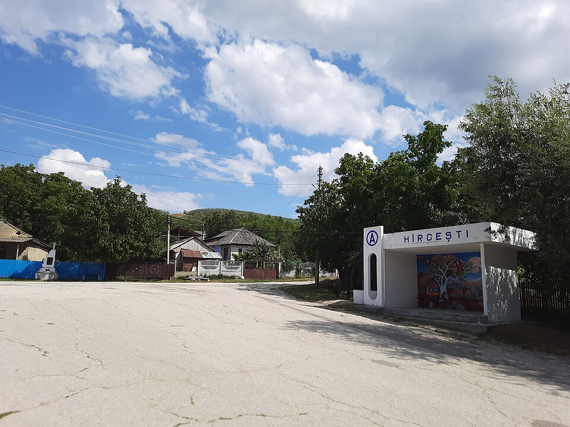
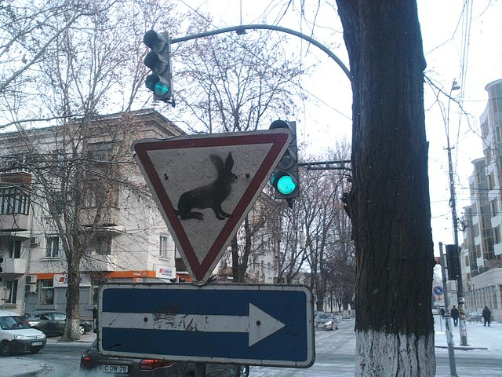

    <h2 class="section-title">{}</h2>
    <ul class="rule-list">
        <li>Em novembro de 2023 não havia cobertura oficial no Street View</li>
        <li>O domínio padrão é .md</li>
        <li>O idioma oficial é o romeno</li>
    </ul>
    {}

{}
{}
{}
O romeno (semelhante ao idioma usado na {}) é amplamente visível em placas e letreiros.
{}

{}
Os balizadores têm o mesmo formato utilizado na {}.
{}

{}
Casas com telhados de metal pintado, lembrando o nordeste da {}, são comuns{}.
{}

{}
A placa de ceda a passagem tem moldura vermelha mais fina do que a versão romena{}.
{}

{}
{}
