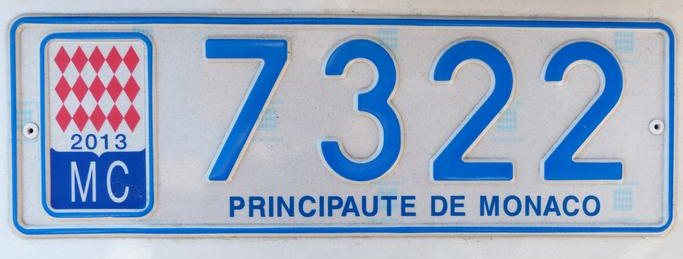

    <h2 class="section-title">{}</h2>
    <ul class="rule-list">
        <li>Domain internetnya .mc</li>
        <li>Bahasa resminya adalah bahasa Prancis</li>
        <li>Ada bollard dengan dua garis merah{}</li>
        <li>Plat nomor kecil dengan warna biru muda samar terlihat, tetapi mobil Italia juga sangat banyak</li>
        <li>Banyak bangunan bertingkat tiga atau lebih di sepanjang pantai</li>
        <li class="no-evidence">Banyak rambu dan tiang yang dicat cokelat tua</li>
    </ul>

{}
{}

{}
Plat nomor terlihat kecil dengan rona biru muda yang sangat samar, meski sekilas tampak putih{}. Plat motor pun serupa{}. Plat dari negara tetangga {} juga sering terlihat.
{}

{}

Domain publik
{}

{}
Sebagai negara berdaulat dengan kepadatan penduduk tertinggi di dunia, Monako dipenuhi apartemen tinggi. Nyaris tidak ada lahan pertanian ataupun jalan dua lajur; yang ada justru jalan sempit berbelok tajam dan banyak terowongan.
{}

{}
Banyak rambu menggunakan ornamen metalik berwarna emas{}. Tiang penyangganya kerap dicat cokelat tua{}, sesuatu yang jarang terlihat di negara lain.
{}

{}
Di dalam kota terdapat banyak stasiun sepeda berbagi MonaBike dengan warna merah terang{}. Selain itu terdapat bollard dengan dua garis merah{}.
{}

{}
{}
