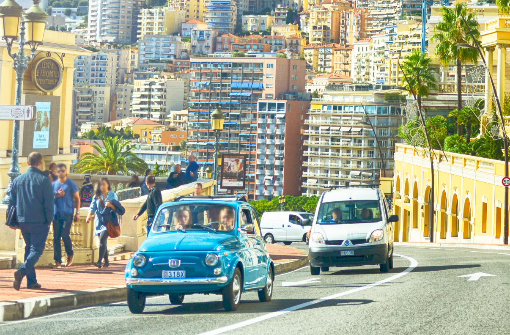
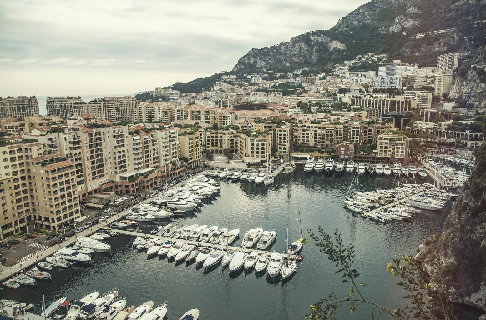
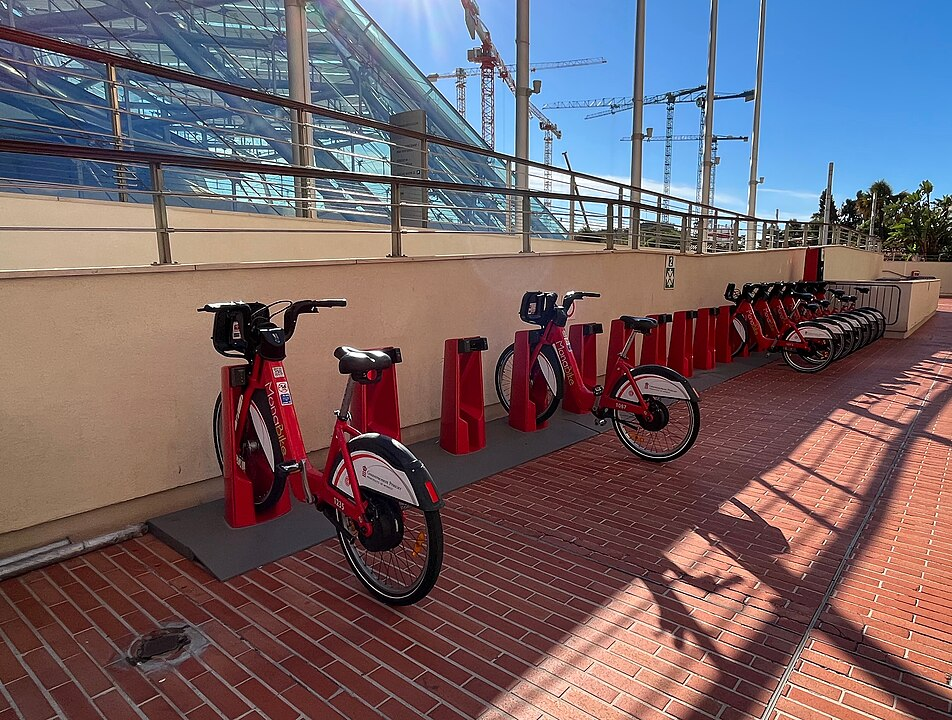

    <h2 class="section-title">{}</h2>
    <ul class="rule-list">
        <li>ドメインは.mc</li>
        <li>公用語はフランス語</li>
        <li>赤色の線が2本入ったボラードがある{}</li>
        <li>青色がうっすらと見える小さめのナンバープレートがあるがイタリアの車も多い</li>
        <li>海沿いで3階建て以上の建物が多い</li>
        <li class="no-evidence">標識のポールや裏側がこげ茶色のものが多い</li>
    </ul>

{}
{}

{}
水色がうっすらと見える小さめのナンバープレートがあるがほぼ白に見える{}。バイクも同様{}。隣国の{}のナンバーも見つかる。
{}

{}

Public domain
{}

{}
世界で最も人口密度の高い主権国家であり高層マンションがとても多い。狭いため農地や４車線道路は存在せず、狭く曲がりくねった道やトンネルが多い。
{}

{}
標識に金色の謎の素材が使われている{}。ポールや裏面はこげ茶色のことが多く{}、他の国で同じものは見かけない。
{}

{}
赤いシェアサイクル（Monabike）を止める場所が町中に見つかる{}。また赤色の線が2本入ったボラードがある{}。
{}

{}
{}