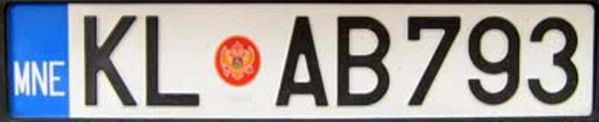

    <h2 class="section-title">{}</h2>
    <ul class="rule-list">
        <li>Domainnya adalah .me</li>
        <li>Bahasa resmi Montenegro (Црногорски језик) menggunakan alfabet Kiril.</li>
        <li>Plat nomor memiliki pita biru di kiri dan lambang di tengah, sehingga kadang terlihat sedikit merah.</li>
        <li>Guardrail kuning yang berkarat sering ditemukan di daerah pegunungan.</li>
        <li>Di pedalaman sering terlihat retakan pada citra Street View{}</li>
    </ul>
    {}

{}
{}
{}
Plat nomor memiliki pita biru di kiri dan lambang di tengah; bagian tersebut kadang tampak kemerahan{}. Ada juga mobil dengan plat putih polos.
{}

{}

CC0
{}

{}
Sering terlihat tebing batu berwarna putih{}. Bollard dari negara tetangga bisa muncul, jadi jangan hanya mengandalkan bollard; periksa retakan gambar atau plat nomor.
{}

By <a href="//commons.wikimedia.org/w/index.php?title=User:Oktoober&amp;action=edit&amp;redlink=1" class="new" title="User:Oktoober (page does not exist)">Oktoober</a> - Own work, <a href="https://creativecommons.org/licenses/by-sa/4.0" title="Creative Commons Attribution-Share Alike 4.0">CC BY-SA 4.0</a>, <a href="https://commons.wikimedia.org/w/index.php?curid=114381873">Link</a>

{}
Guardrail kuning banyak ditemukan di pegunungan dan sering sangat berkarat{}. Ada juga guardrail yang tidak berwarna kuning{}. Di perbatasan dengan Bosnia dan Herzegovina kadang muncul guardrail yang lebih bersudut{}.
{}

{}
Rumah berdinding putih dan gunung berbatu putih sering terlihat{}.
{}

{}
{}
{}
Stasiun pengisian seperti EKO umum di wilayah antara {} dan Montenegro.
{}

{}
Supermarket bernama IDEA hadir di seluruh {} dan Montenegro{}.
{}

{}
{}

<iframe src="https://www.google.com/maps/embed?pb=!4v1687410851957!6m8!1m7!1sdXaLWQxvfPXilYIjRrm6RQ!2m2!1d42.44425415784994!2d18.68941268106376!3f266.9131462613896!4f25.278302749869994!5f3.3038691676053533" width="295" height="295" style="border:0;" allowfullscreen="" loading="lazy" referrerpolicy="no-referrer-when-downgrade"></iframe>
<iframe src="https://www.google.com/maps/embed?pb=!4v1687411037267!6m8!1m7!1sTO1rwlsI1cr8jiIUDlRqig!2m2!1d42.78007458146075!2d18.9535588031351!3f213.31042868716264!4f24.79054008447116!5f3.325193203789971" width="295" height="295" style="border:0;" allowfullscreen="" loading="lazy" referrerpolicy="no-referrer-when-downgrade"></iframe>

{}
{}
