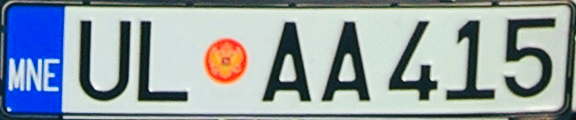
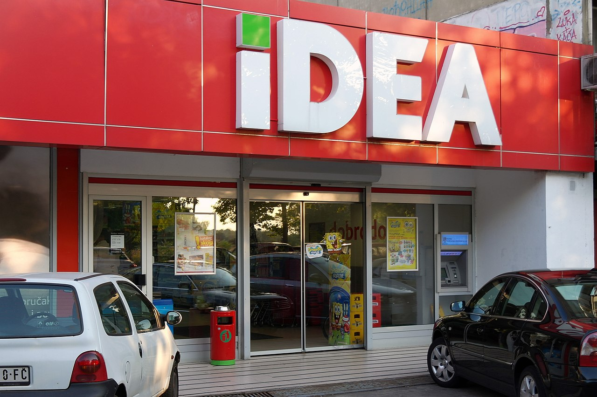

    <h2 class="section-title">{}</h2>
    <ul class="rule-list">
        <li>ドメインは.me</li>
        <li>公用語はモンテネグロ語（Црногорски језик）でキリル文字を使用する</li>
        <li>ナンバープレートは左側に青い線がありナンバープレートの中心にロゴがある</li>
        <li>黄色のガードレールが山中に多くありその多くがかなり錆びている</li>
    </ul>
    {}

{}
{}
{}
ナンバープレートは左側に青い線がありナンバープレートの中心にロゴがあるので中央部分が少しだけ赤く見えることがある
{}

<iframe src="https://www.google.com/maps/embed?pb=!4v1683375084514!6m8!1m7!1s-vh25d1nILMywS8MZtJjjw!2m2!1d42.44529716251037!2d19.25800556113811!3f247.13416297673677!4f-16.92737782336809!5f3.0278388476668896" width="295" height="295" style="border:0;" allowfullscreen="" loading="lazy" referrerpolicy="no-referrer-when-downgrade"></iframe>
<iframe src="https://www.google.com/maps/embed?pb=!4v1683375129582!6m8!1m7!1semP_84KiWEIu7mvC718wbA!2m2!1d43.15531973831427!2d18.84540853743735!3f160.20233144409028!4f-16.82774804326057!5f3.3170533390180648" width="295" height="295" style="border:0;" allowfullscreen="" loading="lazy" referrerpolicy="no-referrer-when-downgrade"></iframe>

{}

By Own work / D. Schneider - D. Schneider, <a href="https://creativecommons.org/licenses/by-sa/3.0/deed.ja">CC BY-SA 3.0</a>, <a href="https://commons.wikimedia.org/w/index.php?curid=10198828">Wikimedia Commons(Link)</a>
{}

{}
白いごつごつした岩肌が見える{}。
{}

By <a href="//commons.wikimedia.org/w/index.php?title=User:Oktoober&amp;amp;action=edit&amp;amp;redlink=1" class="new" title="User:Oktoober (page does not exist)">Oktoober</a> - Own work, <a href="https://creativecommons.org/licenses/by-sa/4.0" title="Creative Commons Attribution-Share Alike 4.0">CC BY-SA 4.0</a>, <a href="https://commons.wikimedia.org/w/index.php?curid=114381873">Link</a>

{}
黄色のガードレールが山中に多くありその多くがかなり錆びている{}。黄色ではないガードレールも存在する{}。また、ボスニア・ヘルツェゴビナに隣接する国では角張ったガードレールもあり得る{}。
{}

{}
{}とモンテネグロ全域にIDEAというスーパーマーケットがある{}。
{}

{}
{}

<iframe src="https://www.google.com/maps/embed?pb=!4v1687410851957!6m8!1m7!1sdXaLWQxvfPXilYIjRrm6RQ!2m2!1d42.44425415784994!2d18.68941268106376!3f266.9131462613896!4f25.278302749869994!5f3.3038691676053533" width="295" height="295" style="border:0;" allowfullscreen="" loading="lazy" referrerpolicy="no-referrer-when-downgrade"></iframe>
<iframe src="https://www.google.com/maps/embed?pb=!4v1687411037267!6m8!1m7!1sTO1rwlsI1cr8jiIUDlRqig!2m2!1d42.78007458146075!2d18.9535588031351!3f213.31042868716264!4f24.79054008447116!5f3.325193203789971" width="295" height="295" style="border:0;" allowfullscreen="" loading="lazy" referrerpolicy="no-referrer-when-downgrade"></iframe>

{}
{}

    <h2 class="section-title">{}</h2>
    <ul class="rule-list">
        <li>内陸側は画像に切れ目があることが多い{}</li>
    </ul>

{}
{}
{}
内陸側は画像に切れ目があることが多い{}
{}

<iframe src="https://www.google.com/maps/embed?pb=!4v1683375380488!6m8!1m7!1semP_84KiWEIu7mvC718wbA!2m2!1d43.15531973831427!2d18.84540853743735!3f280.12276035190143!4f51.541473005647276!5f1.4464286783584681" width="500" height="250" style="border:0;" allowfullscreen="" loading="lazy" referrerpolicy="no-referrer-when-downgrade"></iframe>

{}
{}
