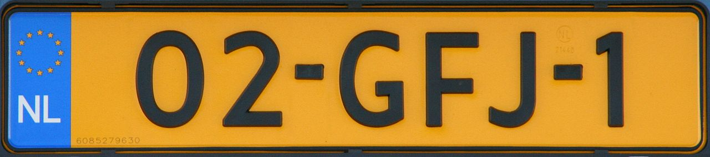

    <h2 class="section-title">{}</h2>
    <ul class="rule-list">
        <li>The domain is .nl</li>
        <li>License plates are yellow</li>
        <li>The landscape is flat with no high mountains</li>
        <li>Residential architecture is frequently brick-built</li>
        <li>Bollards are typically white</li>
        <li>Dedicated cycle paths cover the entire country, often surfaced in brownish asphalt or red brick</li>
        <li>Street names that end with “weg” are everywhere{}</li>
        <li class="no-evidence">Compared with Luxembourg the Netherlands feels flatter, features more canals, has red-toned housing, and a dense bicycle network{}</li>
    </ul>
    {}
    {}

{}
{}
{}
Plates have a blue strip on the left and a yellow background{}. If both front and rear are this colour, you are likely in the Netherlands or {}.
{}

<a data-flickr-embed="true" href="https://www.flickr.com/photos/dutchemergencyphotos/32732231697/in/photolist-RSrf7n-qVcRkT-FdrLTs-21RtiJY-tSRwrc-kemB9G-Cv5Dyo-85G6Xy-N5MhcA-cs7wE9-2bC8Nt1-K3i2rX-sy3jtz-r3Fg6J-2dYvZos-27G1Lxr-ksxUUH-2a4VT68-myxfbK-2ekrdk3-27DuUBz-2e59tpA-ryy3jJ-22XiD7e-28UowUK-Rr9Z86-qHNvi4-pR9YQJ-qLzpsP-27mytXY-ZiKkNi-2b4AFhj-sS7vkV-LyWdes-26JJy1D-27rTY8Y-8zx2Vt-26AkxD9-MDCGew-NJ7uiT-27JPh1k-xzp6nQ-SKa5mV-do5aAm-Pn6T7x-VDjmt7-26eVQ4w-2a57PaS-KB17Zf-29y1p1d" title="Dutch police Volkswagen Touran"></a>

{}

Gert Kalkman - public road, Public Domain, <a href="https://commons.wikimedia.org/w/index.php?curid=4482331">Wikimedia Commons</a>
{}

{}
Brick façades dominate{}, and some buildings retain hoisting beams near the roof. These were once warehouses that used the beam to hoist cargo{}. Even today the hardware is used to lift furniture{}.
{}

{}
Dedicated bicycle lanes (fietspad) are everywhere{}; in the photo the left lane is for bikes. Compared with Luxembourg the Netherlands is very flat and canal-rich. A quarter of the territory lies below sea level and the highest point is only about 333 m.
{}

{}
Roadside bollards are white. Larger roads often display small green boards showing the route number{}. (Bollard photo: <a href="https://commons.wikimedia.org/wiki/File:Fietsers_oversteken_sign,_Wedderveer_(2020)_02.jpg#/media/File:Fietsers_oversteken_sign,_Wedderveer_(2020)_02.jpg">link</a>).
{}

{}
Blue-and-white poles mark locations where cyclists cross the carriageway.
{}

{}
{}

<iframe src="https://www.google.com/maps/embed?pb=!4v1679652577334!6m8!1m7!1sGh2H0vcl5fkL3januoGQKg!2m2!1d52.47262788243366!2d4.7248858695778295!3f356.26011001603567!4f-6.110071338906104!5f3.325193203789971" width="295" height="295" style="border:0;" allowfullscreen="" loading="lazy" referrerpolicy="no-referrer-when-downgrade"></iframe>
<iframe src="https://www.google.com/maps/embed?pb=!4v1679652729911!6m8!1m7!1sS5cSakE8xS3n3d9G9-NstA!2m2!1d52.47427477094067!2d4.729662322579364!3f178.85562421264162!4f-8.167714932681752!5f3.214548530651228" width="295" height="295" style="border:0;" allowfullscreen="" loading="lazy" referrerpolicy="no-referrer-when-downgrade"></iframe>

{}
{}

<iframe src="https://www.google.com/maps/embed?pb=!4v1679652864624!6m8!1m7!1snSgr5uW5tkJNoQeFRdE8ow!2m2!1d52.37191357168391!2d4.892249440800693!3f187.1907931920125!4f-7.820540703828894!5f1.6035771854967309" width="295" height="295" style="border:0;" allowfullscreen="" loading="lazy" referrerpolicy="no-referrer-when-downgrade"></iframe>
<iframe src="https://www.google.com/maps/embed?pb=!4v1679653006444!6m8!1m7!1sHyItq3AUZsGgiGbr4jV_1g!2m2!1d52.37536551962285!2d4.873497305559137!3f8.316634172919015!4f-4.928971971341359!5f0.7820865974627469" width="295" height="295" style="border:0;" allowfullscreen="" loading="lazy" referrerpolicy="no-referrer-when-downgrade"></iframe>

{}
{}

    <h2 class="section-title">{}</h2>
    <ul class="rule-list">
        <li>If you see many warehouses or containers, follow the canals near Amsterdam or Rotterdam</li>
        <li>Street View occasionally jumps to the Dutch Caribbean, e.g. {}</li>
    </ul>

{}
{}
{}
Flat aluminium-clad buildings are often warehouses, typically near waterways. You can even spot Japanese companies{}. The photo is from <a href="https://www.mol.co.jp/en/services/container/">MOL Logistics Netherlands</a>.
{}

<iframe src="https://www.google.com/maps/embed?pb=!4v1690199782462!6m8!1m7!1sZXnBztr5Uzf0TAiV6Xj2_g!2m2!1d52.40373286074148!2d4.749969538076793!3f19.895877507970635!4f2.8884534735692853!5f0.7820865974627469" width="600" height="300" style="border:0;" allowfullscreen="" loading="lazy" referrerpolicy="no-referrer-when-downgrade"></iframe>

{}
{}

    <h4 class="mb-4">Representative Companies</h4>
    <table class="table table-striped table-bordered">
        <thead class="table-light">
            <tr>
                <th scope="col" class="col-width-2">Company</th>
                <th scope="col" class="col-width-1">Ticker</th>
                <th scope="col" class="col-width-7">Overview</th>
                <th scope="col" class="col-width-05">IR</th>
                <th scope="col" class="col-width-05">Dividend</th>
            </tr>
        </thead>
        <tbody class="corp-desc">
            <tr>
                <td>LyondellBasell</td>
                <td>{}</td>
                <td>Chemical manufacturer centred on polyethylene and polypropylene; the third-largest chemical producer in the United States.</td>
                <td>{}</td>
                <td>{}</td>
            </tr>
            <tr>
                <td>ASML</td>
                <td>{}</td>
                <td>One of the world’s largest semiconductor equipment makers alongside Applied Materials, dominating the high-resolution lithography market.</td>
                <td>{}</td>
                <td>{}</td>
            </tr>
        </tbody>
    </table>

