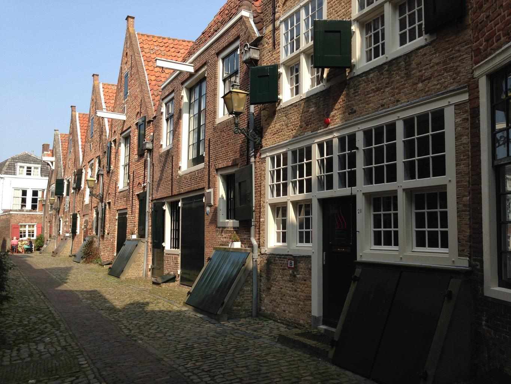
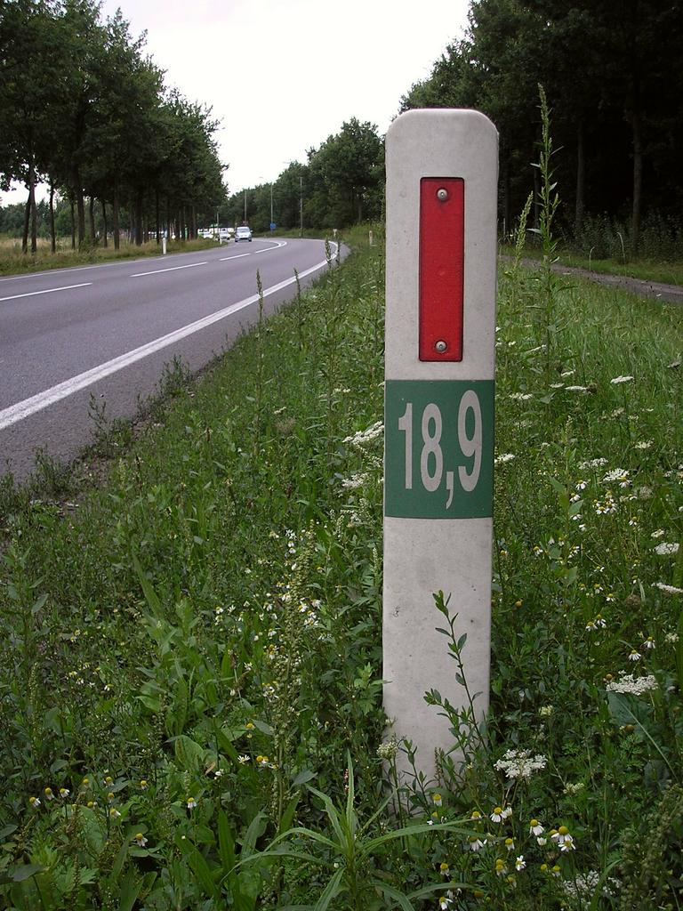
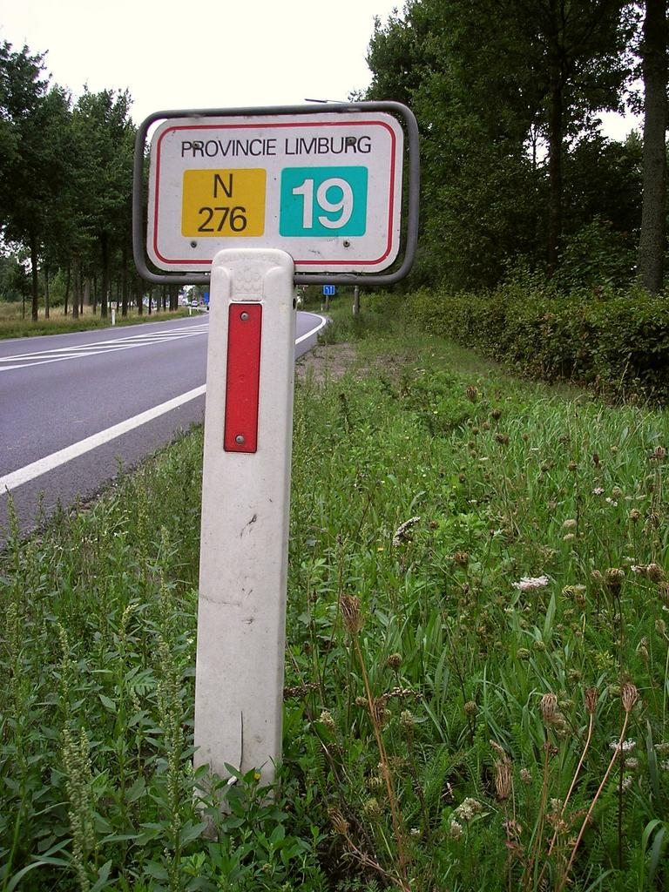
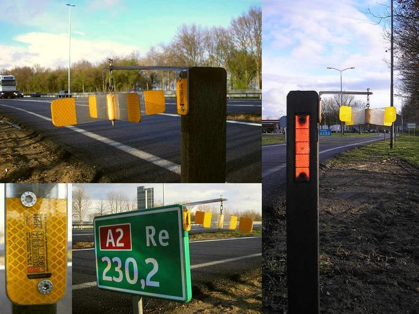
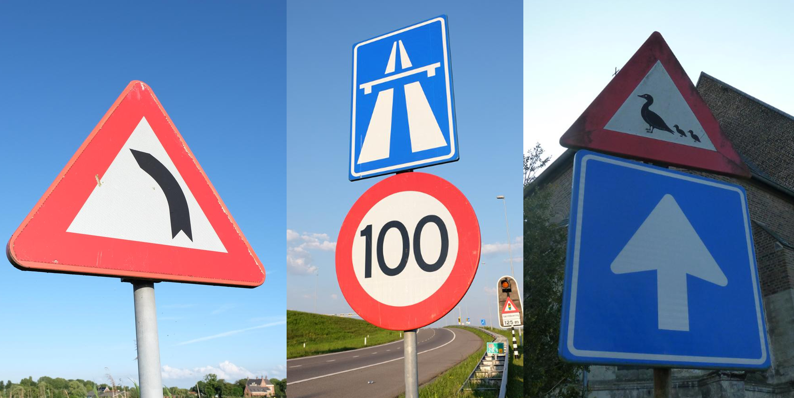
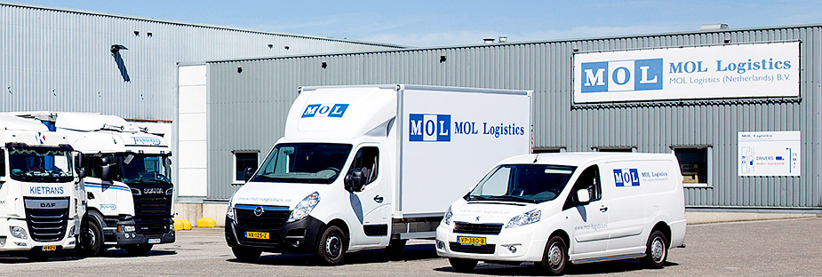

    <h2 class="section-title">{}</h2>
    <ul class="rule-list">
        <li>ドメインは.nl</li>
        <li>ナンバープレートは黄色</li>
        <li>平らで高い山が無い</li>
        <li>家がレンガ造りのものが多い</li>
        <li>ボラードは白色</li>
        <li>自転車を走る道路が国中に整備されていて茶色っぽい路面か赤レンガで舗装されている</li>
        <li>「weg」と付いた通り名が多い{}</li>
        <li class="no-evidence">ルクセンブルグと比べ平坦で、水路が多く、家が全体的に赤っぽく、自転車用の道路数が多いように思える{}</li>
    </ul>
    {}
    {}

{}
{}
{}
ナンバープレートは左側が青色で背景が黄色{}。前後を見てこの色ならオランダか{}。
{}

<a data-flickr-embed="true" href="https://www.flickr.com/photos/dutchemergencyphotos/32732231697/in/photolist-RSrf7n-qVcRkT-FdrLTs-21RtiJY-tSRwrc-kemB9G-Cv5Dyo-85G6Xy-N5MhcA-cs7wE9-2bC8Nt1-K3i2rX-sy3jtz-r3Fg6J-2dYvZos-27G1Lxr-ksxUUH-2a4VT68-myxfbK-2ekrdk3-27DuUBz-2e59tpA-ryy3jJ-22XiD7e-28UowUK-Rr9Z86-qHNvi4-pR9YQJ-qLzpsP-27mytXY-ZiKkNi-2b4AFhj-sS7vkV-LyWdes-26JJy1D-27rTY8Y-8zx2Vt-26AkxD9-MDCGew-NJ7uiT-27JPh1k-xzp6nQ-SKa5mV-do5aAm-Pn6T7x-VDjmt7-26eVQ4w-2a57PaS-KB17Zf-29y1p1d" title="Dutch police Volkswagen Touran"></a>

{}

Gert Kalkman - Public road, パブリック・ドメイン, <a href="https://commons.wikimedia.org/w/index.php?curid=4482331">Wikimedia Commons</a>による
{}

{}
家がレンガ造りのものが多く{}、稀に最上階付近の壁に紐をひっかける棒があることもある。貿易産業が盛んなころに倉庫だった建物は荷物を吊り上げるためにこの棒が付いている{}。現在でもこの金具にロープを吊るして家具を吊り上げているらしい。{}
{}

{}
自転車を走る道路（Fietspad）が国中に整備されていている{}。写真の左側のレーンが自転車用の道路。また、ルクセンブルグと比べ平坦で水路が多い。オランダは平らで高い山が無く、国土の4分の1が海抜0m以下で最高地点も約333mしかない。
{}

{}
道端に白色のボラードがある。大き目の道路には道端に道路番号が書かれた緑色の看板がある{}（ボラード画像のみ<a href="https://commons.wikimedia.org/wiki/File:Fietsers_oversteken_sign,_Wedderveer_(2020)_02.jpg#/media/File:Fietsers_oversteken_sign,_Wedderveer_(2020)_02.jpg">ここ</a>より引用）。
{}

{}
標識を後ろや横から見たときに側面も色が塗られている{}。
{}

{}
{}

{}
標識を後ろから見たときに表側の色が裏の縁取りに見える。
{}

<iframe src="https://www.google.com/maps/embed?pb=!4v1683705263347!6m8!1m7!1sdfQ4RQxdwuBgXAlU_mi8dA!2m2!1d52.62992420087699!2d4.762074621881681!3f162.7511254720969!4f4.2842253491352835!5f3.325193203789971" width="200" height="350" style="border:0;" allowfullscreen="" loading="lazy" referrerpolicy="no-referrer-when-downgrade"></iframe>
<iframe src="https://www.google.com/maps/embed?pb=!4v1683705490118!6m8!1m7!1sBDhlnseXGPxnHXDcZsppmQ!2m2!1d51.24741553750025!2d5.893231231469889!3f104.95455478144709!4f0.5421574830926374!5f3.325193203789971" width="200" height="350" style="border:0;" allowfullscreen="" loading="lazy" referrerpolicy="no-referrer-when-downgrade"></iframe>
<iframe src="https://www.google.com/maps/embed?pb=!4v1683705543455!6m8!1m7!1sh3K0tdDQ9gYR7jeaefKuHg!2m2!1d51.61181829030777!2d4.774081036091234!3f241.1098205668238!4f-1.7548572387365198!5f3.325193203789971" width="200" height="350" style="border:0;" allowfullscreen="" loading="lazy" referrerpolicy="no-referrer-when-downgrade"></iframe>

{}
{}
{}
SPARはアムステルダムに拠点がある小売業者（店自体はオランダ以外にもある）
{}

<iframe src="https://www.google.com/maps/embed?pb=!4v1679344477467!6m8!1m7!1sksoNxDxOgE1x6k6PhqdZzA!2m2!1d52.35462369937679!2d4.950458885723939!3f221.47995793446393!4f1.1243180771967474!5f2.285106199018506" width="295" height="295" style="border:0;" allowfullscreen="" loading="lazy" referrerpolicy="no-referrer-when-downgrade"></iframe>

{}
{}

<iframe src="https://www.google.com/maps/embed?pb=!4v1680776471376!6m8!1m7!1sJfPnL8Hsi0IPghLup8GIzQ!2m2!1d51.60542460100383!2d6.045330555955398!3f158.27245110585704!4f-9.924312843496352!5f3.325193203789971" width="295" height="295" style="border:0;" allowfullscreen="" loading="lazy" referrerpolicy="no-referrer-when-downgrade"></iframe>
<iframe src="https://www.google.com/maps/embed?pb=!4v1680776514480!6m8!1m7!1s-7n1VFjx_nAV_qFYYwPqiA!2m2!1d51.60560341247388!2d6.044987637655998!3f263.1800180302207!4f-14.752971452669513!5f3.32234471507444" width="295" height="295" style="border:0;" allowfullscreen="" loading="lazy" referrerpolicy="no-referrer-when-downgrade"></iframe>

{}
{}

    <h2 class="section-title">{}</h2>
    <ul class="rule-list">
        <li>倉庫やコンテナを多く見かけるならアムステルダムかロッテルダムの近くの運河沿いに行ってみる</li>
        <li>カリブ海のオランダ領の島である{}が出ることがある</li>
    </ul>

{}
{}
{}
アルミ製の壁でフラットな建造物は倉庫であることが多いので運河近くに行ってみる。日本企業の倉庫もいくつか見つかる{}。画像は<a href="https://www.mol.co.jp/en/services/container/">MOL Logistics Netherlands</a>より引用。
{}

<iframe src="https://www.google.com/maps/embed?pb=!4v1690199782462!6m8!1m7!1sZXnBztr5Uzf0TAiV6Xj2_g!2m2!1d52.40373286074148!2d4.749969538076793!3f19.895877507970635!4f2.8884534735692853!5f0.7820865974627469" width="600" height="300" style="border:0;" allowfullscreen="" loading="lazy" referrerpolicy="no-referrer-when-downgrade"></iframe>

{}
{}

    <h4 class="mb-4">代表的な企業の説明</h4>
    <table class="table table-striped table-bordered">
        <thead class="table-light">
            <tr>
                <th scope="col" class="col-width-2">企業名</th>
                <th scope="col" class="col-width-1">コード</th>
                <th scope="col" class="col-width-7">説明</th>
                <th scope="col" class="col-width-05">決算</th>
                <th scope="col" class="col-width-05">配当履歴</th>
            </tr>
        </thead>
        <tbody class="corp-desc">
            <tr>
                <td>LyondellBasell</td>
                <td>{}</td>
                <td>ポリエチレンとポリプロピレンを中心とした化学系メーカー。化学系メーカーとしては米国で3番目の規模をもつ。</td>
                <td>{}</td>
                <td>{}</td>
            </tr>
            <tr>
                <td>ASML</td>
                <td>{}</td>
                <td>Applied Materialsと並ぶ世界でも最大規模の半導体製造装置メーカーであり、とりわけ高分解能である露光装置については寡占状態となっている。</td>
                <td>{}</td>
                <td>{}</td>
            </tr>
        </tbody>
    </table>

