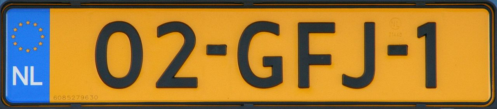

    <h2 class="section-title">{}</h2>
    <ul class="rule-list">
        <li>ドメインは.nl</li>
        <li>ナンバープレートは黄色であり前後を見てこの色ならオランダの可能性が高い</li>
        <li>国土の4分の1が海抜0m以下で最高地点も約333mしかない。平らで高い山が無い。</li>
        <li>家がレンガ造りのものが多く、最上階付近の壁に棒や突起物がある時も。</li>
        <li>自転車を走る道路（Fietspad）が国中に整備されていて茶色っぽい路面か赤レンガで舗装されているケースが多い。</li>
        <li class="no-evidence">ルクセンブルグと比べ平坦で、水路が多く、家が全体的に赤っぽく、自転車用の道路数が多いように思える{}</li>
        <li>「weg」と付いた通り名が多い{}</li>
    </ul>
    {}

{}
{}
{}
ナンバープレートは左側が青色で背景が黄色であり前後を見てこの色ならオランダか{}。
{}

<iframe src="https://www.google.com/maps/embed?pb=!4v1679141332249!6m8!1m7!1sg1RdmgWjKbdxPkez_SYt5A!2m2!1d52.62806409963211!2d4.757430216332611!3f207.98249979502546!4f-33.31514269239735!5f2.925276879255313" width="295" height="295" style="border:0;" allowfullscreen="" loading="lazy" referrerpolicy="no-referrer-when-downgrade"></iframe>

{}

Gert Kalkman - Public road, パブリック・ドメイン, <a href="https://commons.wikimedia.org/w/index.php?curid=4482331">Wikimedia Commons</a>による
{}

{}
家がレンガ造りのものが多く、稀に最上階付近の壁に紐をひっかける棒があることもある。貿易産業が盛んなころに倉庫だった建物は荷物を吊り上げるためにこの棒が付いている。現在でもこの金具にロープを吊るして家具を吊り上げているらしい。{}
{}

<iframe src="https://www.google.com/maps/embed?pb=!4v1682217832683!6m8!1m7!1sMXt13WzxXVmrgvcBCknubg!2m2!1d51.52462280577394!2d5.968059501168068!3f184.46227696003493!4f1.9262711336245815!5f2.5315311573194337" width="295" height="295" style="border:0;" allowfullscreen="" loading="lazy" referrerpolicy="no-referrer-when-downgrade"></iframe>
<iframe src="https://www.google.com/maps/embed?pb=!4v1682217440981!6m8!1m7!1sShrdegp8jM5kGf45qRbN4Q!2m2!1d51.9121151342119!2d4.446415080678936!3f105.34258501375567!4f15.29181978106989!5f3.325193203789971" width="295" height="295" style="border:0;" allowfullscreen="" loading="lazy" referrerpolicy="no-referrer-when-downgrade"></iframe>

{}
自転車を走る道路（Fietspad）が国中に整備されていている。写真の左側のレーンが自転車用の道路。また、ルクセンブルグと比べ平坦で水路が多い。
{}

{}
{}

{}
標識を後ろから見たときに表側の色が裏の縁取りに見える。
{}

<iframe src="https://www.google.com/maps/embed?pb=!4v1683705263347!6m8!1m7!1sdfQ4RQxdwuBgXAlU_mi8dA!2m2!1d52.62992420087699!2d4.762074621881681!3f162.7511254720969!4f4.2842253491352835!5f3.325193203789971" width="200" height="350" style="border:0;" allowfullscreen="" loading="lazy" referrerpolicy="no-referrer-when-downgrade"></iframe>
<iframe src="https://www.google.com/maps/embed?pb=!4v1683705490118!6m8!1m7!1sBDhlnseXGPxnHXDcZsppmQ!2m2!1d51.24741553750025!2d5.893231231469889!3f104.95455478144709!4f0.5421574830926374!5f3.325193203789971" width="200" height="350" style="border:0;" allowfullscreen="" loading="lazy" referrerpolicy="no-referrer-when-downgrade"></iframe>
<iframe src="https://www.google.com/maps/embed?pb=!4v1683705543455!6m8!1m7!1sh3K0tdDQ9gYR7jeaefKuHg!2m2!1d51.61181829030777!2d4.774081036091234!3f241.1098205668238!4f-1.7548572387365198!5f3.325193203789971" width="200" height="350" style="border:0;" allowfullscreen="" loading="lazy" referrerpolicy="no-referrer-when-downgrade"></iframe>

{}
道路番号が書いてある
{}

<iframe src="https://www.google.com/maps/embed?pb=!4v1679141570574!6m8!1m7!1sprdJ9xuz_l9p0xCfBazpdA!2m2!1d51.8035704085399!2d4.697570333012825!3f268.4021750511996!4f-13.239676289471817!5f3.2829566151088043" width="295" height="295" style="border:0;" allowfullscreen="" loading="lazy" referrerpolicy="no-referrer-when-downgrade"></iframe>

{}
{}
{}
SPARはアムステルダムに拠点がある小売業者（店自体はオランダ以外にもある）
{}

<iframe src="https://www.google.com/maps/embed?pb=!4v1679344477467!6m8!1m7!1sksoNxDxOgE1x6k6PhqdZzA!2m2!1d52.35462369937679!2d4.950458885723939!3f221.47995793446393!4f1.1243180771967474!5f2.285106199018506" width="295" height="295" style="border:0;" allowfullscreen="" loading="lazy" referrerpolicy="no-referrer-when-downgrade"></iframe>

{}
{}

<iframe src="https://www.google.com/maps/embed?pb=!4v1680776471376!6m8!1m7!1sJfPnL8Hsi0IPghLup8GIzQ!2m2!1d51.60542460100383!2d6.045330555955398!3f158.27245110585704!4f-9.924312843496352!5f3.325193203789971" width="295" height="295" style="border:0;" allowfullscreen="" loading="lazy" referrerpolicy="no-referrer-when-downgrade"></iframe>
<iframe src="https://www.google.com/maps/embed?pb=!4v1680776514480!6m8!1m7!1s-7n1VFjx_nAV_qFYYwPqiA!2m2!1d51.60560341247388!2d6.044987637655998!3f263.1800180302207!4f-14.752971452669513!5f3.32234471507444" width="295" height="295" style="border:0;" allowfullscreen="" loading="lazy" referrerpolicy="no-referrer-when-downgrade"></iframe>

{}
{}

    <h2 class="section-title">{}</h2>
    <ul class="rule-list">
        <li>カリブ海のオランダ領の島である{}が出ることがある</li>
    </ul>

