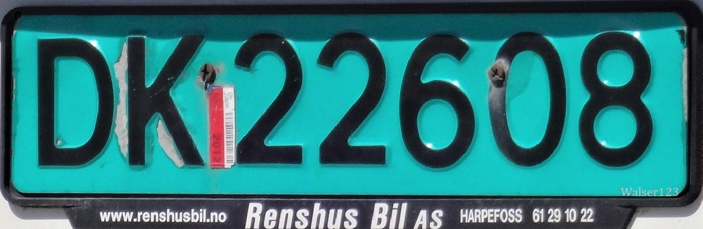

    <h2 class="section-title">見分け方</h2>
    <ul class="rule-list">
        <li>ナンバープレートは白か緑色（緑は公用車・商業車）</li>
        <li>ドメインは.no</li>
        <li>道端にスノーポールがあるかも</li>
        <li>横断歩道の標識は4本</li>
        <li>道路名の標識にオレンジの背景が多い {}</li>
        <li><a href="https://en.wikipedia.org/wiki/Posten_Norge">Posten Norge</a>はノルウェー運輸通信省が所有する郵便会社、Postenと書かれた赤いポストがスーパーの壁とかにあるかも。</li>

{}
{}
{}
ナンバープレートは白か緑色（緑は公用車・商業車）。宅配業者のバンなどがこの色になっていることが多い。横断歩道の標識は4本（たまに5本のものもある）。道端にスノーポールもある。
{}

<iframe src="https://www.google.com/maps/embed?pb=!4v1679347466281!6m8!1m7!1s15_cJ-nrWeREO6hnjzdmdA!2m2!1d61.96712040031104!2d6.525144068432134!3f46.72153939861174!4f4.596703912050998!5f3.325193203789971" width="295" height="295" style="border:0;" allowfullscreen="" loading="lazy" referrerpolicy="no-referrer-when-downgrade"></iframe>
<iframe src="https://www.google.com/maps/embed?pb=!4v1679347488341!6m8!1m7!1sMZmWXEPzuCbN3dF6Gdyr7w!2m2!1d61.96676412106132!2d6.52504408141445!3f196.93470035872124!4f-3.271967390227786!5f3.325193203789971" width="295" height="295" style="border:0;" allowfullscreen="" loading="lazy" referrerpolicy="no-referrer-when-downgrade"></iframe>

{}

Noorwegen kenteken groen nieuw, CC BY-SA 3.0, <a href="https://commons.wikimedia.org/wiki/File:Norway_licenseplate_green_new.JPG#/media/File:Norway_licenseplate_green_new.JPG">wikipedia commons</a>

By Walser123 - Own work, CC BY-SA 4.0, https://commons.wikimedia.org/w/index.php?curid=90954775
{}

{}
道路名の標識にオレンジの背景が多い
{}

<iframe src="https://www.google.com/maps/embed?pb=!4v1681501551090!6m8!1m7!1sQMXHhNCCIrFoUa70gCIukw!2m2!1d61.91201314110614!2d5.986817049843358!3f305.9648425558945!4f-0.030381807345932543!5f3.278136263369802" width="295" height="295" style="border:0;" allowfullscreen="" loading="lazy" referrerpolicy="no-referrer-when-downgrade"></iframe>
<iframe src="https://www.google.com/maps/embed?pb=!4v1681604690032!6m8!1m7!1snz4gKFQvCaRqbRezA2YfEg!2m2!1d58.44621906235802!2d8.741068899004842!3f265.26530061280164!4f-2.732571012207103!5f3.325193203789971" width="295" height="295" style="border:0;" allowfullscreen="" loading="lazy" referrerpolicy="no-referrer-when-downgrade"></iframe>

{}
{}

<iframe src="https://www.google.com/maps/embed?pb=!4v1681604380534!6m8!1m7!1sSlhuKtPUwiPC4ETwfTWwKg!2m2!1d58.43481633781423!2d8.743017858887802!3f138.71623112058222!4f-0.9755656275686562!5f3.325193203789971" width="295" height="295" style="border:0;" allowfullscreen="" loading="lazy" referrerpolicy="no-referrer-when-downgrade"></iframe>
<iframe src="https://www.google.com/maps/embed?pb=!4v1681520602553!6m8!1m7!1sg9GAkBQjUr27MsQuYYtHFg!2m2!1d58.15387328848371!2d8.08026394501885!3f343.9532758156611!4f-4.209087719251556!5f3.3052706623276027" width="295" height="295" style="border:0;" allowfullscreen="" loading="lazy" referrerpolicy="no-referrer-when-downgrade"></iframe>
<iframe src="https://www.google.com/maps/embed?pb=!4v1681520384556!6m8!1m7!1svp5PWVgFQt8JaXIRzh87cQ!2m2!1d60.14681602455514!2d12.31416882299695!3f68.56023321540164!4f1.3126837180885929!5f3.325193203789971" width="295" height="295" style="border:0;" allowfullscreen="" loading="lazy" referrerpolicy="no-referrer-when-downgrade"></iframe>
<iframe src="https://www.google.com/maps/embed?pb=!4v1679347466281!6m8!1m7!1s15_cJ-nrWeREO6hnjzdmdA!2m2!1d61.96712040031104!2d6.525144068432134!3f46.72153939861174!4f4.596703912050998!5f3.325193203789971" width="295" height="295" style="border:0;" allowfullscreen="" loading="lazy" referrerpolicy="no-referrer-when-downgrade"></iframe>
<iframe src="https://www.google.com/maps/embed?pb=!4v1679347534133!6m8!1m7!1swn_mor6TbJxcF3P8sSNLbg!2m2!1d66.3044505371745!2d14.13711222707041!3f324.89227912253875!4f-16.134774204390254!5f2.8309959544919363" width="295" height="295" style="border:0;" allowfullscreen="" loading="lazy" referrerpolicy="no-referrer-when-downgrade"></iframe>
<iframe src="https://www.google.com/maps/embed?pb=!4v1681604610224!6m8!1m7!1skj76m3KRUAj1eoD6vLHtyQ!2m2!1d58.44212734433167!2d8.742230528086207!3f68.52427692871312!4f1.162632679900426!5f3.325193203789971" width="295" height="295" style="border:0;" allowfullscreen="" loading="lazy" referrerpolicy="no-referrer-when-downgrade"></iframe>

{}
{}
{}
ノルウェーの郵便市場の規制緩和が進み、2002年頃にPosten Norgeは株式会社になった。1647年設立らしい（[出典](https://en.wikipedia.org/wiki/Posten_Norge)）。
{}

<iframe src="https://www.google.com/maps/embed?pb=!4v1681609518074!6m8!1m7!1s8p9tt6074u13YcgoKJugpw!2m2!1d59.91376913046805!2d10.78902053673719!3f26.50347827751584!4f-4.808670469837139!5f3.325193203789971" width="295" height="295" style="border:0;" allowfullscreen="" loading="lazy" referrerpolicy="no-referrer-when-downgrade"></iframe>
<iframe src="https://www.google.com/maps/embed?pb=!4v1681609628746!6m8!1m7!1s2lE6nEW-KBQaYCx0c-Y4Qg!2m2!1d67.2984460530041!2d14.40417281129192!3f73.20248657899062!4f-1.3876062247384766!5f3.325193203789971" width="295" height="295" style="border:0;" allowfullscreen="" loading="lazy" referrerpolicy="no-referrer-when-downgrade"></iframe>

{}
{}

<iframe src="https://www.google.com/maps/embed?pb=!4v1679347488341!6m8!1m7!1sMZmWXEPzuCbN3dF6Gdyr7w!2m2!1d61.96676412106132!2d6.52504408141445!3f196.93470035872124!4f-3.271967390227786!5f3.325193203789971" width="295" height="295" style="border:0;" allowfullscreen="" loading="lazy" referrerpolicy="no-referrer-when-downgrade"></iframe>

{}
{}

{}
スカンジナビア3国ではセブンイレブンがあるが他のヨーロッパには少ない。サンドイッチやホットドックのコーナーがある。パンが冷凍状態で売られていた（たぶん）。
{}

<iframe src="https://www.google.com/maps/embed?pb=!4v1681605380467!6m8!1m7!1sPQU8Iu6eNooJGvYq1Thyaw!2m2!1d59.91438803655091!2d10.75343980221014!3f58.301939351618536!4f6.275431131297552!5f3.325193203789971" width="295" height="295" style="border:0;" allowfullscreen="" loading="lazy" referrerpolicy="no-referrer-when-downgrade"></iframe>

{}
{}

    <h2 class="section-title">州・地域の見分け方</h2>
    <ul class="rule-list">
        <li>電話番号が2～7。オスロからスタートして時計回りに数字が大きくなる。画像出典：{}</li>
    </ul>

{}
{}

By <a href="//commons.wikimedia.org/w/index.php?title=User:Gyroscopbill212&amp;amp;action=edit&amp;amp;redlink=1" class="new" title="User:Gyroscopbill212 (page does not exist)">Gyroscopbill212</a> - Own work, <a href="https://creativecommons.org/licenses/by-sa/4.0" title="Creative Commons Attribution-Share Alike 4.0">CC BY-SA 4.0</a>, <a href="https://commons.wikimedia.org/w/index.php?curid=105840743">Link</a>

{}
{}