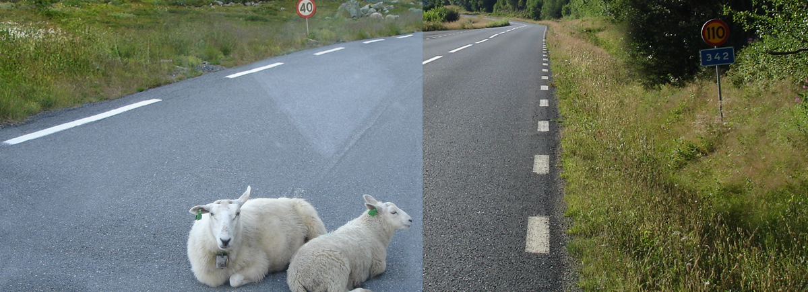

    <h2 class="section-title">{}</h2>
    <ul class="rule-list">
        <li>ドメインは.no</li>
        <li>横断歩道の標識は4本</li>
        <li>ナンバープレートは白か緑色（緑は公用車・商業車）</li>
        <li>北欧であって速度表記の背景が白ならばノルウェーの可能性が高い</li>
        <li>北欧は濃い赤色で塗られたログハウスが多い</li>
        <li>道路の路側帯の破線がスウェーデンと比較して長い{}</li>
        <li>「Ø・ø」の文字はデンマークとノルウェーでのみ使用される</li>
        <li>道路名の看板にオレンジの背景が多い {}</li>
    </ul>
    {}

{}
{}
{}{}やノルウェーなどの北欧は濃い赤色（ファールン赤）で塗られたログハウスがある{}。
{}

{}
ナンバープレートは白か緑色（緑は公用車・商業車）{}。宅配業者のバンなどがこの色になっていることが多い{}。道端にスノーポールもある。
{}

{}
ヨーロッパでナンバープレートが緑なのはノルウェーの商用車か{}の農業用車輛のみ。
{}

{}

Noorwegen kenteken groen nieuw, <a href="https://creativecommons.org/licenses/by-sa/3.0/deed.ja">CC BY-SA 3.0</a>, <a href="https://commons.wikimedia.org/wiki/File:Norway_licenseplate_green_new.JPG#/media/File:Norway_licenseplate_green_new.JPG">wikipedia commons</a>
{}

{}
横断歩道が4本。左からフィンランド・ノルウェー{}・スウェーデン。
{}

{}
北欧であって、速度表記のような警告看板の背景が白ならばノルウェーの可能性が高い{}。左からノルウェー・スウェーデン・フィンランド。ノルウェーとスウェーデンの国境で看板の色が変わることが分かる{}。
{}

{}
道路名の看板にオレンジの背景が多い{} {}
{}

    

        

            
            
        

        
スウェーデン

    

    

        

            
            
        

        
フィンランド

    

    

        

            
        

        
ノルウェー

    

{}
道路の路側帯の破線が長い{}。左からノルウェー・スウェーデン・フィンランド{}。ノルウェーの線の例はこれ{}。ノルウェーとスウェーデンの国境でも線がはっきりと変わっている{}。
{}

{}
左がノルウェー、右がスウェーデン。
{}

{}
{}
{}
ノルウェーの郵便市場の規制緩和が進み、2002年頃にPosten Norgeは株式会社になった。1647年設立らしい（[出典](https://en.wikipedia.org/wiki/Posten_Norge)）。
{}

<iframe src="https://www.google.com/maps/embed?pb=!4v1681609518074!6m8!1m7!1s8p9tt6074u13YcgoKJugpw!2m2!1d59.91376913046805!2d10.78902053673719!3f26.50347827751584!4f-4.808670469837139!5f3.325193203789971" width="295" height="295" style="border:0;" allowfullscreen="" loading="lazy" referrerpolicy="no-referrer-when-downgrade"></iframe>
<iframe src="https://www.google.com/maps/embed?pb=!4v1681609628746!6m8!1m7!1s2lE6nEW-KBQaYCx0c-Y4Qg!2m2!1d67.2984460530041!2d14.40417281129192!3f73.20248657899062!4f-1.3876062247384766!5f3.325193203789971" width="295" height="295" style="border:0;" allowfullscreen="" loading="lazy" referrerpolicy="no-referrer-when-downgrade"></iframe>

{}
北欧は濃い赤色（ファールン赤）で塗られたログハウスが特徴的{{% by "https://ja.wikipedia.org/wiki/%E3%83%95%E3%82%A1%E3%83%BC%E3%83%AB%E3%83%B3%E8%B5%A4" "wiki" "ファールン赤" %}}。
{}

<iframe src="https://www.google.com/maps/embed?pb=!4v1682746523013!6m8!1m7!1svyYpPorc5TuszeOtwyghng!2m2!1d60.81568219020539!2d11.08376652087026!3f2.166999837342132!4f-1.0345161665309917!5f1.9548229044415848" width="295" height="295" style="border:0;" allowfullscreen="" loading="lazy" referrerpolicy="no-referrer-when-downgrade"></iframe>
<iframe src="https://www.google.com/maps/embed?pb=!4v1682746547693!6m8!1m7!1s8PoZARRFhEcIi3wdlBX67g!2m2!1d58.88150865162304!2d5.674196058026946!3f168.96181423848034!4f4.4235632351769!5f1.7435841889690247" width="295" height="295" style="border:0;" allowfullscreen="" loading="lazy" referrerpolicy="no-referrer-when-downgrade"></iframe>

{}
{}

{}
スカンジナビア3国ではセブンイレブンがあるが他のヨーロッパには少ない。サンドイッチやホットドックのコーナーがある。パンが冷凍状態で売られていた記憶（たぶん）。
{}

<iframe src="https://www.google.com/maps/embed?pb=!4v1681605380467!6m8!1m7!1sPQU8Iu6eNooJGvYq1Thyaw!2m2!1d59.91438803655091!2d10.75343980221014!3f58.301939351618536!4f6.275431131297552!5f3.325193203789971" width="295" height="295" style="border:0;" allowfullscreen="" loading="lazy" referrerpolicy="no-referrer-when-downgrade"></iframe>

{}
{}

{}
なぜか京成電鉄の大株主にノルウェー政府がいる{}。画像は2023年3月のもの。
{}

{}
{}

    <h2 class="section-title">{}</h2>
    <ul class="rule-list">
        <li>南北に同じ植生が広く分布しており範囲の絞り込みが難しい
            <ul>
                <li>■最北の山や岩肌が見えるゾーン{}</li>
                <li>■南の山や岩肌が見えるゾーン{}</li>
                <li>■最南端の広葉樹が多いゾーン{}</li>
                <li>■■針葉樹の割合が多く道端が背の低い草で覆われている可能性があるゾーン{}</li>
                <li>■畑・牧草地があり家の周りに背の高い生垣やカエデの木がありうるゾーン{}</li>
            </ul>
        </li>
        <li>市外局番が2～7。オスロからスタートして時計回りに数字が大きくなる。</li>
    </ul>

{}
{}

<a href="//commons.wikimedia.org/w/index.php?title=User:Gyroscopbill212&amp;amp;action=edit&amp;amp;redlink=1" class="new" title="User:Gyroscopbill212 (page does not exist)">Panitz, Sina, et al. "Climate variability and long-term expansion of peatlands in Arctic Norway during the late Pliocene (ODP Site 642, Norwegian Sea)." Climate of the Past 12.4 (2016): 1043-1060.</a>, <a href="https://creativecommons.org/licenses/by/3.0/">表示 3.0 未移植 (CC BY 3.0)</a>

{}
{}

By <a href="//commons.wikimedia.org/w/index.php?title=User:Gyroscopbill212&amp;amp;action=edit&amp;amp;redlink=1" class="new" title="User:Gyroscopbill212 (page does not exist)">Gyroscopbill212</a> - Own work, <a href="https://creativecommons.org/licenses/by-sa/4.0" title="Creative Commons Attribution-Share Alike 4.0">CC BY-SA 4.0</a>, <a href="https://commons.wikimedia.org/w/index.php?curid=105840743">Link</a>

{}
{}