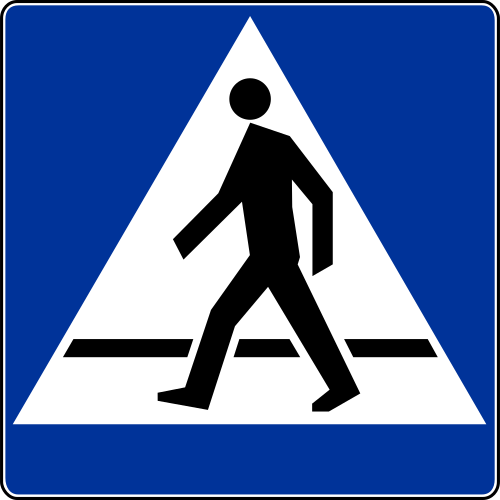
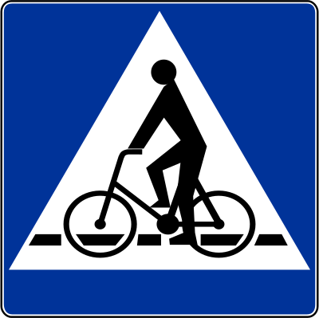
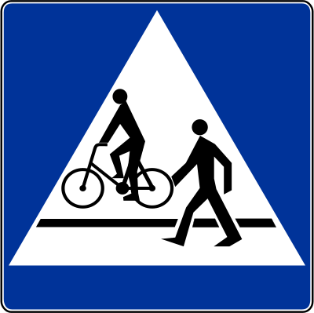
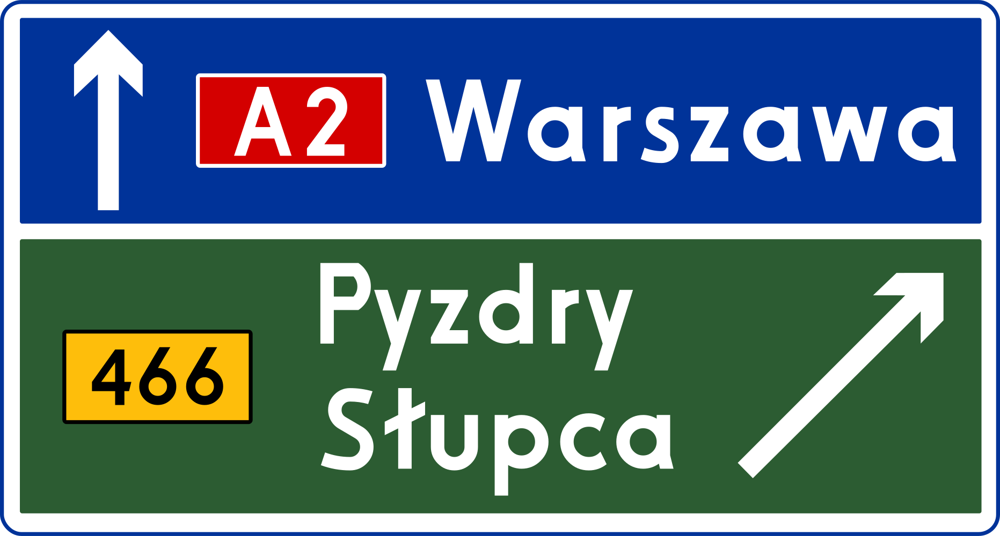
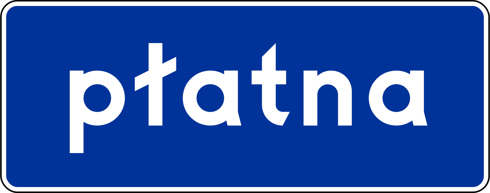
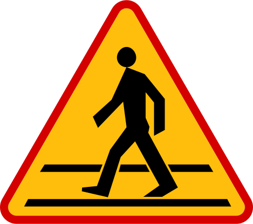
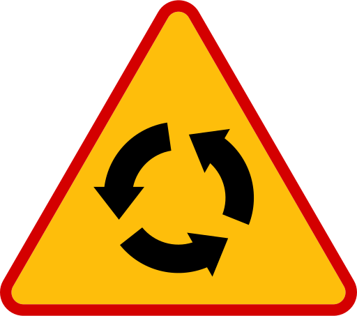
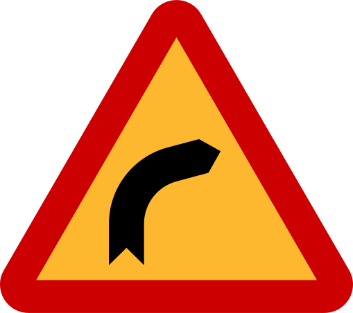
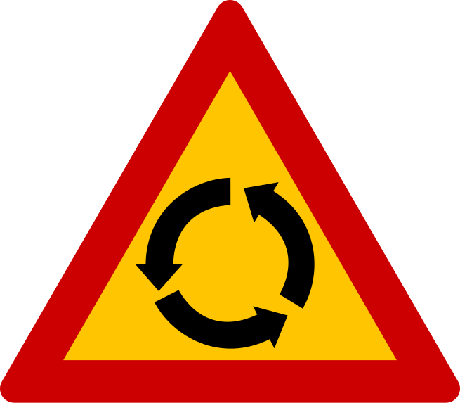

    <h2 class="section-title">{}</h2>
    <ul class="rule-list">
        <li>ドメインは.pl</li>
        <li>反射板が赤色のボラードがある</li>
        <li>電柱の一番下に穴が空いていないことが多い</li>
        <li>ポーランドの横断歩道標識は特徴的で線が横に1本{}</li>
        <li>ポーランドのガードレールは角ばっている</li>
        <li>「Ł・ł」の文字はポーランド以外ではほとんど見られない</li>
        <li>オレンジ色の警告看板があり外枠の赤線がとても細い{}</li>
        <li>Ulicaはスロバキア・スロベニア・セルビア・ポーランドで通りの意味</li>
        <li class="no-evidence">標識で使われるDrogowskazというフォントが特徴的</li>
    </ul>
    {}

{}
{}

{}
ポーランドの横断歩道標識は特徴的で線が横に1本しかない。また、電柱の一番下は穴が空いていないことが多い。
{}

{}
左がポーランド、右がルーマニアのガードレール。ポーランドのガードレールは角ばっているが、ルーマニアは角ばっていないことが多い。ポーランドのような細い角ばった溝で赤い反射板のガードレールはクロアチア・セルビア・モンテネグロ・トルコで使われることがある{}。
{}

<iframe src="https://www.google.com/maps/embed?pb=!4v1683613478709!6m8!1m7!1sPVigjwAp5S3gCNlZJbfhTQ!2m2!1d52.20967082688648!2d21.52991635008977!3f159.22898006509783!4f-17.195021662538068!5f2.9699259630373165" width="295" height="295" style="border:0;" allowfullscreen="" loading="lazy" referrerpolicy="no-referrer-when-downgrade"></iframe>
<iframe src="https://www.google.com/maps/embed?pb=!4v1683613717127!6m8!1m7!1s3NelLW7o7JW1fKrmYdyLIA!2m2!1d44.53170434169891!2d26.06915494078406!3f135.95469358806545!4f-11.458334055778366!5f3.305163021116406" width="295" height="295" style="border:0;" allowfullscreen="" loading="lazy" referrerpolicy="no-referrer-when-downgrade"></iframe>

{}
ポーランドの赤色のボラードはかなりわかりやすい。{}にも稀に見た目がそっくりなボラードがあるのでウクライナでないことだけ確認する。
{}

{}
「Ł・ł」の文字がある。道路標識用にデザインされた専用のフォントを利用していて「t」の形が特徴的{}。以下のフォント名はDrogowskaz。
{}

abcćdefghijklł 
mnoprstuwyzźż

{}
オレンジ色の警告看板があり外枠の赤線がとても細い。上の段はポーランド・下の段は{}。
{}

{}
{}

{}
教会、マップ上に表示されるので位置を探す時に役立つ時がある。
{}

<iframe src="https://www.google.com/maps/embed?pb=!4v1680102862400!6m8!1m7!1sklY3ICnwX3cheAJbtnhG1A!2m2!1d50.45448291473033!2d18.52204277933721!3f124.85585522795998!4f8.349946974971147!5f3.325193203789971" width="295" height="295" style="border:0;" allowfullscreen="" loading="lazy" referrerpolicy="no-referrer-when-downgrade"></iframe>
<iframe src="https://www.google.com/maps/embed?pb=!4v1680187365795!6m8!1m7!1sEVIqENdNb5Zn_d0gD4PNqw!2m2!1d50.97323346407659!2d19.04866347685575!3f1.5789591040383952!4f-7.203666982772006!5f1.779262730331714" width="295" height="295" style="border:0;" allowfullscreen="" loading="lazy" referrerpolicy="no-referrer-when-downgrade"></iframe>

{}
POCZTA（ポスト、赤い）
{}

<iframe src="https://www.google.com/maps/embed?pb=!4v1681293115879!6m8!1m7!1sjns-xRhN_8-7tT-7CU8h8w!2m2!1d50.57988099917564!2d16.50408715260548!3f107.12647794113003!4f-12.497475679292123!5f3.325193203789971" width="295" height="295" style="border:0;" allowfullscreen="" loading="lazy" referrerpolicy="no-referrer-when-downgrade"></iframe>
<iframe src="https://www.google.com/maps/embed?pb=!4v1681293618548!6m8!1m7!1ss1s-jYporQe-z_x2KH86wQ!2m2!1d52.65296801196689!2d23.4344196340504!3f11.65144715718616!4f-11.157963904786698!5f3.325193203789971" width="295" height="295" style="border:0;" allowfullscreen="" loading="lazy" referrerpolicy="no-referrer-when-downgrade"></iframe>

{}
{}

{}
赤いボラード
{}

<iframe src="https://www.google.com/maps/embed?pb=!4v1679572981868!6m8!1m7!1sMACRIDM__EFGk5qNWIk65w!2m2!1d54.03095876476053!2d21.67112053832691!3f223.8432749865922!4f-13.592109168118768!5f3.325193203789971" width="295" height="295" style="border:0;" allowfullscreen="" loading="lazy" referrerpolicy="no-referrer-when-downgrade"></iframe>
<iframe src="https://www.google.com/maps/embed?pb=!4v1681292910021!6m8!1m7!1slw6hjshIioZ5JieekP0UTw!2m2!1d50.4543722305596!2d18.52206990031654!3f110.72667255028875!4f-9.010097359194944!5f3.325193203789971" width="295" height="295" style="border:0;" allowfullscreen="" loading="lazy" referrerpolicy="no-referrer-when-downgrade"></iframe>

{}
{}

    <h2 class="section-title">{}</h2>
    <ul class="rule-list">
        <li>市外局番は気合で覚えられる...？<b>72</b>・45・88などマップに載っていないものは携帯に使われているので要注意。たくさん見つかるわけではない。
            <ul style="font-size:1.05em !important;margin-top:0.1em;">
                <li>22x：{}</li>
                <li>71x：{}</li>
                <li>85x：{}</li>
                <li>91x：{}</a></li>
            </ul>
        </li>
    </ul>

{}
{}
{}
22xがWarszawa付近。8を無視して数が大きいほど北西と覚えている。全体的に平坦な国で景色を見てもどのあたりか分からない気がするので、道路番号・地名・市外局番がわからなかったら、個人的にはとりあえず真ん中に行くことが多い。携帯に使われる番号も存在しているので先頭の数字だけで地域を決めないように注意{}。
{}

By Naive cynic - own work, derivative of <a href="//commons.wikimedia.org/w/index.php?title=User:Swohmeck&amp;amp;action=edit&amp;amp;redlink=1" class="new" title="User:Swohmeck (page does not exist)">Swohmeck</a>'s <a href="//commons.wikimedia.org/wiki/File:POL_Voivodships_1975.svg" title="File:POL Voivodships 1975.svg">image</a>

<a href="https://creativecommons.org/licenses/by-sa/2.5" title="Creative Commons Attribution-Share Alike 2.5">CC BY-SA 2.5</a>, <a href="https://commons.wikimedia.org/w/index.php?curid=3454721">Link</a>

{}
{}

    <h2 class="section-title">{}</h2>
    <ul class="rule-list">
        <li>銀行（Narodowy Bank Polski; NBP）などの看板に町名が書いてある</li>
    </ul>

{}
{}

{}
「w」が英語での「in」の意味なのでwのあとの名前を地図で探してみる
{}

<iframe src="https://www.google.com/maps/embed?pb=!4v1684771455460!6m8!1m7!1seNPF9moNK_wzQ3K4aO-_2Q!2m2!1d53.1238343942832!2d18.00483358680646!3f188.31443418332057!4f4.297202766436001!5f3.325193203789971" width="295" height="295" style="border:0;" allowfullscreen="" loading="lazy" referrerpolicy="no-referrer-when-downgrade"></iframe>
<iframe src="https://www.google.com/maps/embed?pb=!4v1686480305658!6m8!1m7!1s2CINlyHuUSlKw4QRSZMmIA!2m2!1d51.13528305656072!2d16.78075545086447!3f38.62322934299134!4f5.110820825259609!5f3.2078174678824656" width="295" height="295" style="border:0;" allowfullscreen="" loading="lazy" referrerpolicy="no-referrer-when-downgrade"></iframe>

{}
{}
