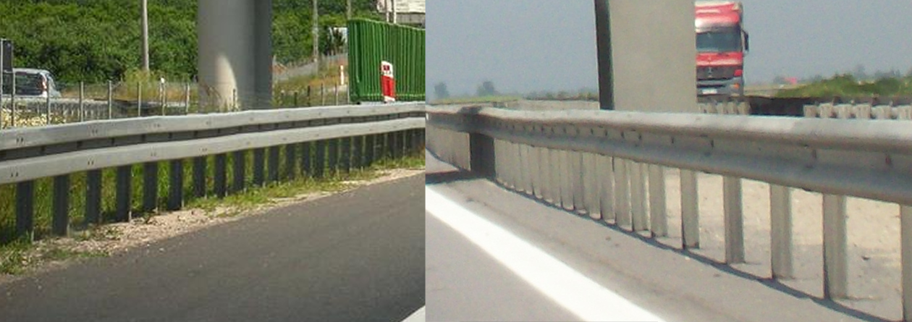

    <h2 class="section-title">{}</h2>
    <ul class="rule-list">
        <li>ドメインは.pl</li>
        <li>反射板が赤色のボラードがある</li>
        <li>電柱の一番下に穴が空いていないことが多い</li>
        <li>ポーランドの横断歩道標識は特徴的で線が横に1本{}</li>
        <li>ポーランドのガードレールは角ばっている</li>
        <li>「Ł・ł」の文字はポーランド以外ではほとんど見られない</li>
        <li>オレンジ色の警告看板があり外枠の赤線がとても細い{}</li>
        <li>Ulicaはスロバキア・スロベニア・セルビア・ポーランドで通りの意味</li>
        <li class="no-evidence">標識で使われるDrogowskazというフォントが特徴的</li>
    </ul>
    {}

{}
{}

{}
オレンジ色の警告看板があり外枠の赤線がとても細い{}。上の段はポーランド・下の段は{}。
{}

{}
ポーランドの赤色のボラードはかなりわかりやすい{}。{}にも稀に見た目がそっくりなボラードがあるのでウクライナでないことだけ確認する。
{}

{}
「Ł・ł」の文字がある{}。道路標識用にデザインされた専用のフォントを利用していて、ポーランドだけでしかこのフォントは使用されていない。「t」の形が特徴的{}{}。フォント名はDrogowskaz。
{}

abcćdefghijklł 
mnoprstuwyzźż

{}
ポーランドの横断歩道標識は特徴的で線が横に1本しかない。また、電柱の一番下は穴が空いていないことが多い{}。
{}

{}
左がポーランド、右がルーマニアのガードレール。ポーランドのガードレールは角ばっているがルーマニアは角ばっていないことが多い。ポーランドのような細い角ばった溝で赤い反射板のガードレールはクロアチア・セルビア・モンテネグロ・トルコで使われることがある{}。
{}

{}
{}

{}
教会、マップ上に表示されるので位置を探す時に役立つ時がある。
{}

{}
POCZTA（ポスト、赤い）
{}

{}
{}

{}
国の4割近くが国有の森林であり、背の高い森が多く存在する{}。
{}

{}
{}

    <h2 class="section-title">{}</h2>
    <ul class="rule-list">
        <li>町名の語尾で南北かわかるが100%ではない</li>
        <li>市外局番は気合で覚えられる...？<b>72</b>・45・88などマップに載っていないものは携帯に使われているので要注意。たくさん見つかるわけではない。
            <ul style="font-size:1.05em !important;margin-top:0.1em;">
                <li>22x：{}</li>
                <li>71x：{}</li>
                <li>85x：{}</li>
                <li>91x：{}</a></li>
            </ul>
        </li>
    </ul>

{}
{}

{}
『~wo』『~no』は北、『~ów』『~ew』は中央から南より。ポーランドの歴史上のGreater Poland・Lesser Polandの境界と関連しているらしいが正確には不明{{% ref "https://ja.wikipedia.org/wiki/%E3%83%9D%E3%83%BC%E3%83%A9%E3%83%B3%E3%83%89%E3%81%AE%E6%AD%B4%E5%8F%B2" "ポーランドの歴史" %}}{}。
{}

<blockquote class="reddit-embed-bq" style="height:500px" data-embed-height="740"><a href="https://www.reddit.com/r/MapPorn/comments/ockqlt/citytown_name_endings_in_poland/">CIty/town name endings in Poland</a>  by<a href="https://www.reddit.com/user/Poiuy2010_2011/">u/Poiuy2010_2011</a> in<a href="https://www.reddit.com/r/MapPorn/">MapPorn</a></blockquote>

{}
{}

{}
22xがWarszawa付近。8を無視して数が大きいほど北西と覚えている。全体的に平坦な国で景色を見てもどのあたりか分からない気がするので、道路番号・地名・市外局番がわからなかったら、個人的にはとりあえず真ん中に行くことが多い。携帯に使われる番号も存在しているので先頭の数字だけで地域を決めないように注意{}。
{}

By Naive cynic - own work, derivative of <a href="//commons.wikimedia.org/w/index.php?title=User:Swohmeck&amp;amp;action=edit&amp;amp;redlink=1" class="new" title="User:Swohmeck (page does not exist)">Swohmeck</a>'s <a href="//commons.wikimedia.org/wiki/File:POL_Voivodships_1975.svg" title="File:POL Voivodships 1975.svg">image</a>

<a href="https://creativecommons.org/licenses/by-sa/2.5" title="Creative Commons Attribution-Share Alike 2.5">CC BY-SA 2.5</a>, <a href="https://commons.wikimedia.org/w/index.php?curid=3454721">Link</a>

{}
{}

    <h2 class="section-title">{}</h2>
    <ul class="rule-list">
        <li>Bank spółdzielczyやNarodowy Bank Polskiのような銀行の看板に町名が書いてあることが多い{}</li>
    </ul>

{}
{}

{}
「w」が英語での「in」の意味なのでwのあとの名前を地図で探してみる{}
{}

{}
{}
