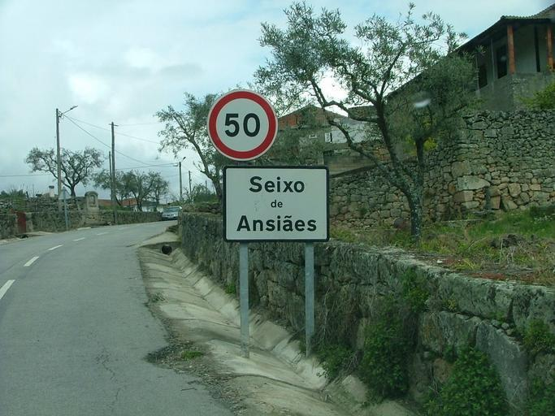
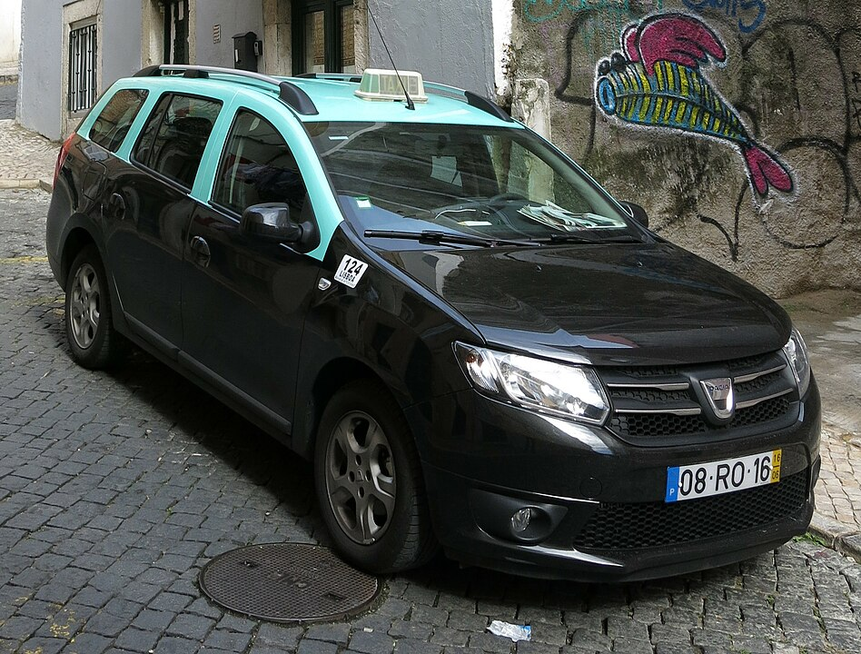
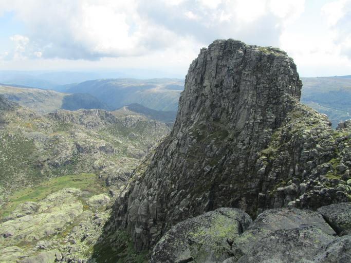
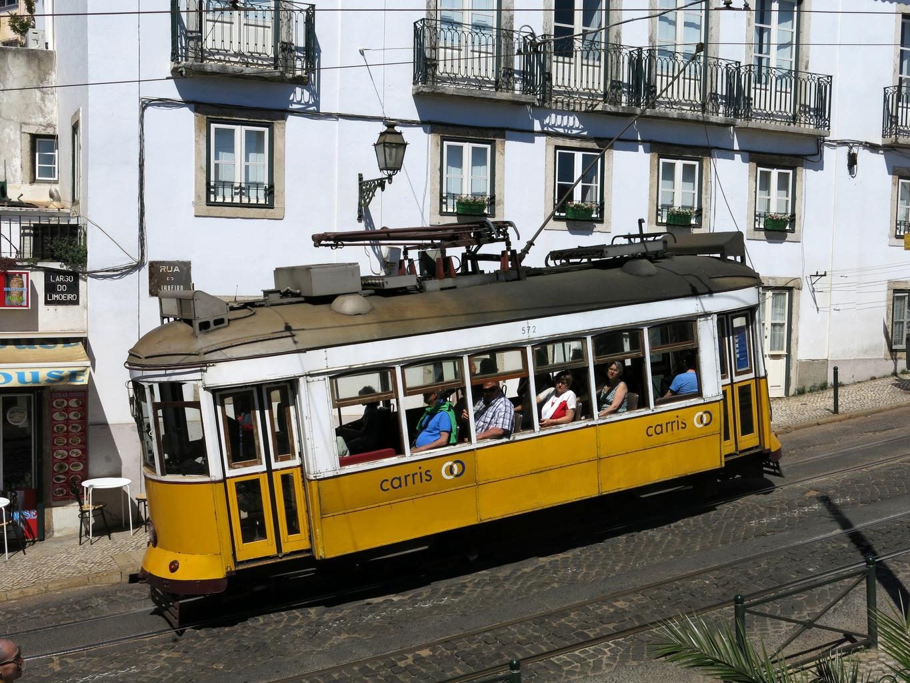

    <h2 class="section-title">{}</h2>
        <ul class="rule-list">
        <li>The domain is .pt</li>
        <li>License plates have a yellow band on the right</li>
        <li>Some utility poles have vertical partitions and holes{}</li>
        <li>Road chevrons are yellow arrows on a black background</li>
        <li>Portuguese often uses tilde and cedilla letters (e.g., &atilde;, &ccedil;), shared with {}</li>
        <li class="no-evidence">Cobblestone streets appear in some suburbs</li>
    </ul>
    {}

{}
{}
{}
Portuguese street plates often use "Rua" and blue-and-white tiles, which stand out from {}{}.
{}

{}
License plates have a yellow band on the right{}.
{}

{}

<a href="//commons.wikimedia.org/wiki/User:Willtron" title="User:Willtron">by Willtron</a>, <a href="https://creativecommons.org/licenses/by-sa/3.0" title="Creative Commons Attribution-Share Alike 3.0">CC BY-SA 3.0</a>, <a href="https://commons.wikimedia.org/w/index.php?curid=4614860">Wikimedia Commons(Link)</a>
{}

{}
Some utility poles have partitions and holes{}. Similar holes also appear in {} and {}.
{}

{}
Only Portugal uses yellow chevrons on a black background in warmer parts of Europe{}. If the climate looks cold, consider {}, {}, {}, or {}. Otherwise, consider {}{}.
{}

{}
Old cobblestone streets and sidewalks appear in many towns{}.
{}

{}
Road signs often show route prefixes like A or IP in Portugal{}. In {}, look for CALLE on street plates instead.
{}

{}
Hunting signs are common on rural roads, often labeled "Proibicao de caca"{}.
{}

{}
In {}, similar signs often say "DE CAZA"{}{}.
{}

<table style="width:480px">
<tr>
<td style="width:120px">

</td>
<td style="width:120px">

</td>
<td style="width:120px">

</td>
<td style="width:120px">

</td>
</tr>
<tr>
<td style="width:120px">
{}
</td>
<td style="width:120px">
{}
</td>
<td style="width:120px">
{}
</td>
<td style="width:120px">
{}
</td>
</tr>
</table>

By <a href="//commons.wikimedia.org/w/index.php?title=User:Joehawkins&amp;action=edit&amp;redlink=1" class="new" title="User:Joehawkins (page does not exist)">Joehawkins</a> - Own work, <a href="https://creativecommons.org/licenses/by-sa/4.0" title="Creative Commons Attribution-Share Alike 4.0">CC BY-SA 4.0</a>, <a href="https://commons.wikimedia.org/w/index.php?curid=54612143">Link</a>

{}
Portugal produces roughly half of the world's cork oak{}. Nearby Spain is the other major source.
{}

{}
{}

{}
Old stone walls and narrow mountain roads often appear in Portugal; similar terrain is less common in Brazil.
{}

<iframe src="https://www.google.com/maps/embed?pb=!4v1682930687544!6m8!1m7!1svfB5_SEsz2Zj37cyZq2Lvg!2m2!1d40.48606931042772!2d-7.668648102818007!3f183.02424638606908!4f-4.740459890635833!5f1.4619587292754703" width="295" height="295" style="border:0;" allowfullscreen="" loading="lazy" referrerpolicy="no-referrer-when-downgrade"></iframe>
<iframe src="https://www.google.com/maps/embed?pb=!4v1682930749312!6m8!1m7!1stnknHHY6wROa7TQJgHFLKw!2m2!1d41.86001503397016!2d-8.38014516316834!3f315.27641034501073!4f-11.779713071577305!5f2.7778849526872884" width="295" height="295" style="border:0;" allowfullscreen="" loading="lazy" referrerpolicy="no-referrer-when-downgrade"></iframe>

{}
{}

<iframe src="https://www.google.com/maps/embed?pb=!4v1681996466214!6m8!1m7!1smX0RoFvrQek_cbABKOZOjg!2m2!1d39.80182585420921!2d-8.850470421514855!3f178.45900236615483!4f-9.51753229662934!5f3.325193203789971" width="295" height="295" style="border:0;" allowfullscreen="" loading="lazy" referrerpolicy="no-referrer-when-downgrade"></iframe>
<iframe src="https://www.google.com/maps/embed?pb=!4v1682929344788!6m8!1m7!1sGJMumJk2YTaFP-ftiFnCHw!2m2!1d39.34936868437937!2d-9.15837176860683!3f155.90362687739503!4f-12.315720803229354!5f3.325193203789971" width="295" height="295" style="border:0;" allowfullscreen="" loading="lazy" referrerpolicy="no-referrer-when-downgrade"></iframe>

{}
{}

    <h2 class="section-title">{}</h2>
    <ul class="rule-list">
        <li>Northern Portugal is greener and more mountainous</li>
        <li>Southern Portugal is warmer and drier, with flatter terrain</li>
        <li>You can find the same poles and license plates in Portuguese territories {} and {} islands</li>
    </ul>

{}
{}

{}
Northern Portugal has rugged hills and cooler climates{}.
{}

{}
Pinus pinaster forests are common in the north{}{}.
{}

{}
{}

{}
Southern Portugal, especially Alentejo, is flatter and drier{}.
{}

{}
{}

{}
Madeira and Azores use the same poles and plates as mainland Portugal.
{}

{}
{}

    <h2 class="section-title">{}</h2>
    <ul class="rule-list">
        <li>Peneda-Ger&ecirc;s has rugged mountain scenery</li>
        <li>Serra da Estrela is known for rocky highlands{}{}</li>
        <li>Berlengas is a remote island chain with forts and cliffs{}{}</li>
    </ul>

{}
{}

{}
Granite mountains and winding roads are common{}.
{}

By <a href="//commons.wikimedia.org/w/index.php?title=User:Mvs12&amp;action=edit&amp;redlink=1" class="new" title="User:Mvs12 (page does not exist)">Mvs12</a> - Own work, <a href="https://creativecommons.org/licenses/by-sa/3.0" title="Creative Commons Attribution-Share Alike 3.0">CC BY-SA 3.0</a>, <a href="https://commons.wikimedia.org/w/index.php?curid=40267992">Link</a>

{}
{}

{}
High-elevation roads and rocky slopes mark Serra da Estrela{}.
{}

{}
{}

{}
Berlengas is about 30 km offshore and feels isolated.
{}

{}
{}

{}
Lisbon's historic yellow trams (Carris) are distinctive.
{}

{}
{}

{}
<li>EN 247 road photo by the same author (edited)</li>
<li>By <a href="//commons.wikimedia.org/w/index.php?title=User:R%C3%BAdisicyon&amp;amp;action=edit&amp;amp;redlink=1" class="new" title="User:Rúdisicyon (page does not exist)">Rúdisicyon</a> - Own work, <a href="https://creativecommons.org/licenses/by-sa/4.0" title="Creative Commons Attribution-Share Alike 4.0">CC BY-SA 4.0</a>, <a href="https://commons.wikimedia.org/w/index.php?curid=75659957">Link</a></li>
<li>By <a href="//commons.wikimedia.org/w/index.php?title=User:R%C3%BAdisicyon&amp;amp;action=edit&amp;amp;redlink=1" class="new" title="User:Rúdisicyon (page does not exist)">Rúdisicyon</a> - Own work, <a href="https://creativecommons.org/licenses/by-sa/4.0" title="Creative Commons Attribution-Share Alike 4.0">CC BY-SA 4.0</a>, <a href="https://commons.wikimedia.org/w/index.php?curid=75659958">Link</a></li>
<li>By <a href="//commons.wikimedia.org/w/index.php?title=User:R%C3%BAdisicyon&amp;amp;action=edit&amp;amp;redlink=1" class="new" title="User:Rúdisicyon (page does not exist)">Rúdisicyon</a> - Own work, <a href="https://creativecommons.org/licenses/by-sa/4.0" title="Creative Commons Attribution-Share Alike 4.0">CC BY-SA 4.0</a>, <a href="https://commons.wikimedia.org/w/index.php?curid=75635277">Link</a></li>
{}
