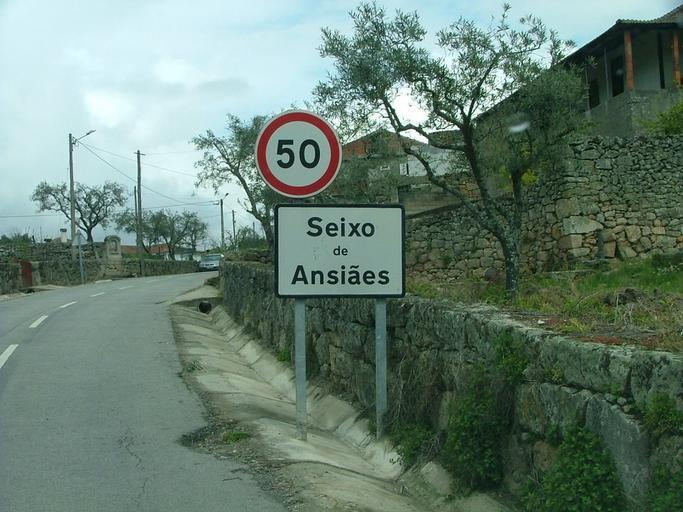
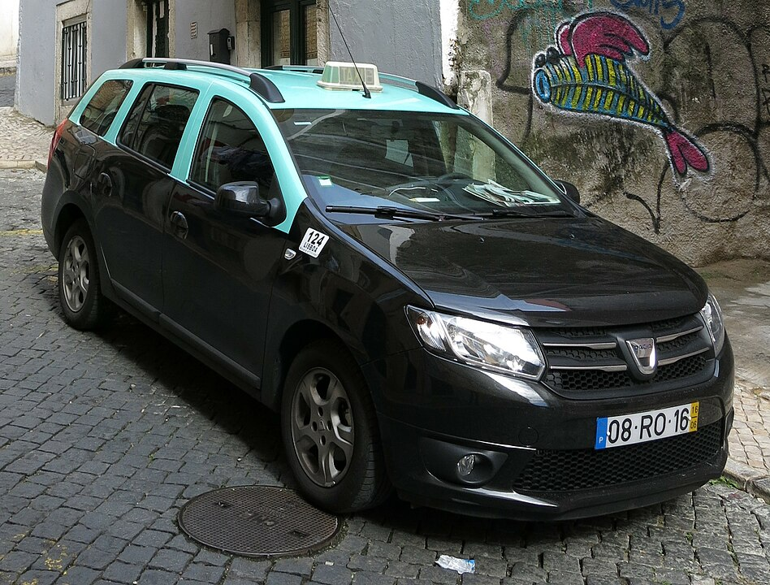
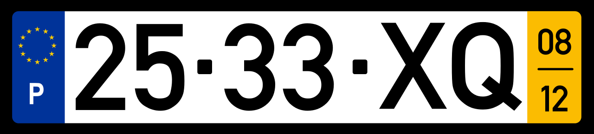
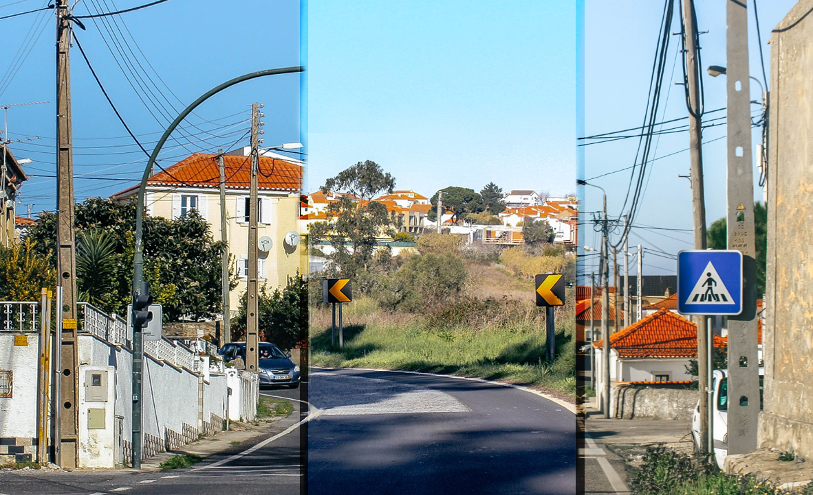
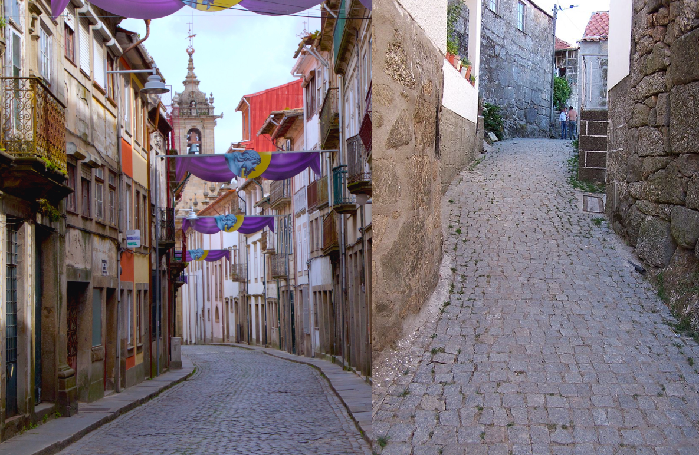
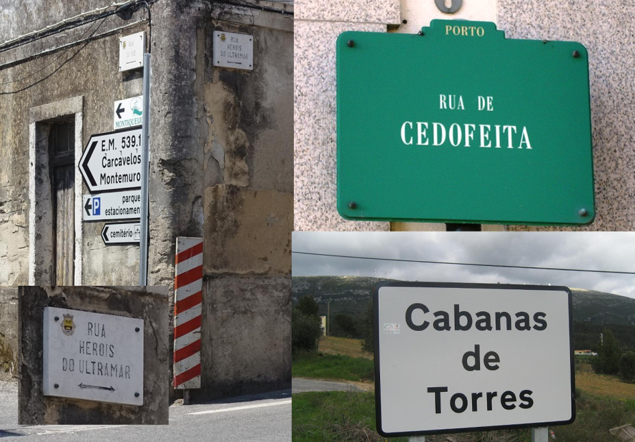
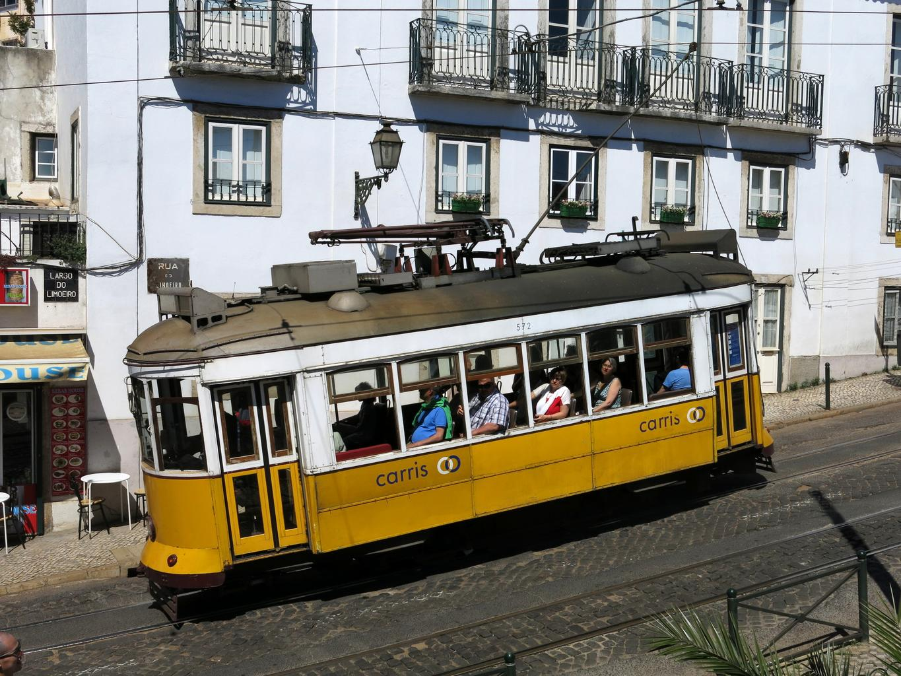
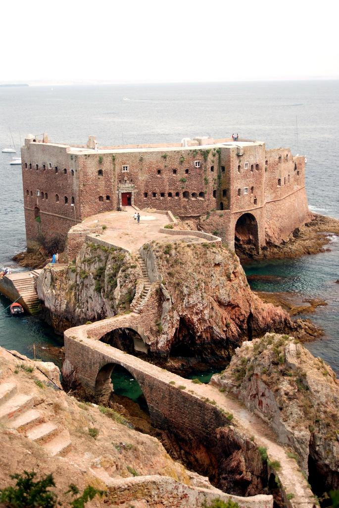
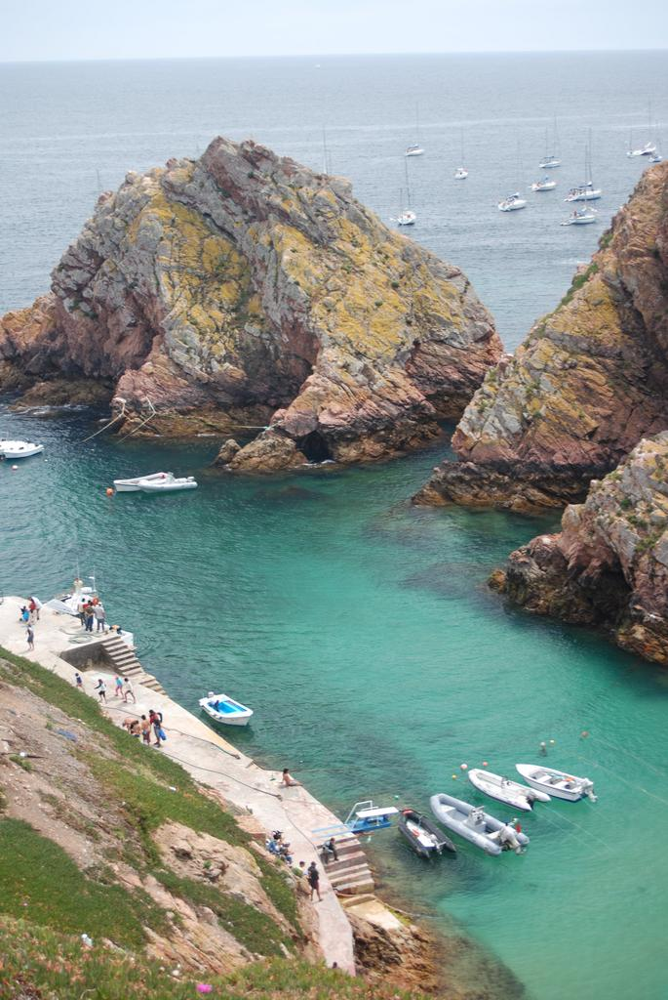
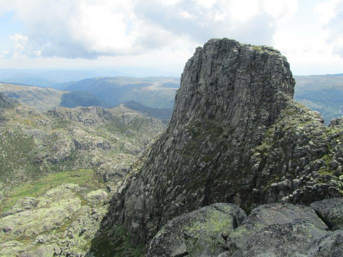

    <h2 class="section-title">{}</h2>
    <ul class="rule-list">
        <li>ドメインは.pt</li>
        <li>ナンバープレートは右側が黄色</li>
        <li>電柱に仕切りがあり穴が空いているものがある{}</li>
        <li>黒背景に黄色の矢印のシェブロンがある</li>
        <li>ポルトガル語は「Ã・ã」の文字が特徴的で南米では{}で使用される</li>
        <li>ポルトガルのgen4のエリアは空が綺麗{}</li>
        <li class="no-evidence">郊外に石畳の道が見つかる</li>
    </ul>
    {}

{}
{}

{}
ポルトガル語が見つかる。『Ã』『ã』が特徴的{}。
{}

{}
ナンバープレートは右側が黄色{}
{}

{}

<a href="//commons.wikimedia.org/wiki/User:Willtron" title="User:Willtron">by Willtron</a>, <a href="https://creativecommons.org/licenses/by-sa/3.0" title="Creative Commons Attribution-Share Alike 3.0">CC 表示-継承 3.0</a>, <a href="https://commons.wikimedia.org/w/index.php?curid=4614860">Wikimedia Commons(Link)</a>
{}

{}
電柱に仕切りがありかつ穴が空いているものがある{}。{}の電柱も穴が空いていることがある点に注意。横断歩道の標識は腰にベルトを付けている{}。
{}

{}
ヨーロッパの暖かい地域で黒背景に黄色のシェブロンを使うのはポルトガルだけ{}。寒そうならば{}・{}・{}・{}を、そうではないならば{}を検討してみる{}。
{}

{}
古い石畳の道があったり歩道が石畳だったりする{}。
{}

{}
『RUA ～』『～ DE ～』といった感じの通り名が多い。{}語ならば『CALLE』になるはず。
{}

{}
{}

{}
古い街並みの場所にタイルを使用していない石畳が多い気がする。こんな感じの道路はブラジルにもある。
{}

<iframe src="https://www.google.com/maps/embed?pb=!4v1682930687544!6m8!1m7!1svfB5_SEsz2Zj37cyZq2Lvg!2m2!1d40.48606931042772!2d-7.668648102818007!3f183.02424638606908!4f-4.740459890635833!5f1.4619587292754703" width="295" height="295" style="border:0;" allowfullscreen="" loading="lazy" referrerpolicy="no-referrer-when-downgrade"></iframe>
<iframe src="https://www.google.com/maps/embed?pb=!4v1682930749312!6m8!1m7!1stnknHHY6wROa7TQJgHFLKw!2m2!1d41.86001503397016!2d-8.38014516316834!3f315.27641034501073!4f-11.779713071577305!5f2.7778849526872884" width="295" height="295" style="border:0;" allowfullscreen="" loading="lazy" referrerpolicy="no-referrer-when-downgrade"></iframe>

{}
{}

<iframe src="https://www.google.com/maps/embed?pb=!4v1681996466214!6m8!1m7!1smX0RoFvrQek_cbABKOZOjg!2m2!1d39.80182585420921!2d-8.850470421514855!3f178.45900236615483!4f-9.51753229662934!5f3.325193203789971" width="295" height="295" style="border:0;" allowfullscreen="" loading="lazy" referrerpolicy="no-referrer-when-downgrade"></iframe>
<iframe src="https://www.google.com/maps/embed?pb=!4v1682929344788!6m8!1m7!1sGJMumJk2YTaFP-ftiFnCHw!2m2!1d39.34936868437937!2d-9.15837176860683!3f155.90362687739503!4f-12.315720803229354!5f3.325193203789971" width="295" height="295" style="border:0;" allowfullscreen="" loading="lazy" referrerpolicy="no-referrer-when-downgrade"></iframe>

{}
{}

    <h2 class="section-title">{}</h2>
    <ul class="rule-list">
        <li>ナンバー・電柱・標識などがほぼ同じの離島である{}と{}がある</li>
    </ul>

    <h2 class="section-title">{}</h2>
    <ul class="rule-list">
        <li>リスボンではCarrisの路面電車を見かけるかも</li>
        <li>ベルレンガ群島という離島があり17世紀に建てられた要塞が見える{}{}</li>
        <li>エストレーラ山脈はスノーポールが道端にある{}{}</li>
    </ul>

{}
{}

{}
1873年に運行を開始したCarris（Companhia Carris de Ferro de Lisboa）の路面電車を見かけるかも。
{}

{}
{}

{}
要塞か灯台が見える{}。人口30人で人の生活感は無い。
{}

{}
{}

{}
ポルトガル唯一のスキー場がありスノーポールが建っている道路もある{}。こんな感じの岩が道端に多く分布している{}。
{}

{}
{}

{}
<li>同一作者によるEN 247 roadの写真、加工あり<li>
<li>By <a href="//commons.wikimedia.org/w/index.php?title=User:R%C3%BAdisicyon&amp;amp;action=edit&amp;amp;redlink=1" class="new" title="User:Rúdisicyon (page does not exist)">Rúdisicyon</a> - Own work, <a href="https://creativecommons.org/licenses/by-sa/4.0" title="Creative Commons Attribution-Share Alike 4.0">CC BY-SA 4.0</a>, <a href="https://commons.wikimedia.org/w/index.php?curid=75659957">Link</a></li>
<li>By <a href="//commons.wikimedia.org/w/index.php?title=User:R%C3%BAdisicyon&amp;amp;action=edit&amp;amp;redlink=1" class="new" title="User:Rúdisicyon (page does not exist)">Rúdisicyon</a> - Own work, <a href="https://creativecommons.org/licenses/by-sa/4.0" title="Creative Commons Attribution-Share Alike 4.0">CC BY-SA 4.0</a>, <a href="https://commons.wikimedia.org/w/index.php?curid=75659958">Link</a></li>
<li>By <a href="//commons.wikimedia.org/w/index.php?title=User:R%C3%BAdisicyon&amp;amp;action=edit&amp;amp;redlink=1" class="new" title="User:Rúdisicyon (page does not exist)">Rúdisicyon</a> - Own work, <a href="https://creativecommons.org/licenses/by-sa/4.0" title="Creative Commons Attribution-Share Alike 4.0">CC BY-SA 4.0</a>, <a href="https://commons.wikimedia.org/w/index.php?curid=75635277">Link</a></li>
{}