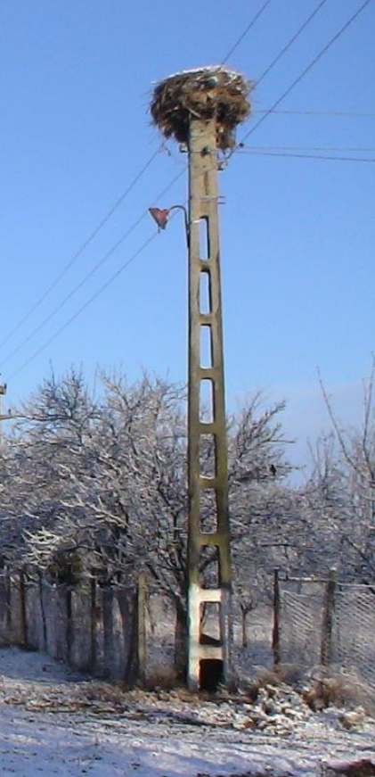
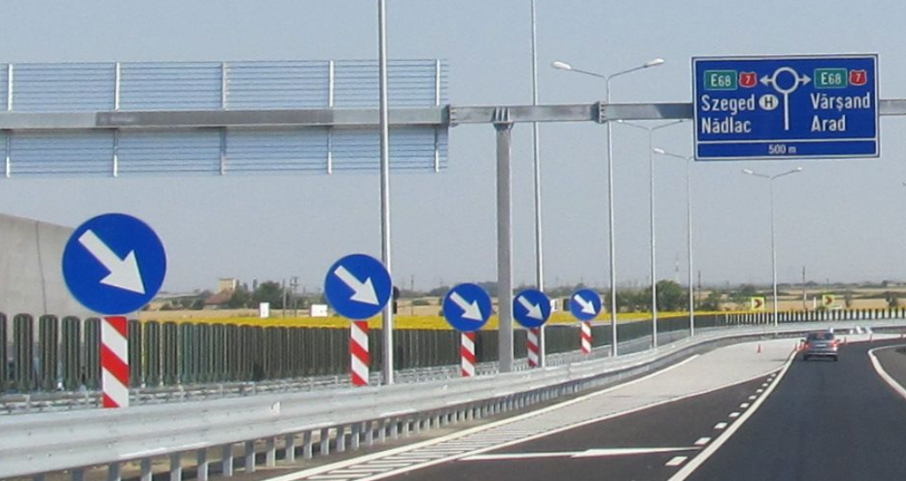
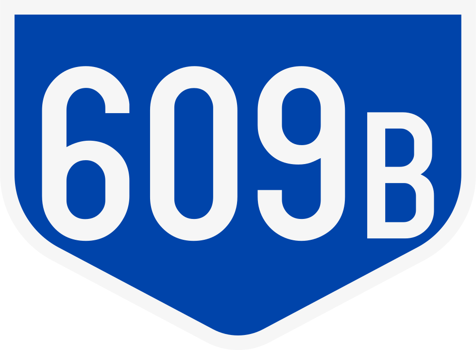
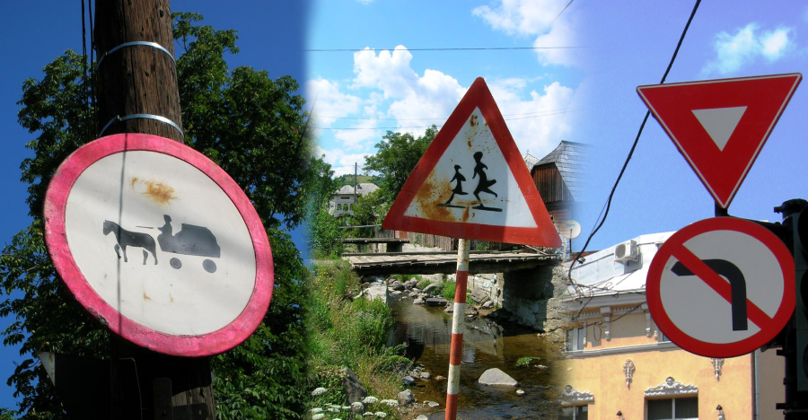
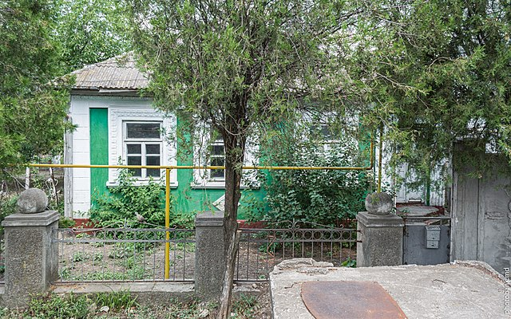
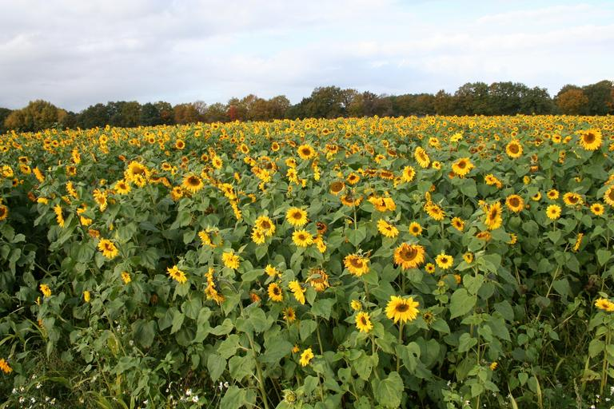
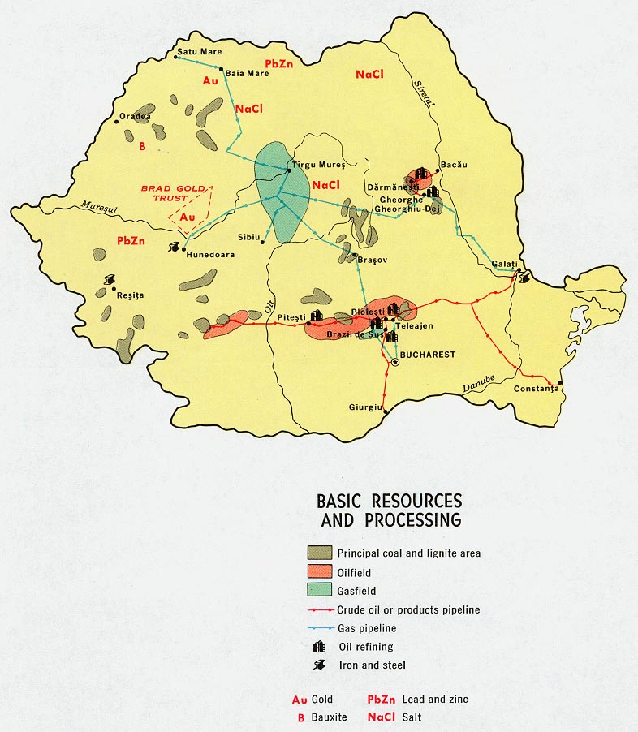
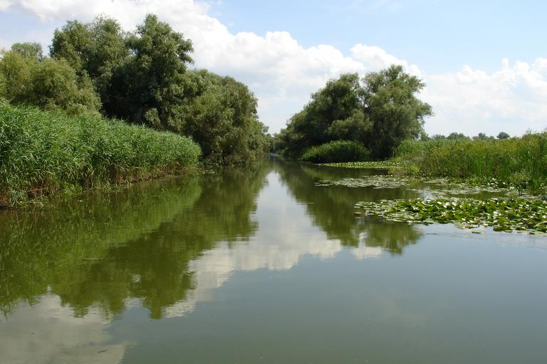

---

title: "Rumania"
date: 2023-02-26
lastmod: 2023-04-11
weight: 2
draft: false
keywords: [""]
sections: [""]
bg: "bg/city.jpg"
flag: "RO.svg"
jetro_detail: true
plonkit: true
sc_title: "Áreas que son fáciles de confundir"
sc: [
    ["../poland/", "Polonia"],
    ["../bulgaria/", "Bulgaria"],
    ["../hungary/", "Hungría"],
    ]
---

    <h2 class="section-title">{}</h2>
    <ul class="rule-list">
        <li>El dominio es .ro</li>
        <li>El idioma oficial es el rumano.latín usar personajes</li>
        <li>Hay un agujero en la parte inferior del poste telefónico.vacante a menudo amarillo Puede tener marcadores de colores.{}</li>
        <li>"Ș・ș"・"Ț・ț”se utiliza en Rumania y Moldavia</li>
        <li>Las barandillas en Rumania son cuadradas no presente</li>
        <li>Con diferencia, el más grande de Europa.▽ Hay una señal de</li>
        <li class="no-evidence">Hay una caja frente a la casa con un tubo amarillo que se extiende.</li>
        <li class="no-evidence">semillas de girasol Parece que las zonas circundantes de Serbia, Ucrania, Bulgaria y Hungría también están cerca de Rumanía y tienen muchos campos de girasoles.{}</li>
    </ul>
    {}
    

        
Señal de paso de peatones: Por <a href="//commons.wikimedia.org/w/index.php?title=User:Gigillo83&amp;amp;action=edit&amp;amp;redlink=1" class="new" title="User:Gigillo83 (page does not exist)">gigillo83</a> - propio trabajo, <a href="https://creativecommons.org/licenses/by-sa/4.0" title="Creative Commons Attribution-Share Alike 4.0">CC BY-SA 4.0</a>, <a href="https://commons.wikimedia.org/w/index.php?curid=40504943">Enlace</a>

    

{}
{}
{}
Hay un gran agujero en el poste telefónico hasta el fondo.Hay a menudo{}Puede parecer que está completo en un solo lado en la parte inferior.{}.Si está vacío hasta el fondo, es Rumania.{}, si el fondo no está vacío{}Tal vez.A menudo está marcado con un marcador amarillo.
{}

(Imagen de la derecha) Por foto: <a href="//commons.wikimedia.org/wiki/User:Myrabella" title="User:Myrabella">mirabella</a>&nbsp;/&nbsp;<a href="//commons.wikimedia.org/wiki/Main_Page" title="Main Page">Wikimedia Commons</a>, <a href="https://creativecommons.org/licenses/by-sa/3.0" title="Creative Commons Attribution-Share Alike 3.0">CC BY-SA 3.0</a>, <a href="https://commons.wikimedia.org/w/index.php?curid=20712710">Enlace</a>

{}
Con diferencia, el más grande de Europa.▽{}.El más delgado de la izquierda.{}, parece ser bastante grueso{}y Rumania{}.
{}

{}
Los bolardos en Rumanía tienen muchas indicaciones para localizarlos.{}{}.También hay una versión más pequeña.{}.
{}

{}
"Ș・ș"・"Ț・ț S y T con una coma debajo se utilizan en Rumania y Moldavia, pero Moldavia no tiene Street View.Si “Ļ・ļ”{}.
{}

{}
La forma del número de la carretera es distintiva.{}
{}

Por <a href="//commons.wikimedia.org/wiki/User:Nenea_hartia" title="User:Nenea hartia">nenea hartia</a> - propio trabajo, <a href="https://creativecommons.org/licenses/by-sa/4.0" title="Creative Commons Attribution-Share Alike 4.0">CC BY-SA 4.0</a>, <a href="https://commons.wikimedia.org/w/index.php?curid=49508175">Enlace</a>

{}
En Rumanía, la parte trasera de los carteles suele ser negra.{}.Además, las señales de cruce de peatones pueden estar rodeadas por líneas amarillas.{}.
{}

{}En otras partes de Europa{}・{}・{}・{}・{}La parte trasera suele ser negra.
{}

{}
A diferencia de los países vecinos, no existe ninguna conexión con las señales.Lo mismo ocurre con las señales azules y las señales cuadradas.
{}

{}
{}

{}
la izquierda es Polonia, el derecho es Rumania barandilla.Polonia Aunque la barandilla es cuadrada,Rumania a menudo no son angulares{}{}.
{}

{}
{}
{}
Los nombres de las calles suelen estar escritos, como en Inglaterra.
{}

<iframe src="https://www.google.com/maps/embed?pb=!4v1681169477862!6m8!1m7!1spsZjptAy5Hi0VI2dTCPBKA!2m2!1d46.38118929726235!2d25.81753321779553!3f30.30393844491686!4f-8.236900282330424!5f3.325193203789971" width="295" height="295" style="border:0;" allowfullscreen="" loading="lazy" referrerpolicy="no-referrer-when-downgrade"></iframe>
<iframe src="https://www.google.com/maps/embed?pb=!4v1681169535511!6m8!1m7!1sI3s3HSbsw0r5eue4gQulmA!2m2!1d46.38150520681397!2d25.81949501285196!3f318.58042425032454!4f-18.39379139049862!5f3.325193203789971" width="295" height="295" style="border:0;" allowfullscreen="" loading="lazy" referrerpolicy="no-referrer-when-downgrade"></iframe>

{}
Hay una caja frente a la casa con un tubo amarillo que se extiende.{}.
{}

<iframe src="https://www.google.com/maps/embed?pb=!4v1680051820686!6m8!1m7!1sZ54VOKNp_U5NgbySWVZtQQ!2m2!1d44.33370267115343!2d23.75005123301861!3f345.2531907157949!4f-18.198736183769995!5f3.3211969354371154" width="295" height="295" style="border:0;" allowfullscreen="" loading="lazy" referrerpolicy="no-referrer-when-downgrade"></iframe>
<iframe src="https://www.google.com/maps/embed?pb=!4v1681169690078!6m8!1m7!1s1HUpdimAn6LXmnwt6Xy8cQ!2m2!1d47.65316069155358!2d26.22653748095559!3f190.54662613263915!4f-9.818147496222608!5f3.325193203789971" width="295" height="295" style="border:0;" allowfullscreen="" loading="lazy" referrerpolicy="no-referrer-when-downgrade"></iframe>

{}
{}
{}
También se pueden encontrar bolardos similares a los de Türkiye e Italia, aunque en pequeñas cantidades.
{}

<iframe src="https://www.google.com/maps/embed?pb=!4v1691922555134!6m8!1m7!1s-HaDwQkAZNU0kKr3_fY3XQ!2m2!1d44.08537370293369!2d23.25785996474632!3f262.9994857988307!4f-8.812591107665511!5f2.755649721040019"width="295" height="295" style="border:0;" allowfullscreen="" loading="lazy" referrerpolicy="no-referrer-when-downgrade"></iframe>
<iframe src="https://www.google.com/maps/embed?pb=!4v1693753420485!6m8!1m7!1sLZJ8bWrNsu2ZM3grKGoYZg!2m2!1d44.88543285626029!2d25.63793520577835!3f344.8247273492445!4f-1.6894219920764186!5f1.591437045702341" width="295" height="295" style="border:0;" allowfullscreen="" loading="lazy" referrerpolicy="no-referrer-when-downgrade"></iframe>

{}
{}

<iframe src="https://www.google.com/maps/embed?pb=!4v1693753340530!6m8!1m7!1sLuY844Tkugn586mTqt9jYw!2m2!1d44.81517233163134!2d25.69458425900886!3f242.37262305312188!4f4.948132299859822!5f2.6360318257588844" width="295" height="295" style="border:0;" allowfullscreen="" loading="lazy" referrerpolicy="no-referrer-when-downgrade"></iframe>
<iframe src="https://www.google.com/maps/embed?pb=!4v1693753689286!6m8!1m7!1s07KoPHx0iKjn6Atq3OmcuA!2m2!1d46.15997827917551!2d28.09812776159574!3f87.97544027911947!4f2.094039384254529!5f2.361157493803028" width="295" height="295" style="border:0;" allowfullscreen="" loading="lazy" referrerpolicy="no-referrer-when-downgrade"></iframe>
<iframe src="https://www.google.com/maps/embed?pb=!4v1693753723050!6m8!1m7!1soWF0C5PNxqN6QXSiTjvRew!2m2!1d45.26867958493148!2d28.49525301320358!3f107.50781636354786!4f0.904070128791389!5f2.3580607011440367" width="295" height="295" style="border:0;" allowfullscreen="" loading="lazy" referrerpolicy="no-referrer-when-downgrade"></iframe>

{}
{}

    <h2 class="section-title">{}</h2>
    <ul class="rule-list">
        <li>En términos generales, cuanto más se avanza hacia el noroeste, más casas tradicionales y prósperas se pueden encontrar en cada región.{}{}
            <ul>
                <li>noroeste ■■:La zona al noroeste de la sierra es más rica que el resto, con muchos tejados anaranjados.</li>
                <li>nordeste ■:Tiene una atmósfera ucraniana.</li>
                <li>sur ■■■:Parece como Bulgaria excepto en los alrededores de la capital.</li>
            </ul>
        </li>
    </ul>

{}
{}

{}
{}
{}

<blockquote class="reddit-embed-bq" style="height:500px" data-embed-height="500"><a href="https://www.reddit.com/r/MapPorn/comments/3c59qn/percentage_of_romanian_homes_with_a_toilet_inside/">Porcentaje de hogares rumanos con baño en su interior [OC][1210x900]</a>  por<a href="https://www.reddit.com/user/Bezbojnicul/">u/Bezbojnicul</a> en<a href="https://www.reddit.com/r/MapPorn/">MapaPorno</a></blockquote>

{}
Las zonas violetas tienen más baños al aire libre.En general, las regiones con baños interiores son más ricas.
{}

{}
{}

{}
TODO / ¿Tejado marrón rojizo o paredes azul claro?{{% ref "https://ja.wikipedia.org/wiki/%E3%83%88%E3%83%A9%E3%83%B3%E3%82%B7%E3%83%AB%E3%83%B4%E3%82%A1%E3%83%8B%E3%82%A2" "transilvania" %}}.
{}
{}

{}

Imagen inferior: Por Cezar Suceveanu - propio trabajo, <a href="https://creativecommons.org/licenses/by/3.0" title="Creative Commons Attribution 3.0">CC POR 3.0</a>, <a href="https://commons.wikimedia.org/w/index.php?curid=8012929">Enlace</a>

{}
TODO / Techos y ductos de material plateado{}.
{}
{}
{}
{}
Las partes de gran altitud son intrincadas (Fuente de la imagen:<a href="https://maps-for-free.com/">https://maps-for-free.com/</a> ©<a href="https://www.openstreetmap.org/copyright">Abrir mapa de calles</a> contribuyentes）
{}

{}
{}

    <ul class="rule-list">
        <li>Otras áreas además de la cordillera central tienen muchas áreas planas donde se practica la agricultura.
            <ul>
                <li> {}</li>
                <li>Los girasoles se cultivan principalmente en el este.{}</li>
                <li>El maíz y la colza se cultivan principalmente en las zonas planas que rodean el distrito de Calarasi.{}</li>
            </ul>
        </li>
        <li>Algunas ciudades están produciendo petróleo y se están industrializando cada vez más.
            <ul>
                <li>Ploieşti{}</li>
                <li>Pitești{}</li>
            </ul>
        </li>
        <li>Hay un tramo donde se viaja en barco entre las zonas deltaicas de Europa llamado Delta del Danubio.{{% ref "https://ja.wikipedia.org/wiki/%E3%83%89%E3%83%8A%E3%82%A6%E3%83%BB%E3%83%87%E3%83%AB%E3%82%BF" "Delta del Danubio" %}}</li>
    </ul>

{}
{}
{}
En la zona naranja se realiza la agricultura.
{}

{}
Es común en oriente, pero tampoco falta en occidente.Si hay un campo de girasoles en los alrededores de Bulgaria, Serbia, Hungría o Ucrania, creo que sería una buena idea ubicarlo cerca de Rumania.
{}

{}
{}
{}
Las áreas que se muestran en naranja en el diagrama tienen refinerías de petróleo y están en proceso de industrialización.{}.Si busca ``refinería'', etc., se mostrará la ubicación de la refinería.
{}

{}
{}
{}
Hay un tramo donde se viaja en barco entre las zonas deltaicas de Europa llamado Delta del Danubio.{}.
{}

{}
{}

    <h2 class="section-title">{}</h2>
    <ul class="rule-list">
        <li>Hay una carretera que cruza las montañas Fagaras llamada Transfăgărășan.{}</li>
        <li>Hay una escultura del rey Decebalus.{}</li>
        <li>La carretera de circunvalación que rodea la capital tiene escrito "CB" en los bolardos.</li>
    </ul>

{}
{}
{}
Siento que no parece rumano (mi impresión personal), así que trato de no cometer errores.{}.
{}

{}
{}

{}
Una vez que vengas, no lo olvidarás.{}
{}

{}
{}

{}
Si ve "CB", dé la vuelta a la capital.Dado que la carretera tiene forma casi circular, en este ejemplo la carretera estará orientada al norte o al sur dependiendo del ángulo de la carretera.Desde allí, puede buscar nombres de lugares cercanos y limitarlos a un lugar en el lado sur.
{}

<iframe src="https://www.google.com/maps/embed?pb=!4v1689253543807!6m8!1m7!1sAMy-_76RH-zXlP6rR6Of3A!2m2!1d44.33533224361797!2d26.11264253598017!3f57.39231935195243!4f-10.58605503694369!5f3.325193203789971" width="300" height="295" style="border:0;" allowfullscreen="" loading="lazy" referrerpolicy="no-referrer-when-downgrade"></iframe>

{}
{}

{}
<li>Por <a href="//commons.wikimedia.org/wiki/User:-wuppertaler" title="User:-wuppertaler">-wuppertaler</a> - propio trabajo, <a href="https://creativecommons.org/licenses/by-sa/4.0" title="Creative Commons Attribution-Share Alike 4.0">CC BY-SA 4.0</a>, <a href="https://commons.wikimedia.org/w/index.php?curid=121271756">Enlace</a></li>
<li>Por <a href="//commons.wikimedia.org/wiki/User:Aisano" class="mw-redirect" title="User:Aisano">Aisano</a> - Autofotografiado, <a href="https://creativecommons.org/licenses/by-sa/4.0" title="Creative Commons Attribution-Share Alike 4.0">CC BY-SA 4.0</a>, <a href="https://commons.wikimedia.org/w/index.php?curid=38136117">Enlace</a></li>
<li>Por <a href="//commons.wikimedia.org/wiki/User:AleXXw" title="User:AleXXw">AleXXw</a> - propio trabajo, <a href="https://creativecommons.org/licenses/by-sa/4.0" title="Creative Commons Attribution-Share Alike 4.0">CC BY-SA 4.0</a>, <a href="https://commons.wikimedia.org/w/index.php?curid=55018177">Enlace</a></li>
{}

