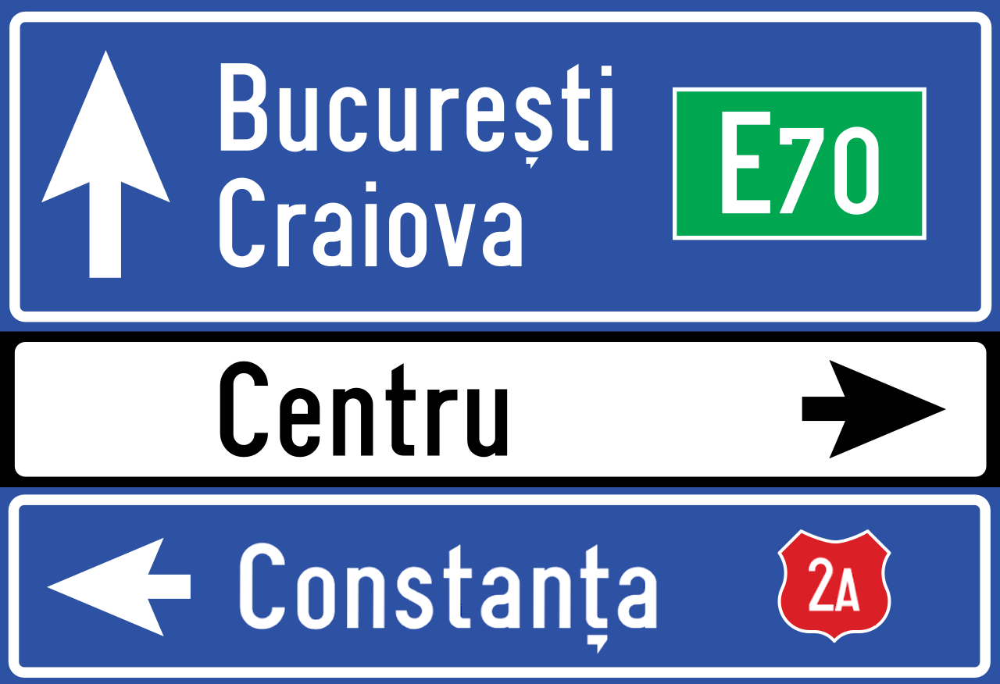
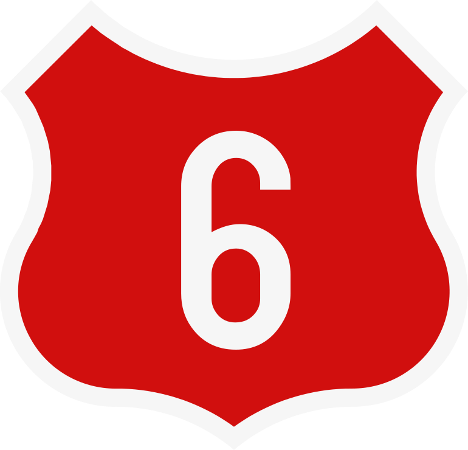
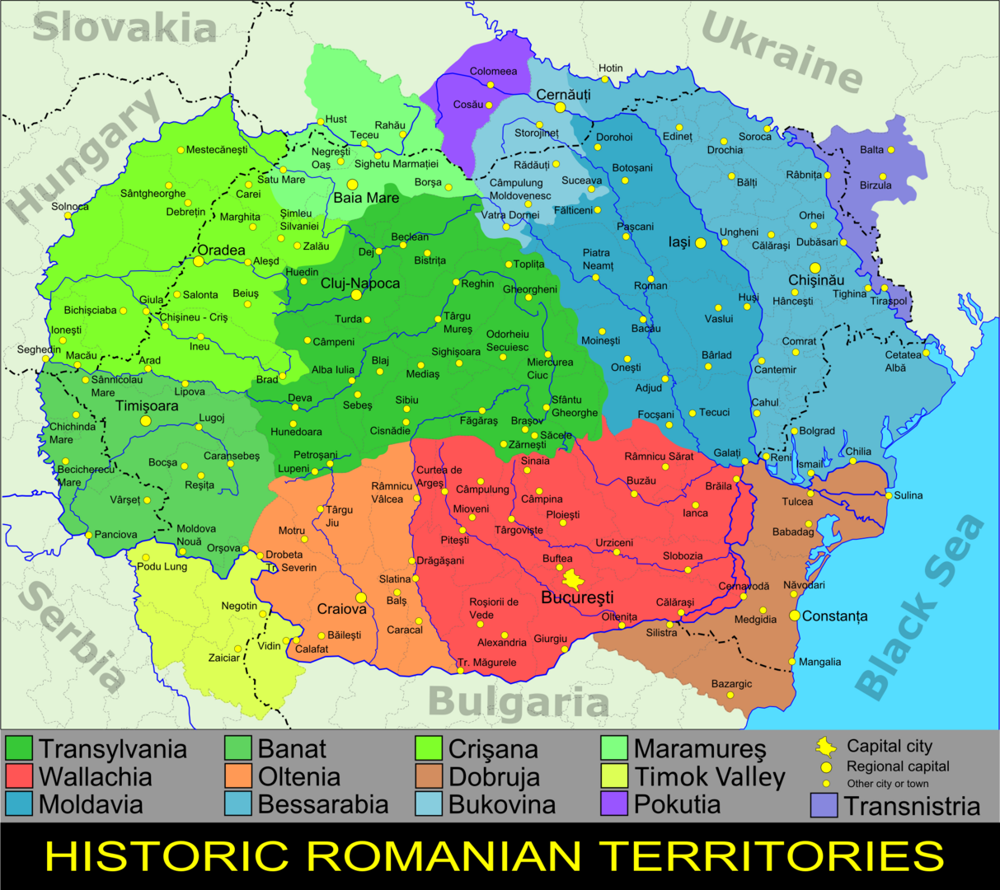
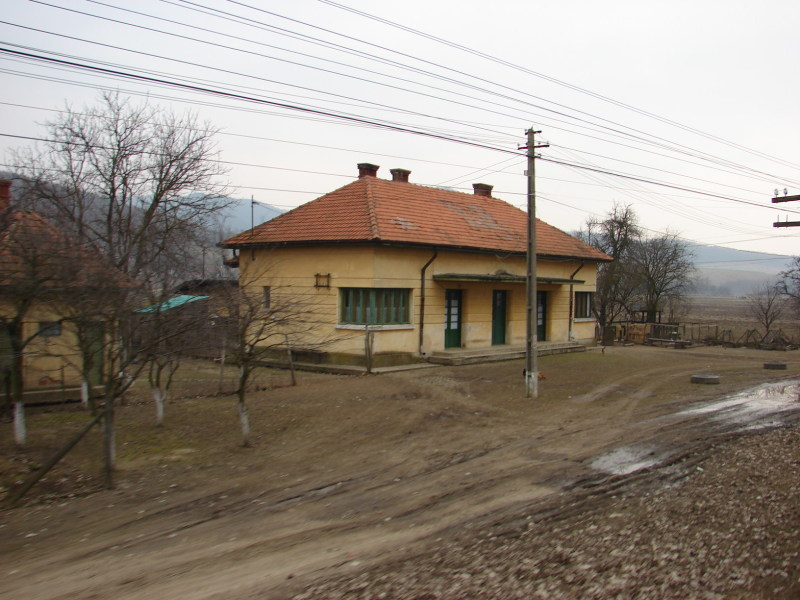
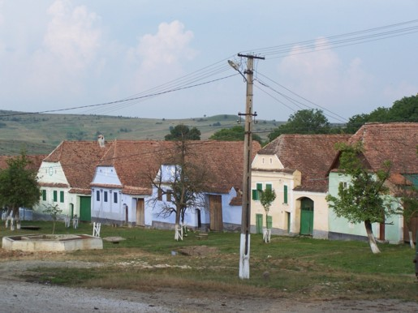

---

title: "Rumania"
date: 2023-02-26
lastmod: 2023-04-11
weight: 2
draft: false
keywords: [""]
sections: [""]
bg: "bg/city.jpg"
flag: "RO.svg"
jetro_detail: true
plonkit: true
sc_title: "Area yang mudah salah"
sc: [
    ["../poland/", "Polandia"],
    ["../bulgaria/", "Bulgaria"],
    ["../hungary/", "Hongaria"],
    ]
---

    <h2 class="section-title">{}</h2>
    <ul class="rule-list">
        <li>Domainnya adalah .ro</li>
        <li>Bahasa resminya adalah bahasa Rumania Latin menggunakan karakter</li>
        <li>Terdapat lubang di bagian bawah tiang telepon kosong sering kuning Mungkin memiliki spidol berwarna{}</li>
        <li>"Ș・ș"・"Ț・ț” digunakan di Rumania dan Moldova</li>
        <li>Pagar pembatas di Rumania berbentuk persegi tidak hadir</li>
        <li>Sejauh ini yang terbesar di Eropa ▽ Ada tandanya</li>
        <li class="no-evidence">Ada sebuah kotak di depan rumah dengan pipa kuning menjulur keluar.</li>
        <li class="no-evidence">biji bunga matahari Nampaknya wilayah sekitar Serbia, Ukraina, Bulgaria, dan Hongaria juga dekat dengan Rumania dan memiliki banyak ladang bunga matahari.{}</li>
    </ul>
    {}
    

        
Tanda penyeberangan: Oleh <a href="//commons.wikimedia.org/w/index.php?title=User:Gigillo83&amp;amp;action=edit&amp;amp;redlink=1" class="new" title="User:Gigillo83 (page does not exist)">Gigilo83</a> - pekerjaan sendiri, <a href="https://creativecommons.org/licenses/by-sa/4.0" title="Creative Commons Attribution-Share Alike 4.0">CC BY-SA 4.0</a>, <a href="https://commons.wikimedia.org/w/index.php?curid=40504943">Link</a>

    

{}
{}
{}
Ada lubang besar di tiang telepon sampai ke bawah.Ada sering{}mungkin tampak terisi hanya pada satu sisi di bagian bawah.{}.Jika kosong sampai ke bawah, itu Rumania.{}, jika bagian bawahnya tidak kosong{}Mungkin.Sering ditandai dengan spidol kuning.
{}

(Gambar di sebelah kanan) Berdasarkan Foto: <a href="//commons.wikimedia.org/wiki/User:Myrabella" title="User:Myrabella">Myrabella</a>&nbsp;/&nbsp;<a href="//commons.wikimedia.org/wiki/Main_Page" title="Main Page">Wikimedia Commons</a>, <a href="https://creativecommons.org/licenses/by-sa/3.0" title="Creative Commons Attribution-Share Alike 3.0">CC BY-SA 3.0</a>, <a href="https://commons.wikimedia.org/w/index.php?curid=20712710">Link</a>

{}
Sejauh ini yang terbesar di Eropa ▽{}.Yang paling tipis dari kiri{}, tampaknya cukup tebal{}, dan Rumania{}.
{}

{}
Tonggak-tonggak di Rumania memiliki banyak petunjuk untuk menemukannya.{}{}.Ada juga versi yang lebih kecil{}.
{}

{}
"Ș・ș"・"Ț・ț S dan T dengan koma di bawah digunakan di Rumania dan Moldova, namun Moldova tidak memiliki Street View.Jika “Ļ・ļ”{}.
{}

{}
Bentuk nomor jalannya pun khas{}
{}

Oleh <a href="//commons.wikimedia.org/wiki/User:Nenea_hartia" title="User:Nenea hartia">Nenea hartia</a> - pekerjaan sendiri, <a href="https://creativecommons.org/licenses/by-sa/4.0" title="Creative Commons Attribution-Share Alike 4.0">CC BY-SA 4.0</a>, <a href="https://commons.wikimedia.org/w/index.php?curid=49508175">Link</a>

{}
Di Rumania, bagian belakang rambu sering kali berwarna hitam.{}.Selain itu, rambu penyeberangan mungkin dikelilingi oleh garis kuning.{}.
{}

{}Di tempat lain di Eropa{}・{}・{}・{}・{}Sisi belakang seringkali berwarna hitam.
{}

{}
Berbeda dengan negara tetangga, tidak ada kaitannya dengan tanda-tanda tersebut.Hal yang sama berlaku untuk tanda biru dan tanda persegi.
{}

{}
{}

{}
Yang kiri adalah Polandia, yang benar adalah Rumania pagar pembatas.Polandia Meskipun pagar pembatasnya berbentuk persegi,Rumania seringkali tidak bersudut{}{}.
{}

{}
{}
{}
Nama jalan sering kali ditulis, seperti di Inggris.
{}

<iframe src="https://www.google.com/maps/embed?pb=!4v1681169477862!6m8!1m7!1spsZjptAy5Hi0VI2dTCPBKA!2m2!1d46.38118929726235!2d25.81753321779553!3f30.30393844491686!4f-8.236900282330424!5f3.325193203789971" width="295" height="295" style="border:0;" allowfullscreen="" loading="lazy" referrerpolicy="no-referrer-when-downgrade"></iframe>
<iframe src="https://www.google.com/maps/embed?pb=!4v1681169535511!6m8!1m7!1sI3s3HSbsw0r5eue4gQulmA!2m2!1d46.38150520681397!2d25.81949501285196!3f318.58042425032454!4f-18.39379139049862!5f3.325193203789971" width="295" height="295" style="border:0;" allowfullscreen="" loading="lazy" referrerpolicy="no-referrer-when-downgrade"></iframe>

{}
Ada sebuah kotak di depan rumah dengan pipa kuning menjulur keluar.{}.
{}

<iframe src="https://www.google.com/maps/embed?pb=!4v1680051820686!6m8!1m7!1sZ54VOKNp_U5NgbySWVZtQQ!2m2!1d44.33370267115343!2d23.75005123301861!3f345.2531907157949!4f-18.198736183769995!5f3.3211969354371154" width="295" height="295" style="border:0;" allowfullscreen="" loading="lazy" referrerpolicy="no-referrer-when-downgrade"></iframe>
<iframe src="https://www.google.com/maps/embed?pb=!4v1681169690078!6m8!1m7!1s1HUpdimAn6LXmnwt6Xy8cQ!2m2!1d47.65316069155358!2d26.22653748095559!3f190.54662613263915!4f-9.818147496222608!5f3.325193203789971" width="295" height="295" style="border:0;" allowfullscreen="" loading="lazy" referrerpolicy="no-referrer-when-downgrade"></iframe>

{}
{}
{}
Tonggak-tonggak yang serupa dengan yang ada di Türkiye dan Italia juga dapat ditemukan, meskipun dalam jumlah kecil.
{}

<iframe src="https://www.google.com/maps/embed?pb=!4v1691922555134!6m8!1m7!1s-HaDwQkAZNU0kKr3_fY3XQ!2m2!1d44.08537370293369!2d23.25785996474632!3f262.9994857988307!4f-8.812591107665511!5f2.755649721040019"width="295" height="295" style="border:0;" allowfullscreen="" loading="lazy" referrerpolicy="no-referrer-when-downgrade"></iframe>
<iframe src="https://www.google.com/maps/embed?pb=!4v1693753420485!6m8!1m7!1sLZJ8bWrNsu2ZM3grKGoYZg!2m2!1d44.88543285626029!2d25.63793520577835!3f344.8247273492445!4f-1.6894219920764186!5f1.591437045702341" width="295" height="295" style="border:0;" allowfullscreen="" loading="lazy" referrerpolicy="no-referrer-when-downgrade"></iframe>

{}
{}

<iframe src="https://www.google.com/maps/embed?pb=!4v1693753340530!6m8!1m7!1sLuY844Tkugn586mTqt9jYw!2m2!1d44.81517233163134!2d25.69458425900886!3f242.37262305312188!4f4.948132299859822!5f2.6360318257588844" width="295" height="295" style="border:0;" allowfullscreen="" loading="lazy" referrerpolicy="no-referrer-when-downgrade"></iframe>
<iframe src="https://www.google.com/maps/embed?pb=!4v1693753689286!6m8!1m7!1s07KoPHx0iKjn6Atq3OmcuA!2m2!1d46.15997827917551!2d28.09812776159574!3f87.97544027911947!4f2.094039384254529!5f2.361157493803028" width="295" height="295" style="border:0;" allowfullscreen="" loading="lazy" referrerpolicy="no-referrer-when-downgrade"></iframe>
<iframe src="https://www.google.com/maps/embed?pb=!4v1693753723050!6m8!1m7!1soWF0C5PNxqN6QXSiTjvRew!2m2!1d45.26867958493148!2d28.49525301320358!3f107.50781636354786!4f0.904070128791389!5f2.3580607011440367" width="295" height="295" style="border:0;" allowfullscreen="" loading="lazy" referrerpolicy="no-referrer-when-downgrade"></iframe>

{}
{}

    <h2 class="section-title">{}</h2>
    <ul class="rule-list">
        <li>Secara kasar, semakin jauh ke barat laut, semakin banyak rumah mewah dan tradisional yang dapat ditemukan di setiap daerah.{}{}
            <ul>
                <li>barat laut ■■:Wilayah barat laut pegunungan lebih kaya dibandingkan daerah lain, dengan banyak atap berwarna oranye.</li>
                <li>timur laut ■:Ini memiliki suasana Ukraina.</li>
                <li>selatan ■■■：Rasanya seperti Bulgaria kecuali daerah sekitar ibu kotanya.</li>
            </ul>
        </li>
    </ul>

{}
{}

{}
{}
{}

<blockquote class="reddit-embed-bq" style="height:500px" data-embed-height="500"><a href="https://www.reddit.com/r/MapPorn/comments/3c59qn/percentage_of_romanian_homes_with_a_toilet_inside/">Persentase rumah di Rumania yang memiliki toilet di dalamnya [OC][1210x900]</a>  oleh<a href="https://www.reddit.com/user/Bezbojnicul/">kamu/Bezbojnicul</a> di dalam<a href="https://www.reddit.com/r/MapPorn/">PetaPorn</a></blockquote>

{}
Daerah ungu memiliki lebih banyak toilet di luar ruangan.Secara umum, wilayah yang mempunyai toilet dalam ruangan lebih makmur.
{}

{}
{}

{}
TODO / Atap merah coklat atau dinding biru muda?{{% ref "https://ja.wikipedia.org/wiki/%E3%83%88%E3%83%A9%E3%83%B3%E3%82%B7%E3%83%AB%E3%83%B4%E3%82%A1%E3%83%8B%E3%82%A2" "transilvania" %}}.
{}
{}

{}

Gambar bawah: Oleh Cezar Suceveanu - pekerjaan sendiri, <a href="https://creativecommons.org/licenses/by/3.0" title="Creative Commons Attribution 3.0">CC OLEH 3.0</a>, <a href="https://commons.wikimedia.org/w/index.php?curid=8012929">Link</a>

{}
TODO / Atap dan saluran terbuat dari bahan perak{}.
{}
{}
{}
{}
Bagian dataran tinggi itu rumit (Sumber gambar:<a href="https://maps-for-free.com/">https://maps-for-free.com/</a> ©<a href="https://www.openstreetmap.org/copyright">Peta jalan terbuka</a> kontributor）
{}

{}
{}

    <ul class="rule-list">
        <li>Daerah selain pegunungan tengah mempunyai banyak daerah datar dimana pertanian dilakukan.
            <ul>
                <li> {}</li>
                <li>Bunga matahari sebagian besar ditanam di wilayah timur.{}</li>
                <li>Jagung dan lobak sebagian besar dibudidayakan di daerah datar sekitar Kecamatan Calarasi.{}</li>
            </ul>
        </li>
        <li>Beberapa kota memproduksi minyak dan menjadi semakin terindustrialisasi.
            <ul>
                <li>Ploieşti{}</li>
                <li>Pitești{}</li>
            </ul>
        </li>
        <li>Ada bagian di mana Anda melakukan perjalanan dengan perahu antara wilayah delta di Eropa yang disebut Delta Danube.{{% ref "https://ja.wikipedia.org/wiki/%E3%83%89%E3%83%8A%E3%82%A6%E3%83%BB%E3%83%87%E3%83%AB%E3%82%BF" "Delta Danube" %}}</li>
    </ul>

{}
{}
{}
Pertanian dilakukan di daerah jeruk.
{}

{}
Hal ini biasa terjadi di wilayah timur, namun tidak jarang juga terjadi di wilayah barat.Jika ada ladang bunga matahari di sekitar Bulgaria, Serbia, Hongaria, atau Ukraina, menurut saya sebaiknya ditempatkan di dekat Rumania.
{}

{}
{}
{}
Area yang ditunjukkan dengan warna oranye pada diagram memiliki kilang minyak dan sedang menjalani industrialisasi.{}.Jika Anda mencari ``kilang'' dll., lokasi kilang akan ditampilkan.
{}

{}
{}
{}
Ada bagian di mana Anda melakukan perjalanan dengan perahu antara wilayah delta di Eropa yang disebut Delta Danube.{}.
{}

{}
{}

    <h2 class="section-title">{}</h2>
    <ul class="rule-list">
        <li>Ada jalan yang melintasi Pegunungan Fagaras yang disebut Transfăgărășan.{}</li>
        <li>Ada patung Raja Decebalus.{}</li>
        <li>Jalan lingkar di sekitar ibu kota memiliki tulisan "CB" di tiang-tiangnya.</li>
    </ul>

{}
{}
{}
Saya merasa ini tidak terlihat seperti bahasa Rumania (kesan pribadi saya) jadi saya berusaha untuk tidak membuat kesalahan.{}.
{}

{}
{}

{}
Begitu Anda datang, Anda tidak akan melupakannya{}
{}

{}
{}

{}
Jika Anda melihat "CB", kelilingi ibu kota.Karena bentuk jalannya hampir melingkar, dalam contoh ini jalan akan menghadap utara atau selatan tergantung pada sudut jalannya.Dari sana, Anda dapat mencari nama tempat terdekat dan mempersempitnya ke tempat di sisi selatan.
{}

<iframe src="https://www.google.com/maps/embed?pb=!4v1689253543807!6m8!1m7!1sAMy-_76RH-zXlP6rR6Of3A!2m2!1d44.33533224361797!2d26.11264253598017!3f57.39231935195243!4f-10.58605503694369!5f3.325193203789971" width="300" height="295" style="border:0;" allowfullscreen="" loading="lazy" referrerpolicy="no-referrer-when-downgrade"></iframe>

{}
{}

{}
<li>Oleh <a href="//commons.wikimedia.org/wiki/User:-wuppertaler" title="User:-wuppertaler">-wuppertaler</a> - pekerjaan sendiri, <a href="https://creativecommons.org/licenses/by-sa/4.0" title="Creative Commons Attribution-Share Alike 4.0">CC BY-SA 4.0</a>, <a href="https://commons.wikimedia.org/w/index.php?curid=121271756">Link</a></li>
<li>Oleh <a href="//commons.wikimedia.org/wiki/User:Aisano" class="mw-redirect" title="User:Aisano">Aisano</a> - Difoto sendiri, <a href="https://creativecommons.org/licenses/by-sa/4.0" title="Creative Commons Attribution-Share Alike 4.0">CC BY-SA 4.0</a>, <a href="https://commons.wikimedia.org/w/index.php?curid=38136117">Link</a></li>
<li>Oleh <a href="//commons.wikimedia.org/wiki/User:AleXXw" title="User:AleXXw">AleXXw</a> - pekerjaan sendiri, <a href="https://creativecommons.org/licenses/by-sa/4.0" title="Creative Commons Attribution-Share Alike 4.0">CC BY-SA 4.0</a>, <a href="https://commons.wikimedia.org/w/index.php?curid=55018177">Link</a></li>
{}

