

    <h2 class="section-title">{}</h2>
    <ul class="rule-list">
        <li>ドメインは.ro</li>
        <li>公用語はルーマニア語でラテン文字を使用する</li>
        <li>電柱の一番下に穴が空いていることが多く黄色のマーカーが付いていることがある{}</li>
        <li>「Ș・ș」・「Ț・ț」はルーマニアとモルドバで使用される</li>
        <li>ルーマニアのガードレールは角ばっていない</li>
        <li>ヨーロッパの中で圧倒的に太い▽の標識がある</li>
        <li class="no-evidence">家の前に何か箱があって黄色いパイプが伸びている</li>
        <li class="no-evidence">ひまわりの種の生産が多く周辺のセルビア・ウクライナ・ブルガリア・ハンガリーもルーマニアに近いエリアでひまわりの畑が多い気がする{}</li>
    </ul>
    {}
    

        
横断歩道標識：By <a href="//commons.wikimedia.org/w/index.php?title=User:Gigillo83&amp;amp;action=edit&amp;amp;redlink=1" class="new" title="User:Gigillo83 (page does not exist)">Gigillo83</a> - Own work, <a href="https://creativecommons.org/licenses/by-sa/4.0" title="Creative Commons Attribution-Share Alike 4.0">CC BY-SA 4.0</a>, <a href="https://commons.wikimedia.org/w/index.php?curid=40504943">Link</a>

    

{}
{}
{}
電柱に大き目の穴が一番下まで空いていることが多い{}が一番下が片面だけ埋まって見えることもある{}。一番下まで空いていたらルーマニアか{}、一番下が空いていなかったら{}かも。黄色いマーカーが付いていることが多い。
{}

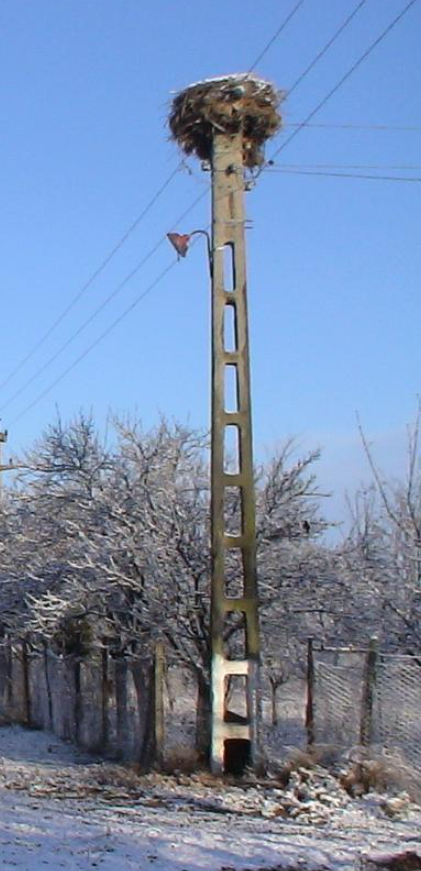

（右の画像）By Photo: <a href="//commons.wikimedia.org/wiki/User:Myrabella" title="User:Myrabella">Myrabella</a>&nbsp;/&nbsp;<a href="//commons.wikimedia.org/wiki/Main_Page" title="Main Page">Wikimedia Commons</a>, <a href="https://creativecommons.org/licenses/by-sa/3.0" title="Creative Commons Attribution-Share Alike 3.0">CC BY-SA 3.0</a>, <a href="https://commons.wikimedia.org/w/index.php?curid=20712710">Link</a>

{}
ヨーロッパの中で圧倒的に太い▽{}。左から順番に一番細い{}、まあまあ太いと思われる{}、そしてルーマニア{}。
{}

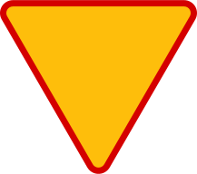
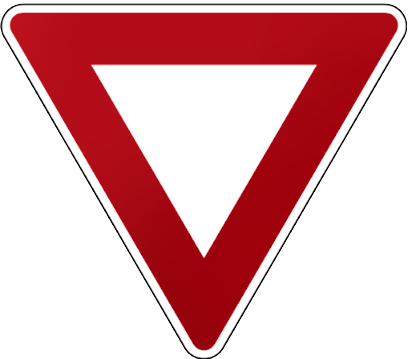

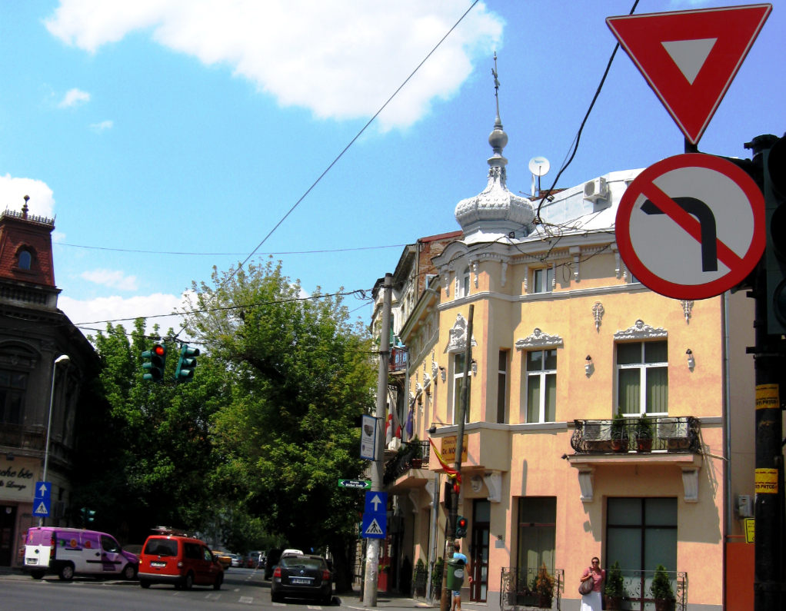

{}
ルーマニアのボラードは場所を特定するためのヒントが多い{}{}。ちっちゃいバージョンもある{}。
{}

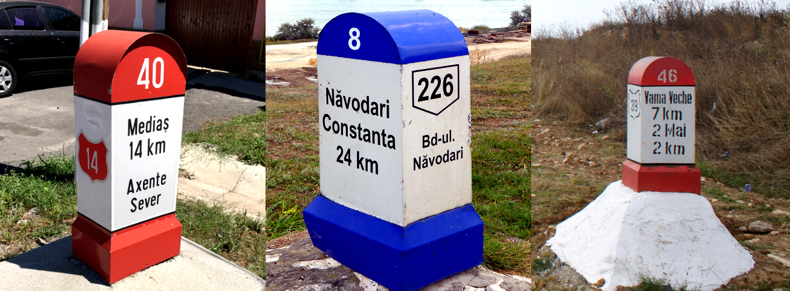

{}
「Ș・ș」・「Ț・ț」のような下に点（コンマビロー）が付いたSとTはルーマニアとモルドバで使用されるが、モルドバにはストリートビューがない。「Ļ・ļ」ならば{}。
{}

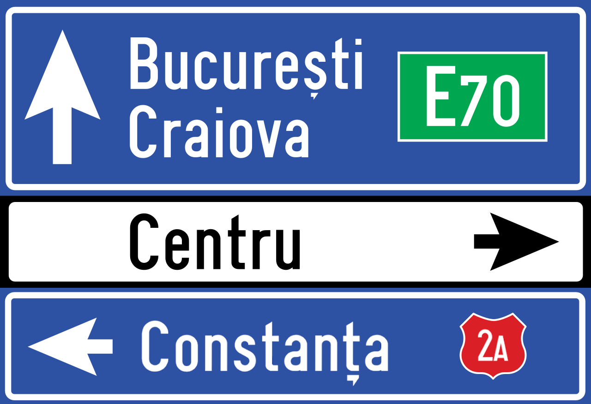

{}
道路番号の形が特徴的{}
{}

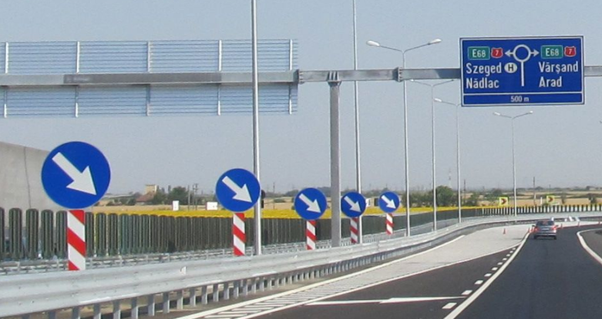

By <a href="//commons.wikimedia.org/wiki/User:Nenea_hartia" title="User:Nenea hartia">Nenea hartia</a> - Own work, <a href="https://creativecommons.org/licenses/by-sa/4.0" title="Creative Commons Attribution-Share Alike 4.0">CC BY-SA 4.0</a>, <a href="https://commons.wikimedia.org/w/index.php?curid=49508175">Link</a>

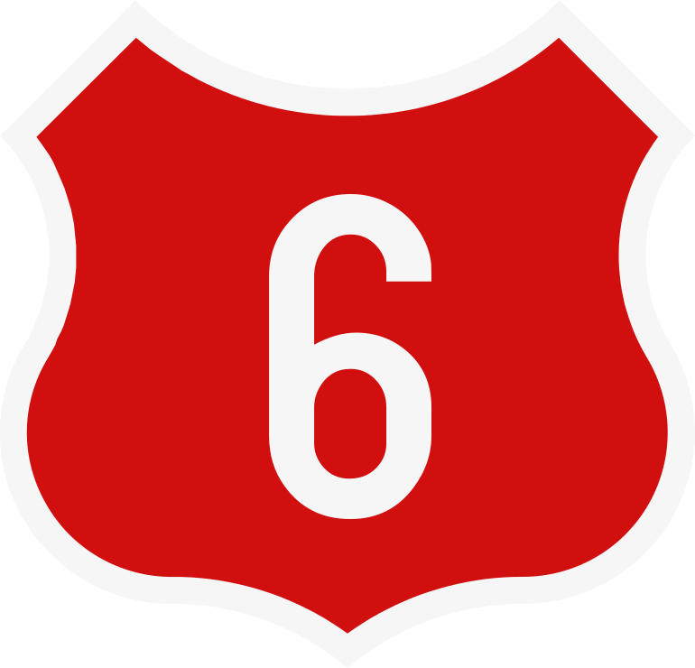
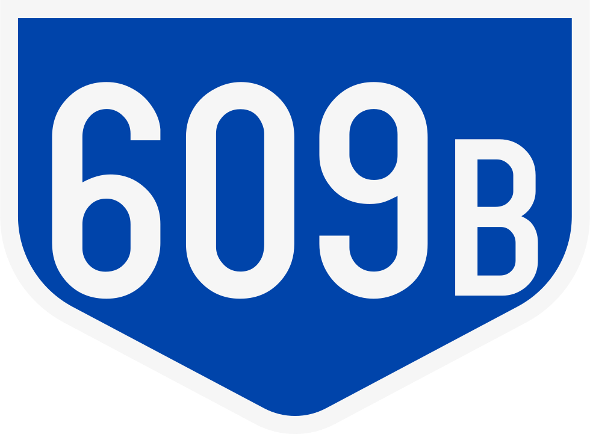

{}
ルーマニアは標識の裏側が黒っぽい時が多い{}。また横断歩道の標識が黄色い線で囲まれていることがある{}。
{}

{}ヨーロッパでは他に{}・{}・{}・{}・{}などで裏が黒いことが多め。
{}

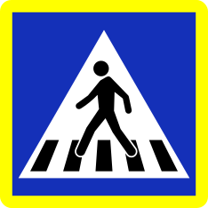

{}
左がポーランド、右がルーマニアのガードレール。ポーランドのガードレールは角ばっているが、ルーマニアは角ばっていないことが多い{}{}。
{}

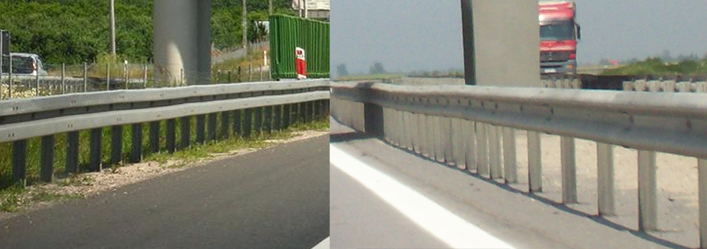

{}
{}
{}
イギリスみたいに通り名が書いてあることが多い
{}

<iframe src="https://www.google.com/maps/embed?pb=!4v1681169477862!6m8!1m7!1spsZjptAy5Hi0VI2dTCPBKA!2m2!1d46.38118929726235!2d25.81753321779553!3f30.30393844491686!4f-8.236900282330424!5f3.325193203789971" width="295" height="295" style="border:0;" allowfullscreen="" loading="lazy" referrerpolicy="no-referrer-when-downgrade"></iframe>
<iframe src="https://www.google.com/maps/embed?pb=!4v1681169535511!6m8!1m7!1sI3s3HSbsw0r5eue4gQulmA!2m2!1d46.38150520681397!2d25.81949501285196!3f318.58042425032454!4f-18.39379139049862!5f3.325193203789971" width="295" height="295" style="border:0;" allowfullscreen="" loading="lazy" referrerpolicy="no-referrer-when-downgrade"></iframe>

{}
家の前に何か箱があって、黄色いパイプが伸びている{}。
{}

<iframe src="https://www.google.com/maps/embed?pb=!4v1680051820686!6m8!1m7!1sZ54VOKNp_U5NgbySWVZtQQ!2m2!1d44.33370267115343!2d23.75005123301861!3f345.2531907157949!4f-18.198736183769995!5f3.3211969354371154" width="295" height="295" style="border:0;" allowfullscreen="" loading="lazy" referrerpolicy="no-referrer-when-downgrade"></iframe>
<iframe src="https://www.google.com/maps/embed?pb=!4v1681169690078!6m8!1m7!1s1HUpdimAn6LXmnwt6Xy8cQ!2m2!1d47.65316069155358!2d26.22653748095559!3f190.54662613263915!4f-9.818147496222608!5f3.325193203789971" width="295" height="295" style="border:0;" allowfullscreen="" loading="lazy" referrerpolicy="no-referrer-when-downgrade"></iframe>

{}
{}

<iframe src="https://www.google.com/maps/embed?pb=!4v1691922555134!6m8!1m7!1s-HaDwQkAZNU0kKr3_fY3XQ!2m2!1d44.08537370293369!2d23.25785996474632!3f262.9994857988307!4f-8.812591107665511!5f2.755649721040019"width="295" height="295" style="border:0;" allowfullscreen="" loading="lazy" referrerpolicy="no-referrer-when-downgrade"></iframe>
<iframe src="https://www.google.com/maps/embed?pb=!4v1693753420485!6m8!1m7!1sLZJ8bWrNsu2ZM3grKGoYZg!2m2!1d44.88543285626029!2d25.63793520577835!3f344.8247273492445!4f-1.6894219920764186!5f1.591437045702341" width="295" height="295" style="border:0;" allowfullscreen="" loading="lazy" referrerpolicy="no-referrer-when-downgrade"></iframe>

{}
{}

<iframe src="https://www.google.com/maps/embed?pb=!4v1693753340530!6m8!1m7!1sLuY844Tkugn586mTqt9jYw!2m2!1d44.81517233163134!2d25.69458425900886!3f242.37262305312188!4f4.948132299859822!5f2.6360318257588844" width="295" height="295" style="border:0;" allowfullscreen="" loading="lazy" referrerpolicy="no-referrer-when-downgrade"></iframe>
<iframe src="https://www.google.com/maps/embed?pb=!4v1693753689286!6m8!1m7!1s07KoPHx0iKjn6Atq3OmcuA!2m2!1d46.15997827917551!2d28.09812776159574!3f87.97544027911947!4f2.094039384254529!5f2.361157493803028" width="295" height="295" style="border:0;" allowfullscreen="" loading="lazy" referrerpolicy="no-referrer-when-downgrade"></iframe>
<iframe src="https://www.google.com/maps/embed?pb=!4v1693753723050!6m8!1m7!1soWF0C5PNxqN6QXSiTjvRew!2m2!1d45.26867958493148!2d28.49525301320358!3f107.50781636354786!4f0.904070128791389!5f2.3580607011440367" width="295" height="295" style="border:0;" allowfullscreen="" loading="lazy" referrerpolicy="no-referrer-when-downgrade"></iframe>

{}
{}
{}
標高が高い部分が入り組んでいる（画像出典：<a href="https://maps-for-free.com/">https://maps-for-free.com/</a> ©<a href="https://www.openstreetmap.org/copyright">Openstreetmap</a> contributors）
{}

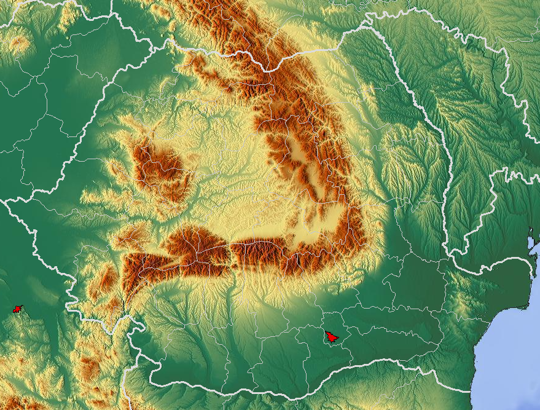

{}
{}

<iframe src="https://www.google.com/maps/embed?pb=!4v1681530525541!6m8!1m7!1scjPMceSjWFpdpA6t3W7bOg!2m2!1d44.70383661002219!2d22.73270512156558!3f223.96349039527334!4f-27.055447129058493!5f1.7562968972076964" width="590" height="270" style="border:0;" allowfullscreen="" loading="lazy" referrerpolicy="no-referrer-when-downgrade"></iframe>

{}
{}

    <h2 class="section-title">{}</h2>
    <ul class="rule-list">
        <li>ざっくりと北西にむかうほど裕福で地方ごとに伝統的な家がある{}{}
            <ul>
                <li>北西■■：オレンジの屋根が多く山脈より北西は他よりも裕福なエリア</li>
                <li>北東■：ウクライナのような雰囲気がある</li>
                <li>南■■■：首都近辺以外はブルガリアのような雰囲気</li>
            </ul>
        </li>
    </ul>

{}
{}

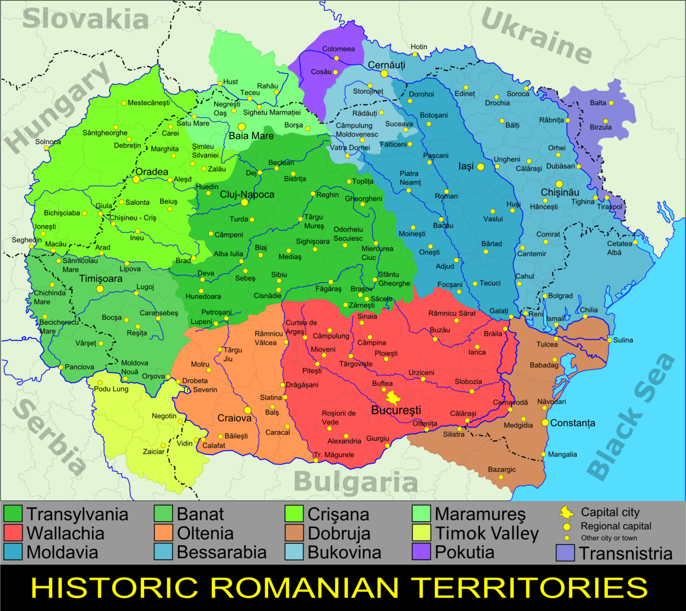

{}
{}
{}

<blockquote class="reddit-embed-bq" style="height:500px" data-embed-height="500"><a href="https://www.reddit.com/r/MapPorn/comments/3c59qn/percentage_of_romanian_homes_with_a_toilet_inside/">Percentage of Romanian homes with a toilet inside them [OC][1210x900]</a>  by<a href="https://www.reddit.com/user/Bezbojnicul/">u/Bezbojnicul</a> in<a href="https://www.reddit.com/r/MapPorn/">MapPorn</a></blockquote>

{}
トイレが屋内にある地域（北西）と屋外にある地域（南東）には経済的な差がある？
{}

{}
{}

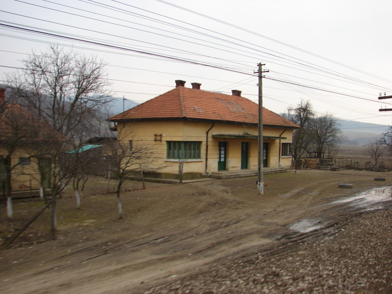
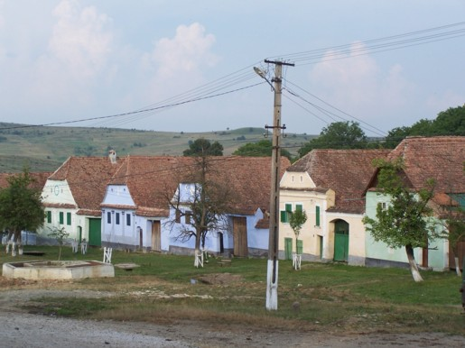

{}
TODO / 赤茶色の屋根や水色の壁？{{% ref "https://ja.wikipedia.org/wiki/%E3%83%88%E3%83%A9%E3%83%B3%E3%82%B7%E3%83%AB%E3%83%B4%E3%82%A1%E3%83%8B%E3%82%A2" "トランシルヴァニア" %}}。
{}
{}

{}

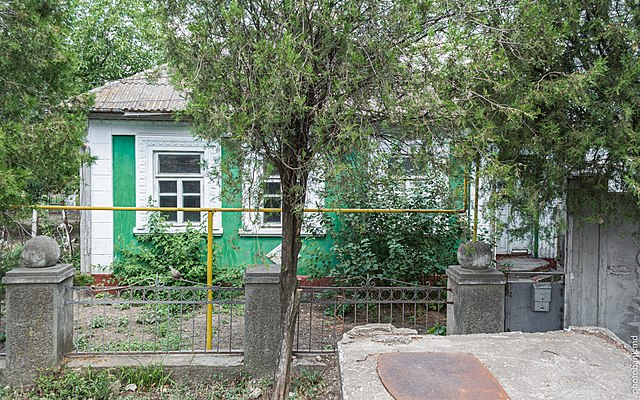

一番下の画像：By Cezar Suceveanu - Own work, <a href="https://creativecommons.org/licenses/by/3.0" title="Creative Commons Attribution 3.0">CC BY 3.0</a>, <a href="https://commons.wikimedia.org/w/index.php?curid=8012929">Link</a>

{}
TODO / 銀色の素材の屋根やダクト{}。
{}
{}
{}

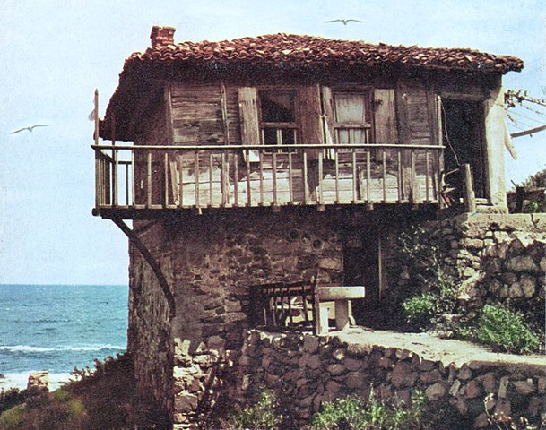

{}
TODO / ブルガリアっぽい建物があるかも。
{}
{}
{}

    <ul class="rule-list">
        <li>ドナウ・デルタと呼ばれるヨーロッパの三角州エリアの間を船で移動する区間がある{{% ref "https://ja.wikipedia.org/wiki/%E3%83%89%E3%83%8A%E3%82%A6%E3%83%BB%E3%83%87%E3%83%AB%E3%82%BF" "ドナウ・デルタ" %}}</li>
        <li> {}
            <ul>
                <li>ひまわりは東側で多く栽培されている</li>
                <li>コーンや菜種はカララシ県の周辺のフラットな地域で多く栽培されている{}</li>
            </ul>
        </li>
    </ul>

{}
{}
{}
ドナウ・デルタと呼ばれるヨーロッパの三角州エリアの間を船で移動する区間がある{}。
{}

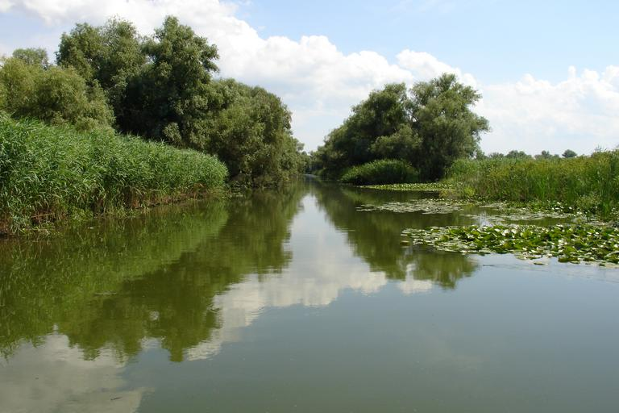

{}
{}
{}
東側に多いが西にも無いわけではないので参考程度。ひまわり畑があるとき、周辺のブルガリア・セルビア・ハンガリー・ウクライナのどこかにいるならばルーマニアの近くに寄せるのはアリな気がする。
{}

<iframe src="https://www.google.com/maps/embed?pb=!4v1684470352192!6m8!1m7!1sjbXvrKql7rKvUppx5CIKlQ!2m2!1d44.99873497073138!2d28.26096536490912!3f233.57437776441674!4f-2.810643552049882!5f1.5504235819947265" width="550" height="300" style="border:0;" allowfullscreen="" loading="lazy" referrerpolicy="no-referrer-when-downgrade"></iframe>

{}
{}

    <h2 class="section-title">{}</h2>
    <ul class="rule-list">
        <li>Transfăgărășanというファガラシュ山脈を越える道がある{}</li>
        <li>デケバルス王の彫刻がある{}</li>
        <li>首都周りの環状線はボラードに「CB」と書いてある</li>
    </ul>

{}
{}
{}
ルーマニアっぽくないと感じる（個人的な感想）ので間違えないようにする{}。
{}

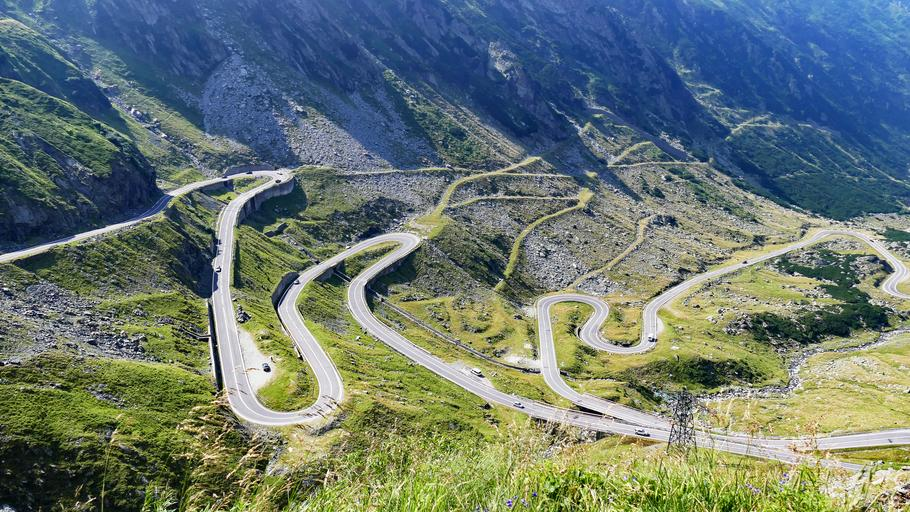

{}
{}

{}
一度来たら忘れないはず{}
{}

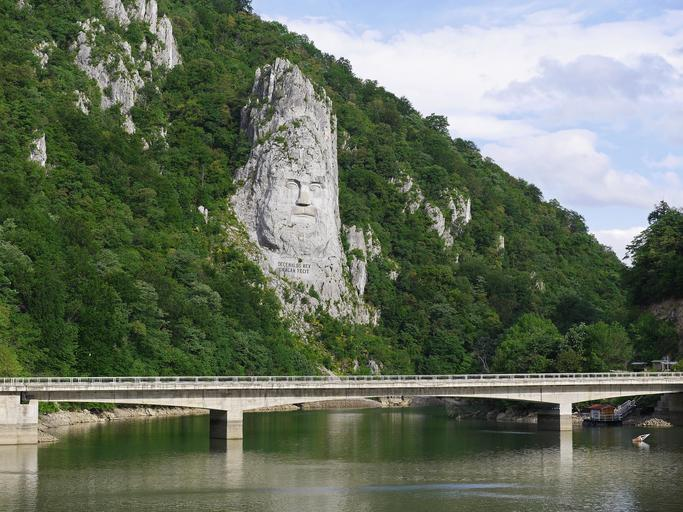

{}
{}

{}
「CB」を見たら首都の周りに行ってみる。道路がほぼ円形の形なので、この例だと道路の角度で北・南側のどちらかになる。そこから付近の地名を探して南側の場所だと絞り込める。
{}

<iframe src="https://www.google.com/maps/embed?pb=!4v1689253543807!6m8!1m7!1sAMy-_76RH-zXlP6rR6Of3A!2m2!1d44.33533224361797!2d26.11264253598017!3f57.39231935195243!4f-10.58605503694369!5f3.325193203789971" width="300" height="295" style="border:0;" allowfullscreen="" loading="lazy" referrerpolicy="no-referrer-when-downgrade"></iframe>

{}
{}

{}
<li>By <a href="//commons.wikimedia.org/wiki/User:-wuppertaler" title="User:-wuppertaler">-wuppertaler</a> - Own work, <a href="https://creativecommons.org/licenses/by-sa/4.0" title="Creative Commons Attribution-Share Alike 4.0">CC BY-SA 4.0</a>, <a href="https://commons.wikimedia.org/w/index.php?curid=121271756">Link</a></li>
<li>By <a href="//commons.wikimedia.org/wiki/User:Aisano" class="mw-redirect" title="User:Aisano">Aisano</a> - Self-photographed, <a href="https://creativecommons.org/licenses/by-sa/4.0" title="Creative Commons Attribution-Share Alike 4.0">CC BY-SA 4.0</a>, <a href="https://commons.wikimedia.org/w/index.php?curid=38136117">Link</a></li>
<li>By <a href="//commons.wikimedia.org/wiki/User:AleXXw" title="User:AleXXw">AleXXw</a> - Own work, <a href="https://creativecommons.org/licenses/by-sa/4.0" title="Creative Commons Attribution-Share Alike 4.0">CC BY-SA 4.0</a>, <a href="https://commons.wikimedia.org/w/index.php?curid=55018177">Link</a></li>
{}

