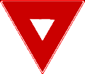

    <h2 class="section-title">{}</h2>
    <ul class="rule-list">
        <li>ドメインは.ro</li>
        <li>公用語はルーマニア語でラテン文字を使用する</li>
        <li>電柱の一番下に穴が空いていることが多く黄色のマーカーが付いていることがある{}</li>
        <li>「Ș・ș」・「Ț・ț」はルーマニアとモルドバで使用される</li>
        <li>ルーマニアのガードレールは角ばっていない</li>
        <li>ヨーロッパの中で圧倒的に太い▽の標識がある</li>
        <li class="no-evidence">家の前に何か箱があって黄色いパイプが伸びている</li>
        <li class="no-evidence">ひまわりの種の生産が多く周辺のセルビア・ウクライナ・ブルガリア・ハンガリーもルーマニアに近いエリアでひまわりの畑が多い気がする{}</li>
    </ul>
    {}
    

        
横断歩道標識：By <a href="//commons.wikimedia.org/w/index.php?title=User:Gigillo83&amp;amp;action=edit&amp;amp;redlink=1" class="new" title="User:Gigillo83 (page does not exist)">Gigillo83</a> - Own work, <a href="https://creativecommons.org/licenses/by-sa/4.0" title="Creative Commons Attribution-Share Alike 4.0">CC BY-SA 4.0</a>, <a href="https://commons.wikimedia.org/w/index.php?curid=40504943">Link</a>

    

{}
{}
{}
電柱に大き目の穴が一番下まで空いていることが多い{}が一番下が片面だけ埋まって見えることもある{}。黄色いマーカーが付いていることが多い。
{}

<iframe src="https://www.google.com/maps/embed?pb=!4v1688184557687!6m8!1m7!1s1q9X84JbsgqznIsNH4LXLQ!2m2!1d44.70535771556276!2d22.72859302476025!3f63.657922468801544!4f-11.33467294366821!5f3.1482143679014967" width="250" height="550" style="border:0;" allowfullscreen="" loading="lazy" referrerpolicy="no-referrer-when-downgrade"></iframe>

By Photo: <a href="//commons.wikimedia.org/wiki/User:Myrabella" title="User:Myrabella">Myrabella</a>&nbsp;/&nbsp;<a href="//commons.wikimedia.org/wiki/Main_Page" title="Main Page">Wikimedia Commons</a>, <a href="https://creativecommons.org/licenses/by-sa/3.0" title="Creative Commons Attribution-Share Alike 3.0">CC BY-SA 3.0</a>, <a href="https://commons.wikimedia.org/w/index.php?curid=20712710">Link</a>

{}
ヨーロッパの中で圧倒的に太い▽{}。左から順番に一番細い{}、まあまあ太いと思われる{}、そしてルーマニア。
{}

{}
ルーマニアのボラードは場所を特定するためのヒントが多い{}。ちっちゃいバージョンもある{}。
{}

{}
「Ș・ș」・「Ț・ț」のような下に点（コンマビロー）が付いたSとTはルーマニアとモルドバで使用されるが、モルドバにはストリートビューがない。「Ļ・ļ」ならば{}。
{}

{}
左がポーランド、右がルーマニアのガードレール。ポーランドのガードレールは角ばっているが、ルーマニアは角ばっていないことが多い{}{}。
{}

{}
横断歩道の標識が黄色い線で囲まれていることがある{}。またルーマニア{}・{}・{}・{}は標識の裏側が黒っぽい時が多いように思う。
{}

{}
{}
{}
イギリスみたいに通り名が書いてあることが多い
{}

<iframe src="https://www.google.com/maps/embed?pb=!4v1681169477862!6m8!1m7!1spsZjptAy5Hi0VI2dTCPBKA!2m2!1d46.38118929726235!2d25.81753321779553!3f30.30393844491686!4f-8.236900282330424!5f3.325193203789971" width="295" height="295" style="border:0;" allowfullscreen="" loading="lazy" referrerpolicy="no-referrer-when-downgrade"></iframe>
<iframe src="https://www.google.com/maps/embed?pb=!4v1681169535511!6m8!1m7!1sI3s3HSbsw0r5eue4gQulmA!2m2!1d46.38150520681397!2d25.81949501285196!3f318.58042425032454!4f-18.39379139049862!5f3.325193203789971" width="295" height="295" style="border:0;" allowfullscreen="" loading="lazy" referrerpolicy="no-referrer-when-downgrade"></iframe>

{}
家の前に何か箱があって、黄色いパイプが伸びている{}。
{}

<iframe src="https://www.google.com/maps/embed?pb=!4v1680051820686!6m8!1m7!1sZ54VOKNp_U5NgbySWVZtQQ!2m2!1d44.33370267115343!2d23.75005123301861!3f345.2531907157949!4f-18.198736183769995!5f3.3211969354371154" width="295" height="295" style="border:0;" allowfullscreen="" loading="lazy" referrerpolicy="no-referrer-when-downgrade"></iframe>
<iframe src="https://www.google.com/maps/embed?pb=!4v1681169690078!6m8!1m7!1s1HUpdimAn6LXmnwt6Xy8cQ!2m2!1d47.65316069155358!2d26.22653748095559!3f190.54662613263915!4f-9.818147496222608!5f3.325193203789971" width="295" height="295" style="border:0;" allowfullscreen="" loading="lazy" referrerpolicy="no-referrer-when-downgrade"></iframe>

{}
{}

<iframe src="https://www.google.com/maps/embed?pb=!4v1691922555134!6m8!1m7!1s-HaDwQkAZNU0kKr3_fY3XQ!2m2!1d44.08537370293369!2d23.25785996474632!3f262.9994857988307!4f-8.812591107665511!5f2.755649721040019"width="295" height="295" style="border:0;" allowfullscreen="" loading="lazy" referrerpolicy="no-referrer-when-downgrade"></iframe>

{}
{}
{}
標高が高い部分が入り組んでいる（画像出典：<a href="https://maps-for-free.com/">https://maps-for-free.com/</a> ©<a href="https://www.openstreetmap.org/copyright">Openstreetmap</a> contributors）
{}

{}
{}

<iframe src="https://www.google.com/maps/embed?pb=!4v1681530525541!6m8!1m7!1scjPMceSjWFpdpA6t3W7bOg!2m2!1d44.70383661002219!2d22.73270512156558!3f223.96349039527334!4f-27.055447129058493!5f1.7562968972076964" width="590" height="270" style="border:0;" allowfullscreen="" loading="lazy" referrerpolicy="no-referrer-when-downgrade"></iframe>

{}
{}

    <h2 class="section-title">{}</h2>
    <ul class="rule-list">
        <li> {}
            <ul>
                <li>ひまわりは東側で多く栽培されている</li>
                <li>コーンや菜種はカララシ県の周辺のフラットな地域で多く栽培されている{}</li>
            </ul>
        </li>
        <li class="no-evidence">野生の赤い花は南東？{}{}</li>
    </ul>

{}
{}

<iframe src="https://www.google.com/maps/embed?pb=!4v1684470352192!6m8!1m7!1sjbXvrKql7rKvUppx5CIKlQ!2m2!1d44.99873497073138!2d28.26096536490912!3f233.57437776441674!4f-2.810643552049882!5f1.5504235819947265" width="550" height="300" style="border:0;" allowfullscreen="" loading="lazy" referrerpolicy="no-referrer-when-downgrade"></iframe>

{}
東側に多いが西にも無いわけではないので参考程度。ひまわり畑があるとき、周辺のブルガリア・セルビア・ハンガリー・ウクライナのどこかにいるならばルーマニアの近くに寄せるのはアリな気がする。
{}
{}
{}

    <h2 class="section-title">{}</h2>
    <ul class="rule-list">
        <li>首都周りの環状線は「DNCB」と名前が付いていてボラードに「CB」と書いてある。ボラードを見つけたら角度と地名でかなり近づけるはず。</li>
        <li class="no-evidence">観光地でもある暖かそうな港町で電柱下半分に色が塗られている{{% ref "https://en.wikipedia.org/wiki/Constan%C8%9Ba" "コンスタンツァ" %}}</li>
        <li class="no-evidence">{}・{}との国境付近と北東のエリアで船に乗っている</li>
    </ul>

{}
{}

<iframe src="https://www.google.com/maps/embed?pb=!4v1689253543807!6m8!1m7!1sAMy-_76RH-zXlP6rR6Of3A!2m2!1d44.33533224361797!2d26.11264253598017!3f57.39231935195243!4f-10.58605503694369!5f3.325193203789971" width="300" height="295" style="border:0;" allowfullscreen="" loading="lazy" referrerpolicy="no-referrer-when-downgrade"></iframe>

{}
「CB」を見たら首都の周りに行ってみる。道路がほぼ円形の形なので、この例だと道路の角度で北・南側のどちらかになる。そこから付近の地名を探して南側の場所だと絞り込める。
{}
{}
{}

<iframe src="https://www.google.com/maps/embed?pb=!4v1691913337071!6m8!1m7!1ssdnyvplPOQNIvfaq0yN4xA!2m2!1d44.22487704598667!2d28.6284569131045!3f264.2490233992116!4f2.6447174271606144!5f0.7820865974627469"width="295" height="295" style="border:0;" allowfullscreen="" loading="lazy" referrerpolicy="no-referrer-when-downgrade"></iframe>
<iframe src="https://www.google.com/maps/embed?pb=!4v1691913444951!6m8!1m7!1sS-X41jFN33k_K0ZVZ3aXPw!2m2!1d44.18015270430237!2d28.63585817879827!3f107.30356722506777!4f1.9108977231148145!5f0.7670595936560078"width="295" height="295" style="border:0;" allowfullscreen="" loading="lazy" referrerpolicy="no-referrer-when-downgrade"></iframe>

{}
タクシーの扉に市の紋章（二人の間に赤い旗があるマーク）があるかも？
{}
{}
{}

<iframe src="https://www.google.com/maps/embed?pb=!4v1691914547080!6m8!1m7!1sT1Yxm5lwiEyFsPYYxPdm5g!2m2!1d43.80474330320947!2d23.72309009075511!3f96.21002723590657!4f-5.4056404449595306!5f0.4000000000000002"width="295" height="295" style="border:0;" allowfullscreen="" loading="lazy" referrerpolicy="no-referrer-when-downgrade"></iframe>
<iframe src="https://www.google.com/maps/embed?pb=!4v1691914416912!6m8!1m7!1sdTJheMLqJUwsPGOhOInC3g!2m2!1d45.18594866576051!2d28.78978232589126!3f332.57048214215274!4f-7.446934373909983!5f0.4000000000000002"width="295" height="295" style="border:0;" allowfullscreen="" loading="lazy" referrerpolicy="no-referrer-when-downgrade"></iframe>

{}
{}

{}
<li>By <a href="//commons.wikimedia.org/wiki/User:-wuppertaler" title="User:-wuppertaler">-wuppertaler</a> - Own work, <a href="https://creativecommons.org/licenses/by-sa/4.0" title="Creative Commons Attribution-Share Alike 4.0">CC BY-SA 4.0</a>, <a href="https://commons.wikimedia.org/w/index.php?curid=121271756">Link</a></li>
<li>By <a href="//commons.wikimedia.org/wiki/User:Aisano" class="mw-redirect" title="User:Aisano">Aisano</a> - Self-photographed, <a href="https://creativecommons.org/licenses/by-sa/4.0" title="Creative Commons Attribution-Share Alike 4.0">CC BY-SA 4.0</a>, <a href="https://commons.wikimedia.org/w/index.php?curid=38136117">Link</a></li>
<li>By <a href="//commons.wikimedia.org/wiki/User:AleXXw" title="User:AleXXw">AleXXw</a> - Own work, <a href="https://creativecommons.org/licenses/by-sa/4.0" title="Creative Commons Attribution-Share Alike 4.0">CC BY-SA 4.0</a>, <a href="https://commons.wikimedia.org/w/index.php?curid=55018177">Link</a></li>
{}

