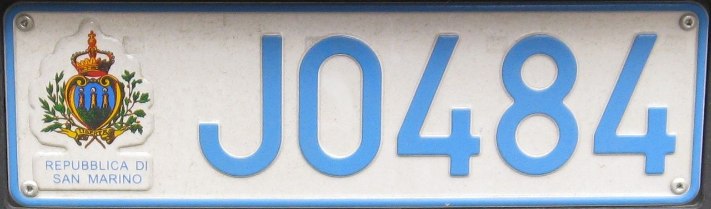
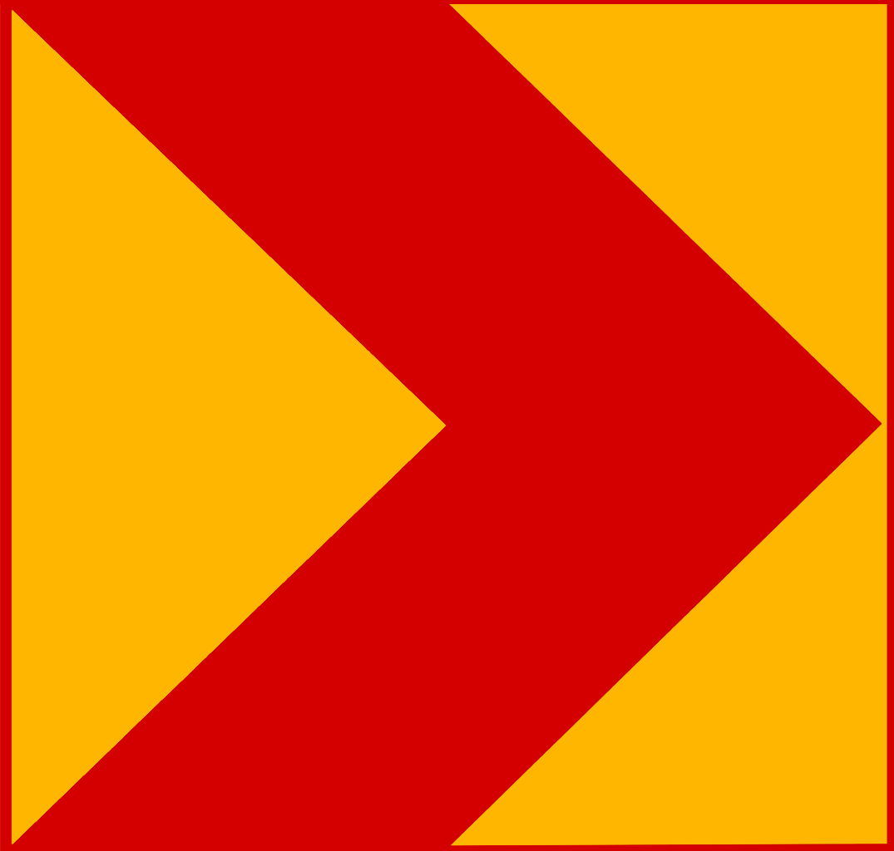

    <h2 class="section-title">{}</h2>
    <ul class="rule-list">
        <li>ドメインは.sm</li>
        <li>言語はイタリア語</li>
        <li>ナンバープレートは前後についていて薄い水色に見える</li>
        <li>サンマリノのシェブロンは赤で背景がオレンジだがイタリアは白で背景が黒</li>
        <li>{}と同じ通り看板が使われていて、青くて角が丸い線で囲われている</li>
        <li class="no-evidence">全体的に山がちできれいな直線の道路があまりない</li>
    </ul>
    {}

{}
{}

{}
ナンバープレートは前後についていて水色に見える。ヨーロッパに居てナンバープレートの左側に青線がないとき、サンマリノ・{}・{}・{}などを一度考えてみる。
{}

<iframe src="https://www.google.com/maps/embed?pb=!4v1683305747381!6m8!1m7!1sqLHEp9hIIZUfWX8n_9_raw!2m2!1d43.94710449247932!2d12.45571351902688!3f170.13147030316836!4f-12.825422101072931!5f3.325193203789971" width="295" height="295" style="border:0;" allowfullscreen="" loading="lazy" referrerpolicy="no-referrer-when-downgrade"></iframe>

{}

By Seth Schoenderivative work: TheFlyingDutchman (talk) - San_Marino_license_plate.jpg, <a href="https://creativecommons.org/licenses/by-sa/2.0/deed.ja">CC BY-SA 2.0</a>, <a href="https://commons.wikimedia.org/w/index.php?curid=9297224">Wikipedia Commons(Link)</a>
{}

{}
シェブロンの色がイタリアと異なる（例<a href="https://goo.gl/maps/tjT4TpDZhg9ZEtY79">①</a>・<a href="https://goo.gl/maps/YgYyFGWcZ9VSxcSz6">②</a>）。左がサンマリノ・右がイタリア{}。
{}

{}
{}