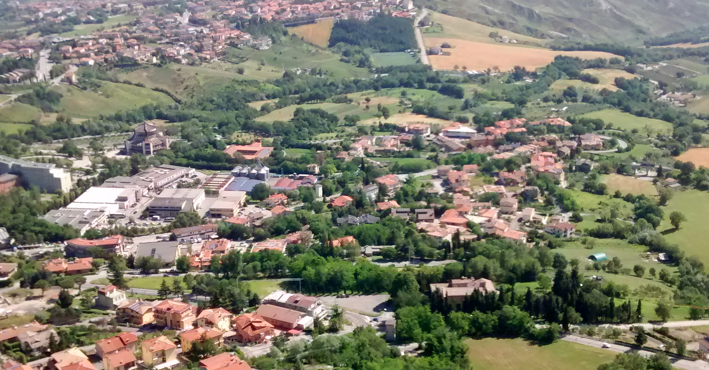
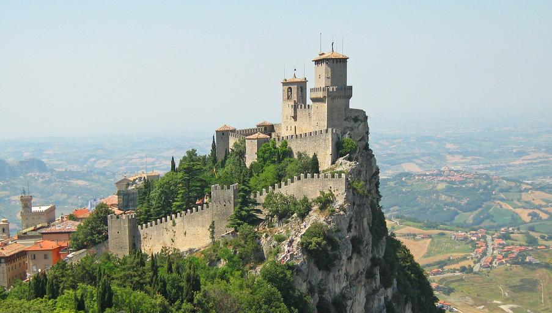

    <h2 class="section-title">{}</h2>
    <ul class="rule-list">
        <li>ドメインは.sm</li>
        <li>言語はイタリア語</li>
        <li>ナンバープレートは前後についていて薄い水色に見える</li>
        <li>サンマリノのシェブロンは赤で背景がオレンジだがイタリアは白で背景が黒</li>
        <li>{}と同じ通り看板が使われている</li>
    </ul>
    {}

{}
{}

{}
シェブロンの色がイタリアと異なる{}。左がサンマリノ・右がイタリア{}。
{}

<iframe src="https://www.google.com/maps/embed?pb=!4v1721233261089!6m8!1m7!1sv3qJ7As-TQDsQu6jcuB6nQ!2m2!1d43.9466488737296!2d12.45883792043881!3f247.82909812895753!4f-3.4906638879723317!5f0.7820865974627469" width="90%" height="300" style="border:0;" allowfullscreen="" loading="lazy" referrerpolicy="no-referrer-when-downgrade"></iframe>

{}
平坦な場所が無く、まっすぐな道もほとんど存在しない{}。
{}

{}
こんな感じの崖と山がある{}。
{}

{}
ナンバープレートは前後についていて水色に見える。ヨーロッパに居てナンバープレートの左側に青線がないとき、サンマリノ・{}・{}・{}・{}を一度考えてみる。
{}

{}

By Seth Schoenderivative work, <a href="https://creativecommons.org/licenses/by-sa/2.0/deed.ja">CC BY-SA 2.0</a>, <a href="https://commons.wikimedia.org/w/index.php?curid=9297224">Wikipedia Commons(Link)</a>
{}

{}
道幅が狭く路肩が少ない{}{{% ref "https://ja.wikipedia.org/wiki/%E8%B7%AF%E8%82%A9" "路肩" %}}。１車線でカーブや起伏がある道が多い{}。周辺のイタリア国内とあまり大きな違いはないので注意。
{}

{}
{}