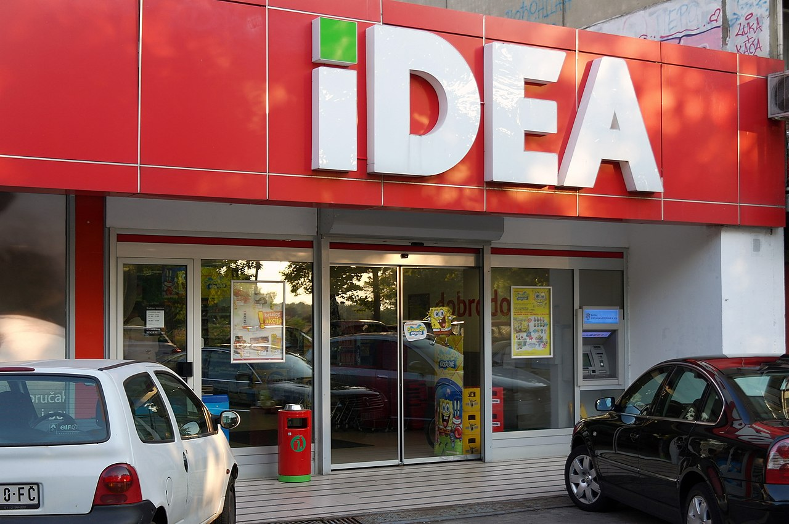
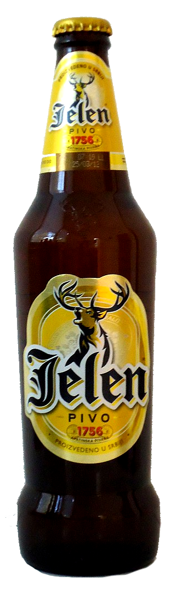
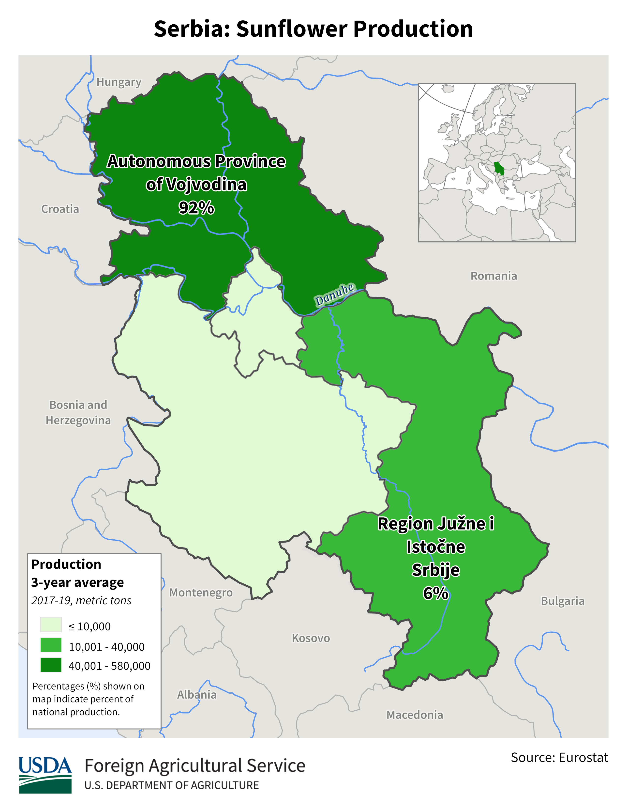
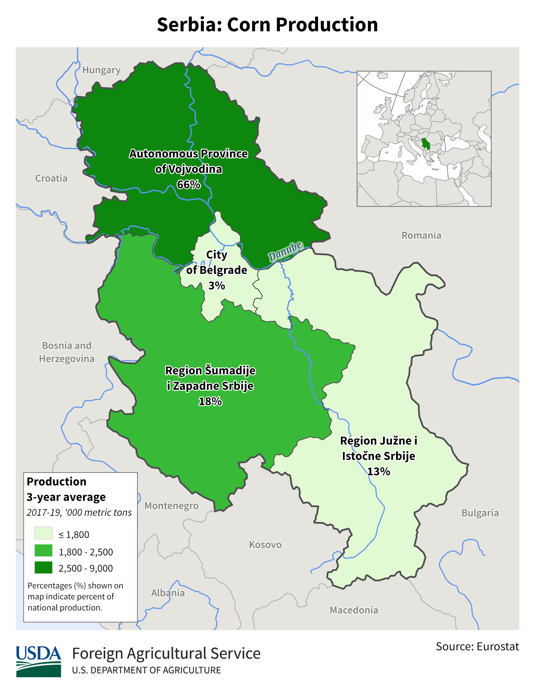

    <h2 class="section-title">{}</h2>
    <ul class="rule-list">
        <li>ドメインは.rs</li>
        <li>セルビア語（српски језик）が公用語でキリル文字とラテン文字が混ざっている</li>
        <li>反射板が偏った薄いボラード</li>
        <li>「Ћ・ћ」の文字を街中で見かけたならばセルビアの可能性が高い</li>
        <li>ヨーロッパで白背景に黒の矢印のシェブロンを使うのはここだけ</li>
        <li class="no-evidence">Google Carのアンテナが見えないことが多い</li>
    </ul>
    {}

{}
{}
{}
<b>反射板が偏った薄い</b>ボラード。またセルビアはガードレールが角ばっている{}。ボスニア・ヘルツェゴビナに隣接している国は角張っていると頭に入れておく。ただし岩肌が見えていたりGoogle Carのアンテナが見えているならば{}を考えてみる。
{}

<iframe src="https://www.google.com/maps/embed?pb=!4v1679484005514!6m8!1m7!1sWz8RFN0-CgzApjtxkFwF-w!2m2!1d43.83999275217523!2d21.6932567136369!3f99.09302692952393!4f-9.091950867102014!5f3.2939988331476435" width="295" height="295" style="border:0;" allowfullscreen="" loading="lazy" referrerpolicy="no-referrer-when-downgrade"></iframe>
<iframe src="https://www.google.com/maps/embed?pb=!4v1679484038664!6m8!1m7!1sg3a68LbDjAXKg7a2inWuPQ!2m2!1d43.84000316236607!2d21.69343511255818!3f355.8746463407556!4f-17.860709868089188!5f3.325193203789971" width="295" height="295" style="border:0;" allowfullscreen="" loading="lazy" referrerpolicy="no-referrer-when-downgrade"></iframe>

{}
「Ћ」の文字でストリートビューがあるのはセルビアのみ。太字のフォントだと小文字の「ћ」の斜線が見にくいことがあるので注意。この文字はセルビアの一般的な名前での使用が多い{}ので人名が書かれたポスターとかを見るのもあり？
{}

By <a href="//commons.wikimedia.org/w/index.php?title=User:11sasapus11&amp;amp;action=edit&amp;amp;redlink=1" class="new" title="User:11sasapus11 (page does not exist)">11sasapus11</a> - Own work, <a href="https://creativecommons.org/licenses/by-sa/4.0" title="Creative Commons Attribution-Share Alike 4.0">CC BY-SA 4.0</a>, <a href="https://commons.wikimedia.org/w/index.php?curid=85021744">Link</a>

{}
セルビアと{}全域にIDEAというスーパーマーケットがある{}。セルビアにのみDelhaize SerbiaというスーパーマーケットチェーンがありロゴにMAXIと書いてある{}。他に街中でよく見るロゴはFricomやJelenなど（例<a href="https://goo.gl/maps/nJyL3T1FLVhc96Dq7">①</a>・<a href="https://goo.gl/maps/DjLNsVvDLbJCqYqV6">②</a>）。
{}

{}
白背景に黒の矢印のシェブロンはセルビアに多い。
{}

{}
{}

<iframe src="https://www.google.com/maps/embed?pb=!4v1679484104985!6m8!1m7!1sWz8RFN0-CgzApjtxkFwF-w!2m2!1d43.83999275217523!2d21.6932567136369!3f116.84126184225822!4f-17.559530561812622!5f3.281609227185739" width="295" height="295" style="border:0;" allowfullscreen="" loading="lazy" referrerpolicy="no-referrer-when-downgrade"></iframe>
<iframe src="https://www.google.com/maps/embed?pb=!4v1679483854408!6m8!1m7!1sPOiP55mn3TfXRV-WXIJ3xw!2m2!1d43.3209387531642!2d21.89630008069384!3f190.68095892746902!4f-7.9796872044064315!5f3.325193203789971" width="295" height="295" style="border:0;" allowfullscreen="" loading="lazy" referrerpolicy="no-referrer-when-downgrade"></iframe>

{}
{}

    <h2 class="section-title">{}</h2>
    <ul class="rule-list">
        <li>農作物の生産は北部に多い
            <ul>
                <li>ひまわりの畑があるのはほとんど北部</li>
                <li>データ提供元：<a href="https://ipad.fas.usda.gov/rssiws/al/europe_cropprod.aspx">Europe - Crop Production Maps(U.S. Department of Agriculture)</a></li>
            </ul>
        </li>
    </ul>

{}
{}

{}
90%が北部に集中している
{}

<iframe src="https://www.google.com/maps/embed?pb=!4v1684814260255!6m8!1m7!1sdCRRSekGYnJaxb9EO9y16Q!2m2!1d44.80272179830468!2d21.10631427113424!3f350.50688575763337!4f-3.942378894542756!5f3.165673307578776" width="400" height="200" style="border:0;" allowfullscreen="" loading="lazy" referrerpolicy="no-referrer-when-downgrade"></iframe>

{}
{}

<iframe src="https://www.google.com/maps/embed?pb=!4v1684814125370!6m8!1m7!1sLUHQtDAW8O4qYtTEqsPcPw!2m2!1d45.76833028335478!2d19.19222245694041!3f183.39320962680003!4f-6.913770601882405!5f1.6846646614112646" width="295" height="295" style="border:0;" allowfullscreen="" loading="lazy" referrerpolicy="no-referrer-when-downgrade"></iframe>
<iframe src="https://www.google.com/maps/embed?pb=!4v1684814132818!6m8!1m7!1sdjmwDMwJXQMraELdW6rsjg!2m2!1d45.78952535461075!2d19.97861671609926!3f188.596094617829!4f-2.7633637452743613!5f0.7820865974627469" width="295" height="295" style="border:0;" allowfullscreen="" loading="lazy" referrerpolicy="no-referrer-when-downgrade"></iframe>

{}
{}