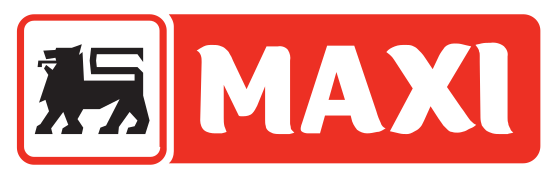

    <h2 class="section-title">{}</h2>
    <ul class="rule-list">
        <li>ドメインは.rs</li>
        <li>セルビア語（српски језик）が公用語でキリル文字とラテン文字が混ざっている</li>
        <li>反射板が偏った薄いボラード</li>
        <li>「Ђ・ђ・Ћ・ћ」の文字を街中で見かけたならばセルビアの可能性が高い</li>
        <li class="no-evidence">Google Carのアンテナが見えないことが多い</li>
        <li class="no-evidence">{}や{}より丸い電柱が多い</li>
    </ul>
    {}

{}
{}
{}
<b>反射板が偏った薄い</b>ボラード。またセルビアはガードレールが角ばっている{}。ボスニア・ヘルツェゴビナに隣接している国は角張っていると頭に入れておく。ただし岩肌が見えていたりGoogle Carのアンテナが見えているならば{}を考えてみる。モンテネグロにもセルビアに似たボラードがたまに見つかる{}。
{}

{}
「Ђ」や「Ћ」の文字でストリートビューがあるのはセルビアのみ{}{{% ref "https://ja.wikipedia.org/wiki/%D0%82" "Ђ" %}}。太字のフォントだと小文字の「ћ」の斜線が見にくいことがあるので注意。この文字はセルビアの一般的な名前での使用が多い{}ので人名が書かれたポスターとかを見るのもあり？
{}

{}
セルビアと{}全域にIDEAというスーパーマーケットがある{}。セルビアにのみDelhaize SerbiaというスーパーマーケットチェーンがありロゴにMAXIと書いてある{}。他に街中でよく見るロゴはFricomやJelenなど{}。
{}

{}
<b>白</b>背景に<b>黒</b>の矢印のシェブロンはセルビア・{}・{}以外はあまり見かけないように思う。
{}

{}
{}

<iframe src="https://www.google.com/maps/embed?pb=!4v1679484104985!6m8!1m7!1sWz8RFN0-CgzApjtxkFwF-w!2m2!1d43.83999275217523!2d21.6932567136369!3f116.84126184225822!4f-17.559530561812622!5f3.281609227185739" width="295" height="295" style="border:0;" allowfullscreen="" loading="lazy" referrerpolicy="no-referrer-when-downgrade"></iframe>
<iframe src="https://www.google.com/maps/embed?pb=!4v1679483854408!6m8!1m7!1sPOiP55mn3TfXRV-WXIJ3xw!2m2!1d43.3209387531642!2d21.89630008069384!3f190.68095892746902!4f-7.9796872044064315!5f3.325193203789971" width="295" height="295" style="border:0;" allowfullscreen="" loading="lazy" referrerpolicy="no-referrer-when-downgrade"></iframe>

{}
{}

    <h2 class="section-title">{}</h2>
    <ul class="rule-list">
        <li>農作物の生産は平坦な場所が多い北部に多い
            <ul>
                <li>ひまわりの畑があるのはほとんど北部にある</li>
                <li>コーンもひまわりと同様で北部に多い</li>
                <li>南部のほとんどの地域は山がち{}で生産できる場所は限られている</li>
                <li>データ提供元：<a href="https://ipad.fas.usda.gov/rssiws/al/europe_cropprod.aspx">Europe - Crop Production Maps(U.S. Department of Agriculture)</a></li>
            </ul>
        </li>
        <li class="no-evidence">{}との国境付近で船に乗っている{}</li>
    </ul>

{}
{}

{}
ひまわり畑の90%が平坦で農業がしやすい北部に集中している{}。フランスやスペインではないと分かっていてひまわり畑がたくさんあるならば、基本的にルーマニア周辺と考えて良いと思う。
{}

{}
{}

{}
コーン畑もひまわりと同じく平坦な北部にい多い{}。
{}

{}
{}

