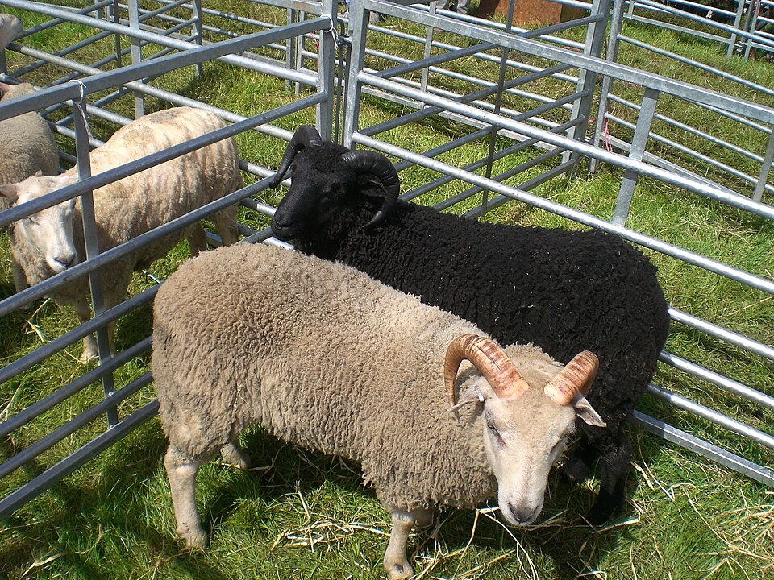

    <h2 class="section-title">{}</h2>
    <ul class="rule-list">
        <li>場所はイギリスの最北部{}</li>
        <li>車は左側通行</li>
        <li>基本的にはイギリス本土と同じ特徴を持っているが生垣はほとんど無い</li>
        <li class="no-evidence">曇りの日が一般的でストリートビューも雲が多い時がある{{% ref "https://ja.wikipedia.org/wiki/%E3%82%B7%E3%82%A7%E3%83%88%E3%83%A9%E3%83%B3%E3%83%89%E8%AB%B8%E5%B3%B6" "シェトランド諸島#気候" %}}</li>
        <li class="no-evidence">土着の樹木は崖や離島以外は存在しない</li>
    </ul>
    {}

{}
{}
{}
低木も含め野生の木がほぼ存在しない{}。本土側のスコットランドのようにPassing placeの看板が散見される。{}のように岩肌がたくさん見える感じならば本土側に行っていいと思う。
{}

{}
Cattle Gridと呼ばれる金属棒を平行に並べた橋がある{}。こうすることで羊や牛がエリアから外に逃げないようになる。牧畜が一般的な場所ならどこでもあると思われるがシェットランド諸島はこれが多いように思う{}。
{}

{}
シェトランド・シープがいる{}{{% ref "https://ja.wikipedia.org/wiki/%E3%82%B7%E3%82%A7%E3%83%88%E3%83%A9%E3%83%B3%E3%83%89%E3%83%BB%E3%82%B7%E3%83%BC%E3%83%97" "シェットランドシープ" %}}。
{}

{}
{}
