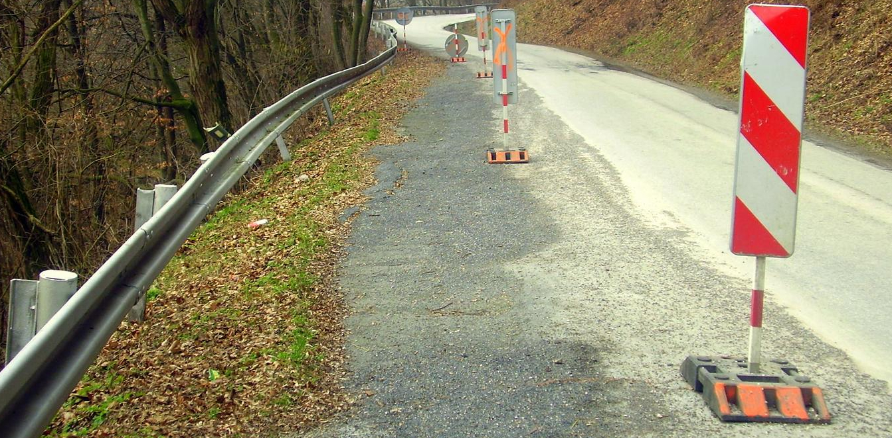
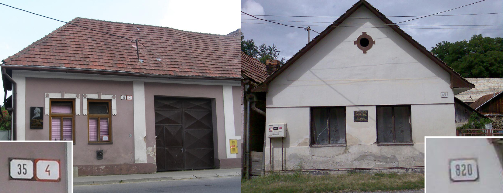
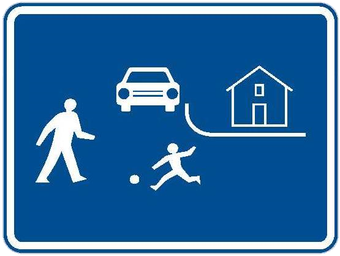
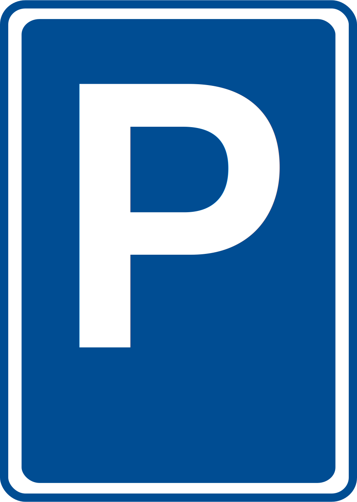
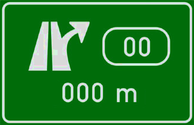
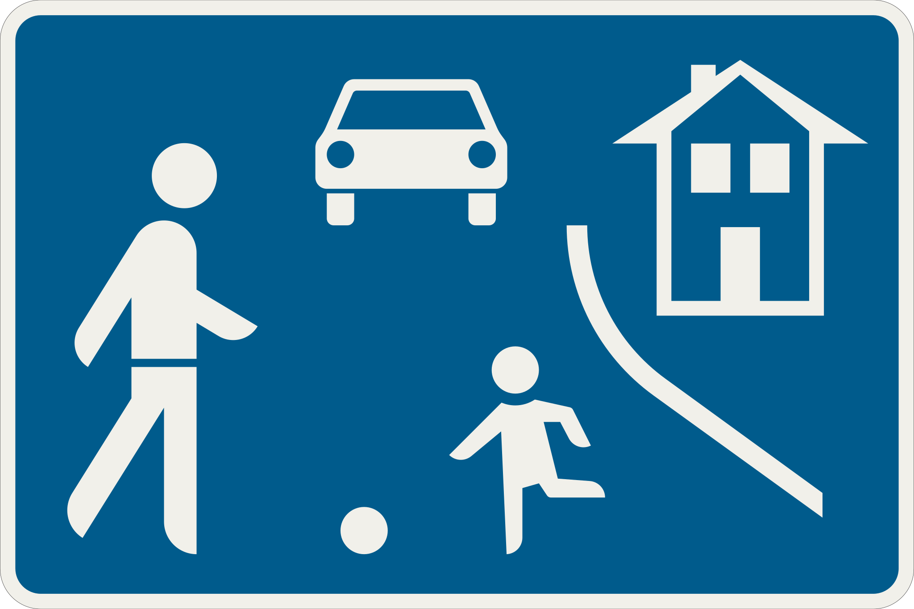
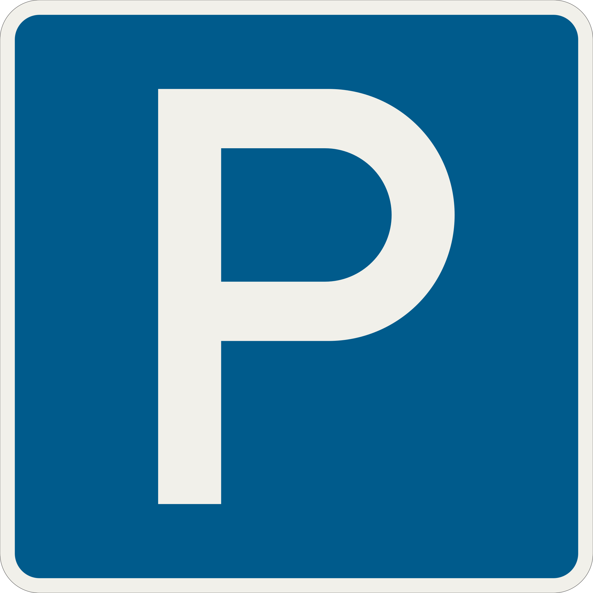
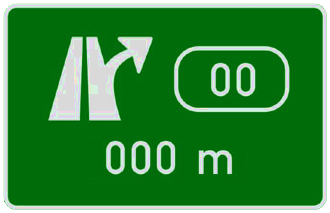

    <h2 class="section-title">{}</h2>
    <ul class="rule-list">
        <li>ドメインは.sk</li>
        <li>ボラードはチェコと同じく黒い領域に反射板が2枚</li>
        <li>チェコ語とスロバキア語に違いがある
            <ul>
                <li>「<b>Ř</b>」ならチェコ・「<b>Ŕ</b>」ならスロバキア</li>
                <li>「<b>Ľ</b>」が合ったらほぼスロバキア{{% ref "https://ja.wikipedia.org/wiki/%C4%BD" "Ľ" %}}。
                    <ul>
                        <li>「<b>Ļ</b>」なら{}</li>
                        <li>「<b>Ł</b>」なら{}</li>
                    </ul>
                </li>
            </ul>
        </li>
        <li>チェコとスロバキアのみthin-B profileと呼ばれるタイプのガードレールを使用する{}</li>
        <li>家に赤や青の背景に白で文字が書かれていればチェコかも。白の背景に黒で文字が書かれていればスロバキアの可能性が高い{}。</li>
        <li>スロバキアは全体的にタトラ山脈の影響で全体的に山がち</li>
        <li>ブラチスラバとそれ以外との間に経済的な格差があり、一人当たりGDPについて2021年時点でチェコは26,410米ドル・スロバキアは21,050米ドル{}。</li>
    </ul>
    {}

{}
{}

{}
ボラードとガードレール。ボラードは黒い領域に反射板が2枚ありガードレールは角ばっていて真ん中の凹みの幅が広いのが特徴的{}。ボラードとガードレールは{}にも同じものがある。
{}

{}
家の番地が白の背景に黒で文字が書かれていればスロバキアの可能性が高い。一方で赤や青の背景に白で文字が書かれていればチェコかも{}{}。100%当たるわけではない。
{}

{}
チェコの標識は背景色と同じ縁がある時が多いがスロバキアはない時が多い{}。
上がチェコ、下がスロバキア{}。ただし町の入口看板など一部に例外あり。
{}

    <table class="compare-table">
        <tr>
            <td>看板の種類</td>
            <td>チェコ</td>
            <td>スロバキア</td>
        </tr>
        <tr>
            <td>町の出入り口</td>
            <td>{}</td>
            <td>{}</td>
        </tr>
        <tr>
            <td>横断歩道</td>
            <td>{}</td>
            <td>{}</td>
        </tr>
        <tr>
            <td>ZONE</td>
            <td>{}</td>
            <td>{}</td>
        </tr>
        <tr>
            <td>道路案内の看板</td>
            <td>{}</td>
            <td>{}</td>
        </tr>
        <tr>
            <td>道路番号</td>
            <td>{}</td>
            <td>{}</td>
        </tr>
        <tr>
            <td>通り抜け不可</td>
            <td>{}</td>
            <td>{}</td>
        </tr>
        <tr>
            <td>駐車エリア(P)</td>
            <td>{}</td>
            <td>{}</td>
        </tr>
        <tr>
            <td>角の画像の例</td>
            <td style="background-color:#413F40;"></td>
            <td style="background-color:#413F40;"></td>
        </tr>
    </table>

{}
{}とスロバキアの平坦な場所はこんな感じの並木道が見られる{}。片側だけの場合もある{}。
{}

{}
スロバキアは円形の標識の一部にすごい太いフォントを使用していることがある{}
{}

{}
{}

<iframe src="https://www.google.com/maps/embed?pb=!4v1682028228774!6m8!1m7!1syzhkPYZX-csqei7oLhfn-Q!2m2!1d49.04594409804296!2d19.33144226955884!3f231.73320361993967!4f-33.50072526701923!5f3.325193203789971" width="295" height="295" style="border:0;" allowfullscreen="" loading="lazy" referrerpolicy="no-referrer-when-downgrade"></iframe>
<iframe src="https://www.google.com/maps/embed?pb=!4v1682096984922!6m8!1m7!1sS5DH2bQy5ZHg0P7joEC_GQ!2m2!1d48.85622059897239!2d20.94864393960423!3f127.77607982349431!4f-9.494063724722722!5f3.288496370313581" width="295" height="295" style="border:0;" allowfullscreen="" loading="lazy" referrerpolicy="no-referrer-when-downgrade"></iframe>

{}
{}

{}
チェコと共通なので{}を参照してください。
{}

{}
{}

    <h2 class="section-title">{}</h2>
    <ul class="rule-list">
        <li>おそらく都市の旗に合わせた色のバスやポールがある
            <ul>
                <li class="no-evidence">Košiceはバスがが黄色と水色</li>
                <li class="no-evidence">西ほど赤に近い色で東ほど水色に近い色が出る印象？</li>
            </ul>
        </li>
    </ul>

{}
{}
{}
全体的に赤色のバスが多い。赤の黄色のポールもあったけれど他の地域にあるのかは確認してない。
{}

{}
{}
{}
全体的に黄色と緑色
{}

<iframe src="https://www.google.com/maps/embed?pb=!4v1685439314254!6m8!1m7!1sfbkFN7iO6IiQme1OyOblMQ!2m2!1d49.21990563561668!2d18.74878171570621!3f300.2983318816846!4f-4.259156806879972!5f3.108740984799686" width="295" height="295" style="border:0;" allowfullscreen="" loading="lazy" referrerpolicy="no-referrer-when-downgrade"></iframe>
<iframe src="https://www.google.com/maps/embed?pb=!4v1685439295221!6m8!1m7!1sFhAC3_v24c5xWFj1n7n8Wg!2m2!1d49.22061930786143!2d18.74535392772265!3f236.22017763439084!4f-2.9957731734657216!5f3.0279931666712927" width="295" height="295" style="border:0;" allowfullscreen="" loading="lazy" referrerpolicy="no-referrer-when-downgrade"></iframe>

{}
{}
{}
全体的に青色
{}

<iframe src="https://www.google.com/maps/embed?pb=!4v1685567673093!6m8!1m7!1s-iwGZvFAUyO8D7LmSld9vA!2m2!1d48.30724296112083!2d18.08553697367951!3f125.8031835780313!4f-4.928507275795425!5f1.6739744815296138" width="500" height="350" style="border:0;" allowfullscreen="" loading="lazy" referrerpolicy="no-referrer-when-downgrade"></iframe>

{}
{}
{}
全体的に黄色と青色だけどポールは周りの町にも同じ色のものが結構あるらしかった。
{}

<iframe src="https://www.google.com/maps/embed?pb=!4v1685439075492!6m8!1m7!1sn9C3ZGquFFRDUV3naf2jFg!2m2!1d48.71932860313007!2d21.26469050469173!3f56.40935971111108!4f-9.629869768487197!5f0.7820865974627469" width="200" height="350" style="border:0;" allowfullscreen="" loading="lazy" referrerpolicy="no-referrer-when-downgrade"></iframe>
<iframe src="https://www.google.com/maps/embed?pb=!4v1685439090006!6m8!1m7!1sHqIs0KoLS6pOip-uAb5UYA!2m2!1d48.62731385184814!2d21.70709577744244!3f24.522011659814055!4f-14.424229268256127!5f3.325193203789971" width="200" height="350" style="border:0;" allowfullscreen="" loading="lazy" referrerpolicy="no-referrer-when-downgrade"></iframe>
<iframe src="https://www.google.com/maps/embed?pb=!4v1685439115279!6m8!1m7!1sm90w-mNPyV5wCEXW81Hrtw!2m2!1d48.71807235897145!2d21.26508792237363!3f53.858294504185764!4f-5.925298793927638!5f2.578828786716657" width="200" height="350" style="border:0;" allowfullscreen="" loading="lazy" referrerpolicy="no-referrer-when-downgrade"></iframe>

{}
{}
{}
赤白？
{}

<iframe src="https://www.google.com/maps/embed?pb=!4v1685567849461!6m8!1m7!1sLLxqWnD_8slsBDhfIkOYog!2m2!1d48.73344303192824!2d19.14955639344997!3f344.1531892650964!4f-16.25832495199269!5f1.426259876124274" width="295" height="295" style="border:0;" allowfullscreen="" loading="lazy" referrerpolicy="no-referrer-when-downgrade"></iframe>
<iframe src="https://www.google.com/maps/embed?pb=!4v1685568029013!6m8!1m7!1szYgFZCZPCHxs8tdasbJE0g!2m2!1d48.7415384793235!2d19.17507602397361!3f205.2811025282949!4f-20.920188390277985!5f0.7820865974627469" width="295" height="295" style="border:0;" allowfullscreen="" loading="lazy" referrerpolicy="no-referrer-when-downgrade"></iframe>

{}
{}