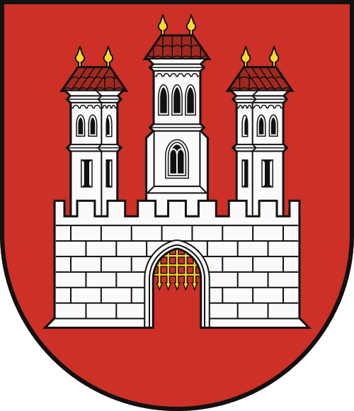
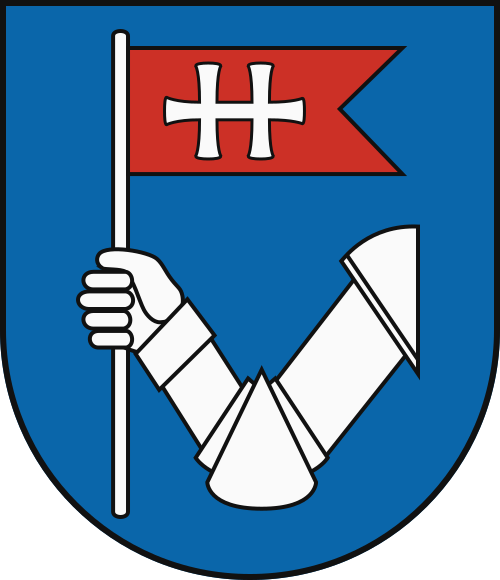

    <h2 class="section-title">{}</h2>
    <ul class="rule-list">
        <li>ドメインは.sk</li>
        <li>ボラードは黒い領域に反射板が2枚</li>
        <li>チェコとスロバキアのみthin-B profileと呼ばれるタイプのガードレールを使用する{}</li>
        <li>家に赤や青の背景に白で文字が書かれていればチェコかも。白の背景に黒で文字が書かれていればスロバキアの可能性が高い。{}</li>
        <li>チェコかスロバキアのどちらか分からないとき標識のポールに黒いキャップがあったならばチェコ{}</li>
        <li>スロバキアは全体的にタトラ山脈の影響で全体的に山がち</li>
        <li>ブラチスラバとそれ以外との間に経済的な格差がある。一人当たりGDPがチェコよりも低い（2021年時点でチェコ26,410米ドル・スロバキア21,050米ドル）{}。</li>
    </ul>
    {}

{}
{}

{}
ボラードとガードレール。ボラードは黒い領域に反射板が2枚ありガードレールは角ばっていて真ん中の凹みの幅が広いのが特徴的。ボラードとガードレールはチェコにも同じものがある。
{}

<iframe src="https://www.google.com/maps/embed?pb=!4v1683136324198!6m8!1m7!1spW0SwBM1hsNE29uhb0W3Zw!2m2!1d48.99967062082606!2d21.20669986780844!3f93.74248495307123!4f-11.071923441083669!5f3.3052168407372107" width="400" height="280" style="border:0;" allowfullscreen="" loading="lazy" referrerpolicy="no-referrer-when-downgrade"></iframe>

{}
家に赤や青の背景に白で文字が書かれていればチェコかも。白の背景に黒で文字が書かれていればスロバキアの可能性が高い{}。
{}

<iframe src="https://www.google.com/maps/embed?pb=!4v1683087676121!6m8!1m7!1sWMpxTBlDS5ocK8xzt0OGWg!2m2!1d48.97615252860064!2d21.26261707453704!3f213.68461658722833!4f2.3543964784207105!5f3.325193203789971" width="295" height="295" style="border:0;" allowfullscreen="" loading="lazy" referrerpolicy="no-referrer-when-downgrade"></iframe>
<iframe src="https://www.google.com/maps/embed?pb=!4v1683087734594!6m8!1m7!1sEvItyxQT9-Y8fxl3dxkcXw!2m2!1d49.10310522107545!2d18.93303207261095!3f291.853768146102!4f4.042097994797658!5f3.325193203789971" width="295" height="295" style="border:0;" allowfullscreen="" loading="lazy" referrerpolicy="no-referrer-when-downgrade"></iframe>

{}
{}

<iframe src="https://www.google.com/maps/embed?pb=!4v1682028228774!6m8!1m7!1syzhkPYZX-csqei7oLhfn-Q!2m2!1d49.04594409804296!2d19.33144226955884!3f231.73320361993967!4f-33.50072526701923!5f3.325193203789971" width="295" height="295" style="border:0;" allowfullscreen="" loading="lazy" referrerpolicy="no-referrer-when-downgrade"></iframe>
<iframe src="https://www.google.com/maps/embed?pb=!4v1682096984922!6m8!1m7!1sS5DH2bQy5ZHg0P7joEC_GQ!2m2!1d48.85622059897239!2d20.94864393960423!3f127.77607982349431!4f-9.494063724722722!5f3.288496370313581" width="295" height="295" style="border:0;" allowfullscreen="" loading="lazy" referrerpolicy="no-referrer-when-downgrade"></iframe>

{}
{}

{}
チェコと共通なので{}を参照してください。
{}

{}
{}

    <h2 class="section-title">{}</h2>
    <ul class="rule-list">
        <li>おそらく都市の旗に合わせた色のバスやポールがある
            <ul>
                <li class="no-evidence">Košiceはバスがが黄色と水色</li>
            </ul>
        </li>
    </ul>

{}
{}
{}
全体的に赤色のバスが多い。赤の黄色のポールもあったけれど他の地域にあるのかは確認してない。
{}

{}
{}
{}
全体的に黄色と緑色
{}

<iframe src="https://www.google.com/maps/embed?pb=!4v1685439314254!6m8!1m7!1sfbkFN7iO6IiQme1OyOblMQ!2m2!1d49.21990563561668!2d18.74878171570621!3f300.2983318816846!4f-4.259156806879972!5f3.108740984799686" width="295" height="295" style="border:0;" allowfullscreen="" loading="lazy" referrerpolicy="no-referrer-when-downgrade"></iframe>
<iframe src="https://www.google.com/maps/embed?pb=!4v1685439295221!6m8!1m7!1sFhAC3_v24c5xWFj1n7n8Wg!2m2!1d49.22061930786143!2d18.74535392772265!3f236.22017763439084!4f-2.9957731734657216!5f3.0279931666712927" width="295" height="295" style="border:0;" allowfullscreen="" loading="lazy" referrerpolicy="no-referrer-when-downgrade"></iframe>

{}
{}
{}
全体的に青色
{}

<iframe src="https://www.google.com/maps/embed?pb=!4v1685567673093!6m8!1m7!1s-iwGZvFAUyO8D7LmSld9vA!2m2!1d48.30724296112083!2d18.08553697367951!3f125.8031835780313!4f-4.928507275795425!5f1.6739744815296138" width="500" height="350" style="border:0;" allowfullscreen="" loading="lazy" referrerpolicy="no-referrer-when-downgrade"></iframe>

{}
{}
{}
全体的に黄色と青色だけどポールは周りの町にも同じ色のものが結構あるらしかった。
{}

<iframe src="https://www.google.com/maps/embed?pb=!4v1685439075492!6m8!1m7!1sn9C3ZGquFFRDUV3naf2jFg!2m2!1d48.71932860313007!2d21.26469050469173!3f56.40935971111108!4f-9.629869768487197!5f0.7820865974627469" width="200" height="350" style="border:0;" allowfullscreen="" loading="lazy" referrerpolicy="no-referrer-when-downgrade"></iframe>
<iframe src="https://www.google.com/maps/embed?pb=!4v1685439090006!6m8!1m7!1sHqIs0KoLS6pOip-uAb5UYA!2m2!1d48.62731385184814!2d21.70709577744244!3f24.522011659814055!4f-14.424229268256127!5f3.325193203789971" width="200" height="350" style="border:0;" allowfullscreen="" loading="lazy" referrerpolicy="no-referrer-when-downgrade"></iframe>
<iframe src="https://www.google.com/maps/embed?pb=!4v1685439115279!6m8!1m7!1sm90w-mNPyV5wCEXW81Hrtw!2m2!1d48.71807235897145!2d21.26508792237363!3f53.858294504185764!4f-5.925298793927638!5f2.578828786716657" width="200" height="350" style="border:0;" allowfullscreen="" loading="lazy" referrerpolicy="no-referrer-when-downgrade"></iframe>

{}
{}
{}
赤白？
{}

<iframe src="https://www.google.com/maps/embed?pb=!4v1685567849461!6m8!1m7!1sLLxqWnD_8slsBDhfIkOYog!2m2!1d48.73344303192824!2d19.14955639344997!3f344.1531892650964!4f-16.25832495199269!5f1.426259876124274" width="295" height="295" style="border:0;" allowfullscreen="" loading="lazy" referrerpolicy="no-referrer-when-downgrade"></iframe>
<iframe src="https://www.google.com/maps/embed?pb=!4v1685568029013!6m8!1m7!1szYgFZCZPCHxs8tdasbJE0g!2m2!1d48.7415384793235!2d19.17507602397361!3f205.2811025282949!4f-20.920188390277985!5f0.7820865974627469" width="295" height="295" style="border:0;" allowfullscreen="" loading="lazy" referrerpolicy="no-referrer-when-downgrade"></iframe>

{}
{}