---

title: "Slovenia"
date: 2023-02-26
lastmod: 2023-07-01
weight: 2
draft: false
keywords: [""]
sections: [""]
bg: "bg/city.jpg"
flag: "SI.svg"
no_detaile_info: true
jetro_detail: true
plonkit: true
sc_title: "Area yang mudah salah"
sc: [
    ["../austria/", "Austria"],
    ["../croatia/", "Kroasia"],
    ["../montenegro/", "Montenegro"],
    ]
---

    <h2 class="section-title">{}</h2>
    <ul class="rule-list">
        <li>Domainnya adalah .si</li>
        <li>Ada tonggak yang bentuknya mirip dengan yang ada di Austria.</li>
        <li>Austria adalah ZONA, tetapi Slovenia adalah ZONA KONA</li>
        <li>Nomor jalan tertulis di pinggir jalan.putih dan kecil Ada papan nama.</li>
        <li>"Č・č" tidak digunakan di Austria{{% ref "https://ja.wikipedia.org/wiki/%C4%8C" "C" %}}</li>
        <li class="no-evidence">Seringkali ada pot bunga di ambang jendela yang dihiasi bunga-bunga indah.</li>
        <li class="no-evidence">Mungkin ada stiker kuning di bagian belakang tanda.</li>
    </ul>
    {}
    {}

{}
{}
{}
{}Ada tonggak yang bentuknya mirip{}.Kadang-kadang{}Ada tonggak yang bentuknya mirip{}Hati-hati.
{}

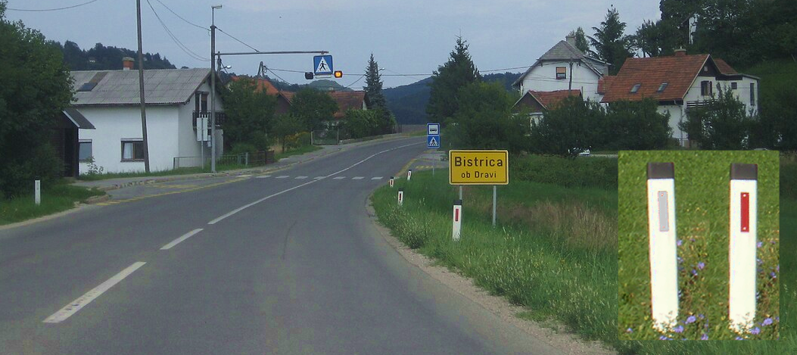

{}
Negara-negara yang terkait dengan Yugoslavia oranye Ada tanda berbentuk pensil.{}.Ada tanda kecil berwarna putih di pinggir jalan dengan tertulis nomor jalan di atasnya.{}, papan nama jenis ini adalah yang paling umum di Slovenia.{}atau{}Itu juga jarang ada.
{}

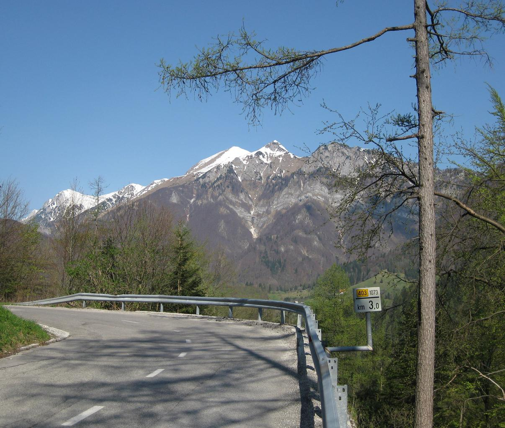

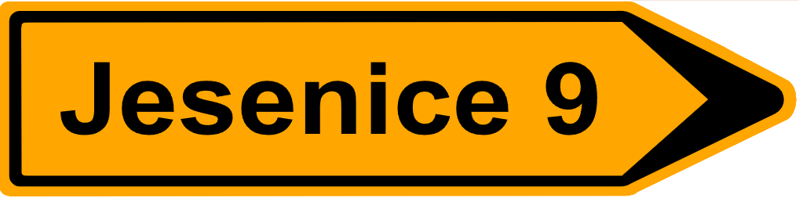
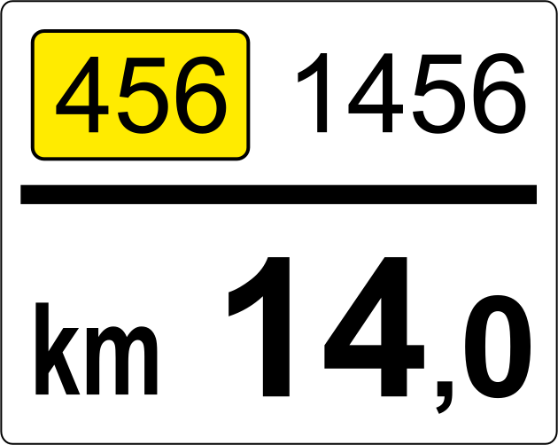

{}
Notasi "ZONA" adalah "KONA' Kemudian Slovenia dikonfirmasi.di balik tanda itu{}Berbeda dengan gambar, sering kali ada stiker berwarna kuning, bukan hitam.{}.
{}

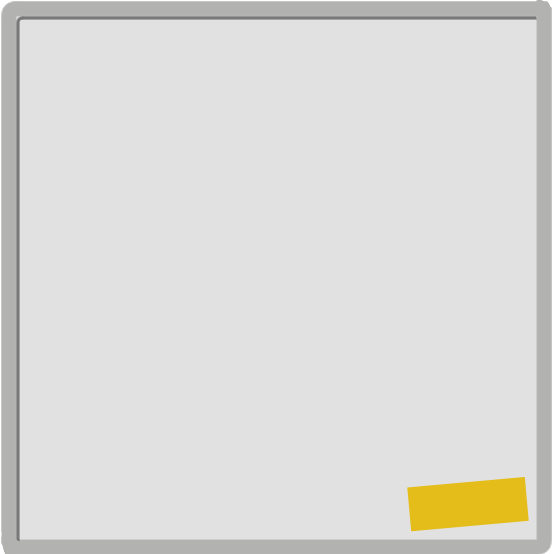

{}
rumah dihiasi dengan bunga merah{}.Tentu saja tidak 100%.
{}

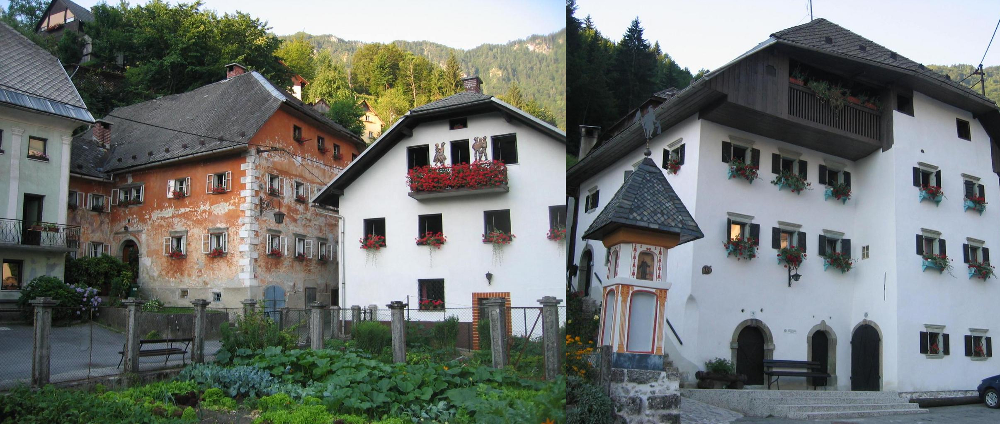

{}
bersebelahan{}atau{}Berbeda dengan ini, tidak ada sabuk pengaman pada rambu penyeberangan.Dari kiri Slovenia・Kroasia・Hongaria.
{}

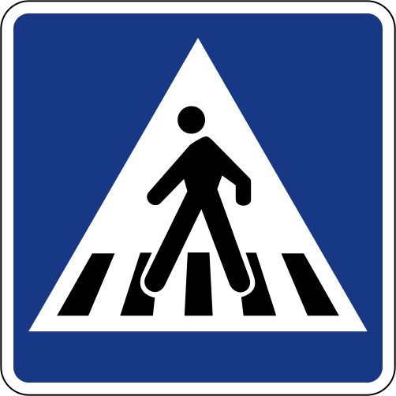
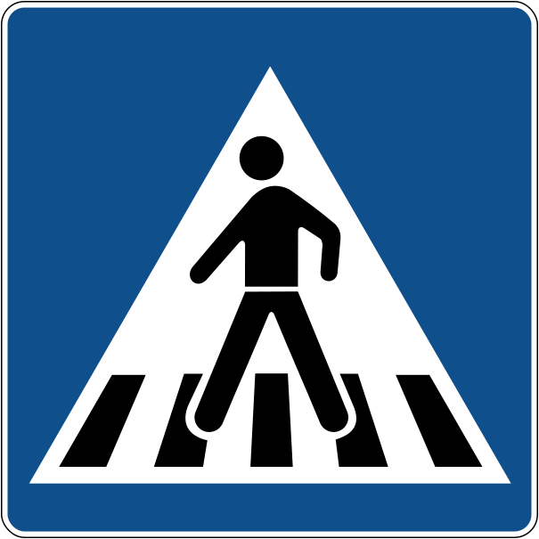
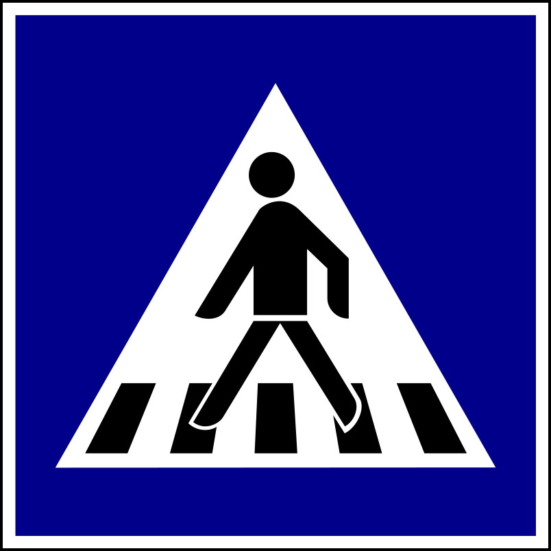

{}
Industri telah berkembang pesat karena merupakan kawasan industri paling maju di Yugoslavia.PDB per kapita sejauh ini merupakan yang tertinggi di antara negara-negara sekitar Yugoslavia (Slovenia: sekitar $30.000, Serbia: $7.400){}.Ada banyak negara terdekat yang menggunakan tanda pangkat dengan warna yang sama, tetapi jika rumah atau mobil Anda baru, kemungkinan besar Slovenia.{}.Juga,{}gigi<b>latar belakang berwarna</b>Ini juga akan membantu Anda menghindari salah memilih negara.
{}

{}
{}
{}
Stiker kuning?Secara pribadi, menurut saya akan lebih baik jika ini dilakukan di Slovenia daripada di Austria.
{}

<iframe src="https://www.google.com/maps/embed?pb=!4v1682337361603!6m8!1m7!1spjz4QjMKq_gFdCDyqpqR3Q!2m2!1d46.14719906959731!2d13.76840776905096!3f116.33340281396843!4f-6.531777834813354!5f2.8845364049357647" width="295" height="295" style="border:0;" allowfullscreen="" loading="lazy" referrerpolicy="no-referrer-when-downgrade"></iframe>
<iframe src="https://www.google.com/maps/embed?pb=!4v1683612553875!6m8!1m7!1sqkmoCYH7FLVI9jqYirgFLw!2m2!1d46.31489311130071!2d15.47932015215573!3f2.3315421701561263!4f1.2121848942166338!5f3.325193203789971" width="295" height="295" style="border:0;" allowfullscreen="" loading="lazy" referrerpolicy="no-referrer-when-downgrade"></iframe>
<iframe src="https://www.google.com/maps/embed?pb=!4v1683612606136!6m8!1m7!1sEY4sCrMYDw7yDJjpzZEJ0g!2m2!1d45.50244180747816!2d13.78590385240943!3f186.9282221576562!4f-7.902578988324919!5f3.325193203789971" width="295" height="295" style="border:0;" allowfullscreen="" loading="lazy" referrerpolicy="no-referrer-when-downgrade"></iframe>
<iframe src="https://www.google.com/maps/embed?pb=!4v1683612669705!6m8!1m7!1sh00IsjyCxD9iKeEqssga5Q!2m2!1d46.49371219293226!2d13.75815431957018!3f204.52782577877386!4f-3.1209454404265387!5f3.325193203789971" width="295" height="295" style="border:0;" allowfullscreen="" loading="lazy" referrerpolicy="no-referrer-when-downgrade"></iframe>

{}
{}

{}
Apakah ada pot bunga dan bunga di ambang jendela?
{}

<iframe src="https://www.google.com/maps/embed?pb=!4v1683357423357!6m8!1m7!1smXlQofPLqwXVG40XOlT-cw!2m2!1d46.54343847896519!2d15.65664575055611!3f274.5442973094061!4f-0.8964263945268272!5f3.305109203400886" width="295" height="295" style="border:0;" allowfullscreen="" loading="lazy" referrerpolicy="no-referrer-when-downgrade"></iframe>
<iframe src="https://www.google.com/maps/embed?pb=!4v1683357348162!6m8!1m7!1s0ZF5DG0ElpotnKNPsL-WcA!2m2!1d46.54329923880041!2d15.65802801061761!3f298.5911233644874!4f-2.881815226217981!5f3.314209002950368" width="295" height="295" style="border:0;" allowfullscreen="" loading="lazy" referrerpolicy="no-referrer-when-downgrade"></iframe>

{}
{}

    <h2 class="section-title">{}</h2>
    <ul class="rule-list">
        <li class="no-evidence">Budaya negara-negara di sekitarnya beragam, dan rumah-rumah berbeda dari satu daerah ke daerah lain.{{% ref "http://www2.arnes.si/~jjakon/HGH/houses/Houses%20in%20Slovenia_3.pdf" "Traditional houses in Slovenia" %}}
            <ul>
                <li>Rumah batu kapur: Štanjel{}dan Cerknica{}Apakah di sisi barat lebih banyak dibandingkan di tengah?</li>
                <li>Rumah di Pegunungan Alpen: Tržič atau Kranjska gora{}Daerah pegunungan di barat laut seperti</li>
                <li>Rumah beratap jerami: Tampaknya umum ditemukan di dataran rendah Pannonia (dataran timur), seperti Gorišnica.Apakah sulit menemukannya di Street View?</li>
            </ul>
        </li>
        <li class="no-evidence">Bentang alam karst terbentang dari barat daya Slovenia hingga Italia.</li>
        <li class="no-evidence">Kalau di segala penjuru tidak ada gunung, mungkin di sisi timur.</li>
    </ul>

{}
{}

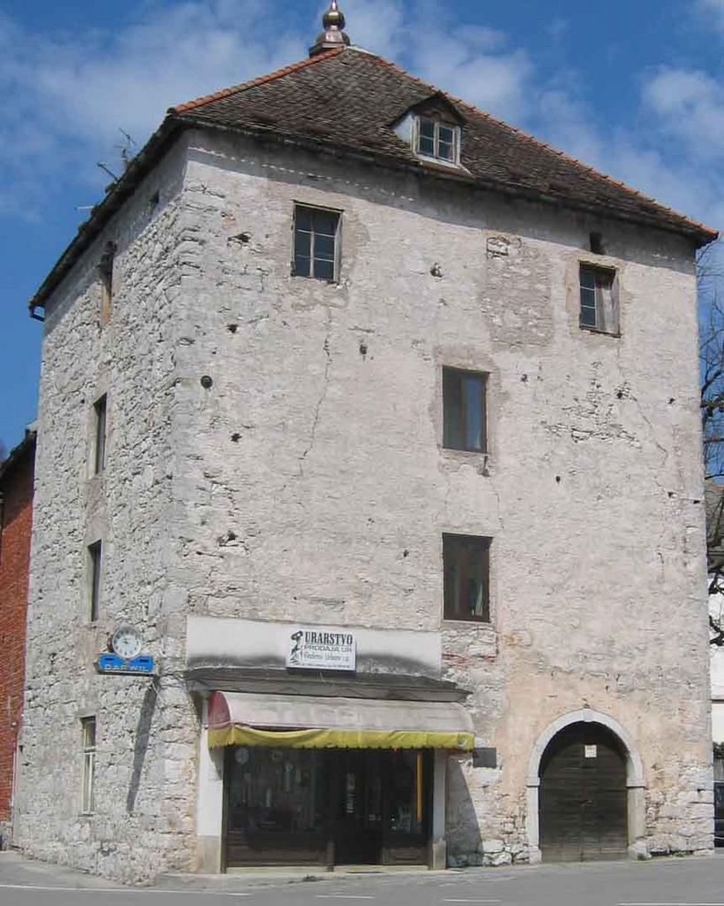

{}
{}

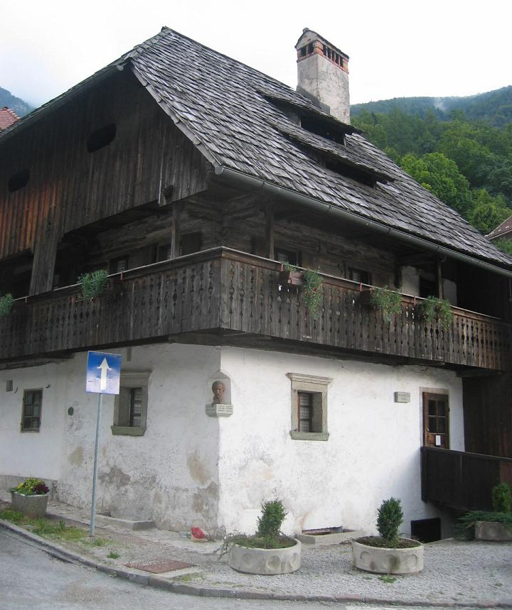

{}
{}

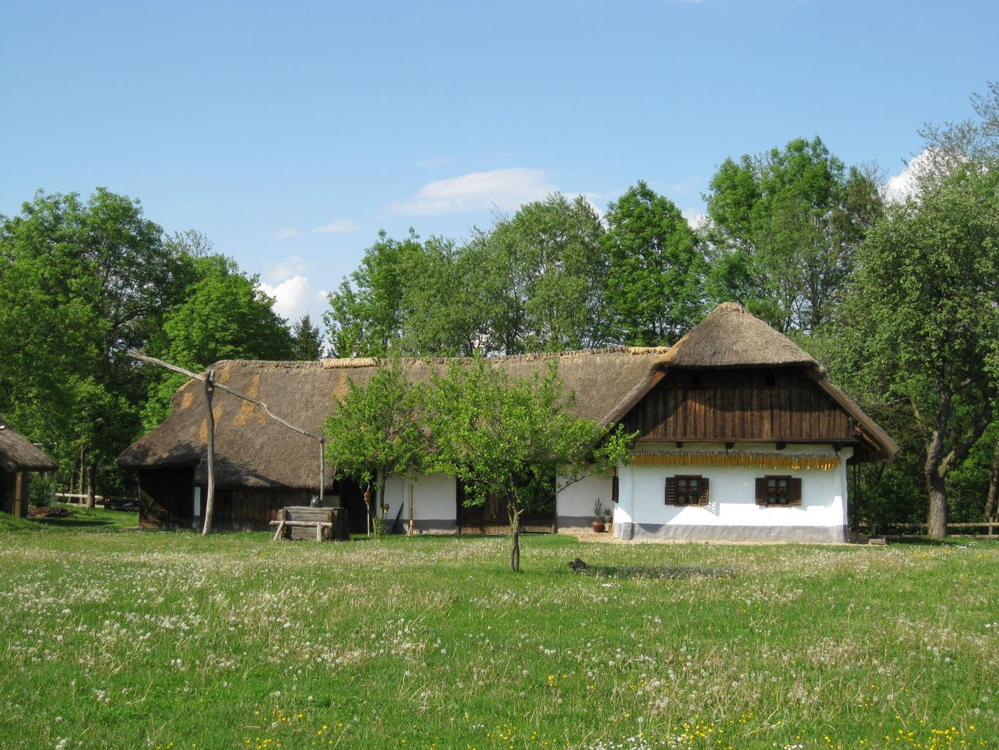

{}
{}

<iframe src="https://www.google.com/maps/embed?pb=!4v1683358678599!6m8!1m7!1srP-4D1rna8kWjojjFqsuXg!2m2!1d46.27916041461864!2d13.55426806357821!3f165.0419528242373!4f-0.2806715501310464!5f0.4000000000000002" width="580" height="300" style="border:0;" allowfullscreen="" loading="lazy" referrerpolicy="no-referrer-when-downgrade"></iframe>

{}
{}

    <h4 class="mb-4">Deskripsi perusahaan perwakilan</h4>
    <table class="table table-striped table-bordered">
        <thead class="table-light">
            <tr>
                <th scope="col" class="col-width-2">Nama perusahaan</th>
                <th scope="col" class="col-width-1">kode</th>
                <th scope="col" class="col-width-7">penjelasan</th>
                <th scope="col" class="col-width-05">penyelesaian rekening</th>
                <th scope="col" class="col-width-05">Sejarah dividen</th>
            </tr>
        </thead>
        <tbody class="corp-desc">
            <tr>
                <td>Novartis</td>
                <td>{}</td>
                <td>Sebuah perusahaan farmasi dan bioteknologi yang berbasis di Swiss.</td>
                <td>-</td>
                <td>{}</td>
            </tr>
        </tbody>
    </table>

