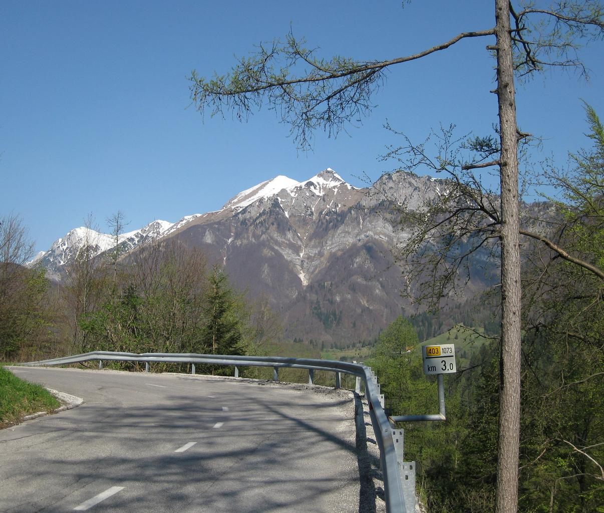
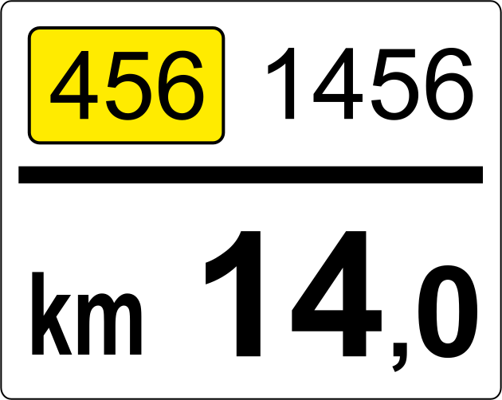
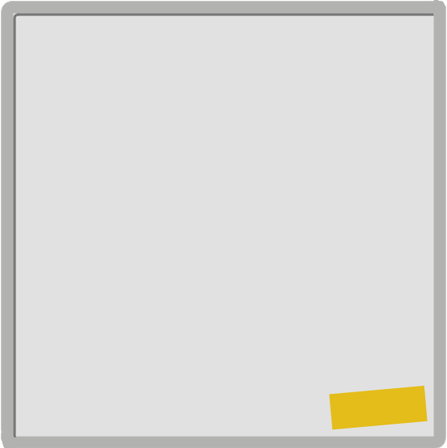
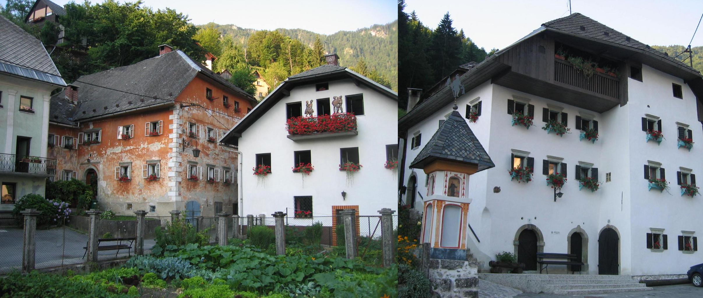
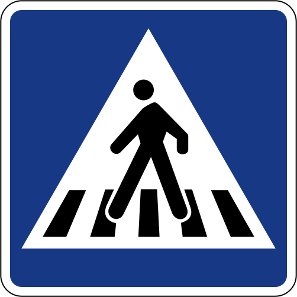
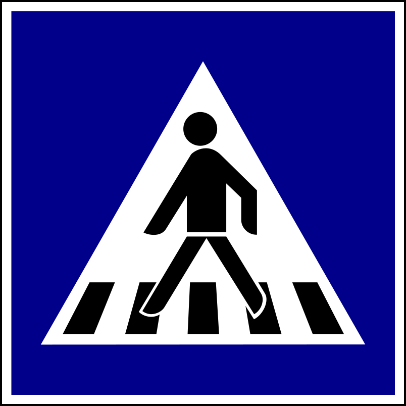
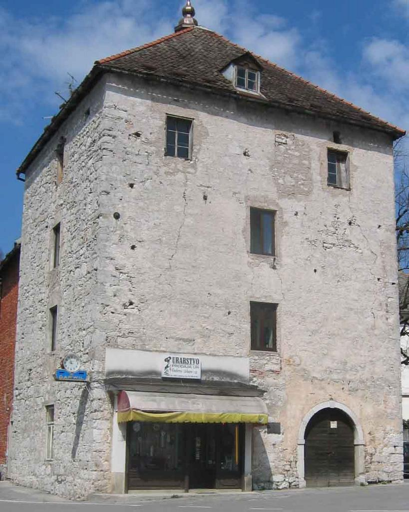
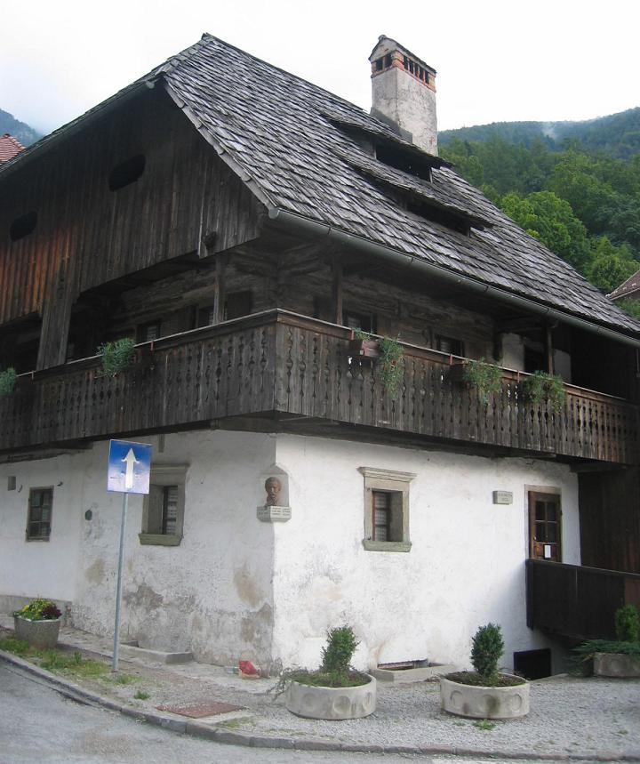

    <h2 class="section-title">{}</h2>
    <ul class="rule-list">
        <li>ドメインは.si</li>
        <li>オーストリアと見た目が似ているボラードがある</li>
        <li>オーストリアはZONEだがスロベニアはCONA</li>
        <li>道端に道路番号が書かれた白く小さい看板がある。</li>
        <li>「Č・č」はオーストリアでは使われない{{% ref "https://ja.wikipedia.org/wiki/%C4%8C" "Č" %}}</li>
        <li class="no-evidence">窓辺に植木鉢がありきれいな花が飾られていることが多い</li>
        <li class="no-evidence">標識の裏に黄色いシールが張ってあることがある</li>
    </ul>
    {}
    {}

{}
{}
{}
{}と見た目が似ているボラードがある{}。たまに{}にも似た見た目のボラードが存在する{}ため注意。
{}

{}
ユーゴスラビア関連国にはオレンジの鉛筆の形の看板がある{}。道端に道路番号が書かれた白く小さい看板があり{}、このタイプの看板はスロベニアが一番多い。{}や{}にも稀に存在する。
{}

{}
『ZONE』の表記が『CONA』ならばスロベニア確定。標識の裏は{}と違い黒色ではなく、黄色いシールが貼ってあることが多いイメージ{}。
{}

{}
赤い花が飾られた家{}。もちろん100%ではないです。
{}

{}
隣接している{}や{}と異なり横断歩道の看板にベルトが無い。左からスロベニア・クロアチア・ハンガリー。
{}

{}
ユーゴスラビア内で一番進んだ工業地域であった過去から工業が栄えている。ユーゴスラビア周辺国の中で他よりも群を抜いて一人当たりGDPが高い（スロベニア：約30,000ドル、セルビア：7,400ドル）{}。同じ色のシェブロンを使う国は周辺にたくさんあるものの、家や車が新しいならばスロベニアの可能性が高くなる{}。また、{}は<b>背景に色が付いている</b>のも国を間違えないヒントになる。
{}

{}
{}
{}
黄色いシール？個人的にはこれがあったらオーストリアでなくスロベニアでいいと思っている。
{}

<iframe src="https://www.google.com/maps/embed?pb=!4v1682337361603!6m8!1m7!1spjz4QjMKq_gFdCDyqpqR3Q!2m2!1d46.14719906959731!2d13.76840776905096!3f116.33340281396843!4f-6.531777834813354!5f2.8845364049357647" width="295" height="295" style="border:0;" allowfullscreen="" loading="lazy" referrerpolicy="no-referrer-when-downgrade"></iframe>
<iframe src="https://www.google.com/maps/embed?pb=!4v1683612553875!6m8!1m7!1sqkmoCYH7FLVI9jqYirgFLw!2m2!1d46.31489311130071!2d15.47932015215573!3f2.3315421701561263!4f1.2121848942166338!5f3.325193203789971" width="295" height="295" style="border:0;" allowfullscreen="" loading="lazy" referrerpolicy="no-referrer-when-downgrade"></iframe>
<iframe src="https://www.google.com/maps/embed?pb=!4v1683612606136!6m8!1m7!1sEY4sCrMYDw7yDJjpzZEJ0g!2m2!1d45.50244180747816!2d13.78590385240943!3f186.9282221576562!4f-7.902578988324919!5f3.325193203789971" width="295" height="295" style="border:0;" allowfullscreen="" loading="lazy" referrerpolicy="no-referrer-when-downgrade"></iframe>
<iframe src="https://www.google.com/maps/embed?pb=!4v1683612669705!6m8!1m7!1sh00IsjyCxD9iKeEqssga5Q!2m2!1d46.49371219293226!2d13.75815431957018!3f204.52782577877386!4f-3.1209454404265387!5f3.325193203789971" width="295" height="295" style="border:0;" allowfullscreen="" loading="lazy" referrerpolicy="no-referrer-when-downgrade"></iframe>

{}
{}

{}
窓辺に植木鉢があり花が飾られている？
{}

<iframe src="https://www.google.com/maps/embed?pb=!4v1683357423357!6m8!1m7!1smXlQofPLqwXVG40XOlT-cw!2m2!1d46.54343847896519!2d15.65664575055611!3f274.5442973094061!4f-0.8964263945268272!5f3.305109203400886" width="295" height="295" style="border:0;" allowfullscreen="" loading="lazy" referrerpolicy="no-referrer-when-downgrade"></iframe>
<iframe src="https://www.google.com/maps/embed?pb=!4v1683357348162!6m8!1m7!1s0ZF5DG0ElpotnKNPsL-WcA!2m2!1d46.54329923880041!2d15.65802801061761!3f298.5911233644874!4f-2.881815226217981!5f3.314209002950368" width="295" height="295" style="border:0;" allowfullscreen="" loading="lazy" referrerpolicy="no-referrer-when-downgrade"></iframe>

{}
{}

    <h2 class="section-title">{}</h2>
    <ul class="rule-list">
        <li class="no-evidence">周辺国の文化が混在し地域ごとに家屋が異なる{{% ref "http://www2.arnes.si/~jjakon/HGH/houses/Houses%20in%20Slovenia_3.pdf" "Traditional houses in Slovenia" %}}
            <ul>
                <li>石灰石の家：Štanjel{}やCerknica{}など真ん中よりも西部側に多い？</li>
                <li>アルプスの家：TržičやKranjska gora{}など北西部の山岳地帯</li>
                <li>藁ぶき屋根の家：Gorišnicaなどパンノニア低地（東部の平野）に多いらしい。ストリートビューで見つけるのは難しい？</li>
            </ul>
        </li>
        <li class="no-evidence">カルスト地形がスロベニア南西部からイタリアにかけて広がっている</li>
        <li class="no-evidence">全方位に山が無いならば東側かも</li>
    </ul>

{}
{}

{}
{}

{}
{}

{}
{}

<iframe src="https://www.google.com/maps/embed?pb=!4v1683358678599!6m8!1m7!1srP-4D1rna8kWjojjFqsuXg!2m2!1d46.27916041461864!2d13.55426806357821!3f165.0419528242373!4f-0.2806715501310464!5f0.4000000000000002" width="580" height="300" style="border:0;" allowfullscreen="" loading="lazy" referrerpolicy="no-referrer-when-downgrade"></iframe>

{}
{}

    <h4 class="mb-4">代表的な企業の説明</h4>
    <table class="table table-striped table-bordered">
        <thead class="table-light">
            <tr>
                <th scope="col" class="col-width-2">企業名</th>
                <th scope="col" class="col-width-1">コード</th>
                <th scope="col" class="col-width-7">説明</th>
                <th scope="col" class="col-width-05">決算</th>
                <th scope="col" class="col-width-05">配当履歴</th>
            </tr>
        </thead>
        <tbody class="corp-desc">
            <tr>
                <td>Novartis</td>
                <td>{}</td>
                <td>スイスを拠点とする製薬・バイオテクノロジー企業。</td>
                <td>-</td>
                <td>{}</td>
            </tr>
        </tbody>
    </table>

