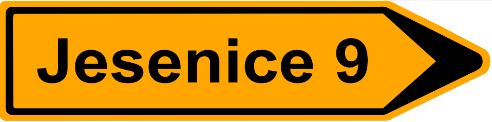

    <h2 class="section-title">{}</h2>
    <ul class="rule-list">
        <li>ドメインは.si</li>
        <li>オーストリアと見た目が似ているボラードがある</li>
        <li>オーストリアはZONEだがスロベニアはCONA</li>
        <li>道端に道路番号が書かれた白く小さい看板がある。</li>
        <li>「Č・č」はオーストリアでは使われない{{% ref "https://ja.wikipedia.org/wiki/%C4%8C" "Č" %}}</li>
        <li class="no-evidence">窓辺に植木鉢がありきれいな花が飾られていることが多い</li>
        <li class="no-evidence">標識の裏に黄色いシールが張ってあることがある</li>
    </ul>
    {}

{}
{}
{}
{}と見た目が似ているボラードがある{}
{}

{}
ユーゴスラビア関連国にはオレンジの鉛筆の形の看板がある。道端に道路番号が書かれた白く小さい看板があり、このタイプの看板はスロベニアが一番多い印象。{}や{}にも存在する。
{}

<iframe src="https://www.google.com/maps/embed?pb=!4v1683357828395!6m8!1m7!1sJRpX6bvOw6mEQnWZ3pkzag!2m2!1d46.56622161705025!2d15.94286329009644!3f342.54349243980585!4f-9.747063589557555!5f2.7512952801286747" width="500" height="280" style="border:0;" allowfullscreen="" loading="lazy" referrerpolicy="no-referrer-when-downgrade"></iframe>

{}
{}と異なり横断歩道の看板にベルトが無い。左からスロベニア・クロアチア・ハンガリー。
{}

{}
{}
{}
黄色いシール？個人的にはこれがあったらオーストリアでなくスロベニアでいいと思っている。
{}

<iframe src="https://www.google.com/maps/embed?pb=!4v1682337361603!6m8!1m7!1spjz4QjMKq_gFdCDyqpqR3Q!2m2!1d46.14719906959731!2d13.76840776905096!3f116.33340281396843!4f-6.531777834813354!5f2.8845364049357647" width="295" height="295" style="border:0;" allowfullscreen="" loading="lazy" referrerpolicy="no-referrer-when-downgrade"></iframe>
<iframe src="https://www.google.com/maps/embed?pb=!4v1683612553875!6m8!1m7!1sqkmoCYH7FLVI9jqYirgFLw!2m2!1d46.31489311130071!2d15.47932015215573!3f2.3315421701561263!4f1.2121848942166338!5f3.325193203789971" width="295" height="295" style="border:0;" allowfullscreen="" loading="lazy" referrerpolicy="no-referrer-when-downgrade"></iframe>
<iframe src="https://www.google.com/maps/embed?pb=!4v1683612606136!6m8!1m7!1sEY4sCrMYDw7yDJjpzZEJ0g!2m2!1d45.50244180747816!2d13.78590385240943!3f186.9282221576562!4f-7.902578988324919!5f3.325193203789971" width="295" height="295" style="border:0;" allowfullscreen="" loading="lazy" referrerpolicy="no-referrer-when-downgrade"></iframe>
<iframe src="https://www.google.com/maps/embed?pb=!4v1683612669705!6m8!1m7!1sh00IsjyCxD9iKeEqssga5Q!2m2!1d46.49371219293226!2d13.75815431957018!3f204.52782577877386!4f-3.1209454404265387!5f3.325193203789971" width="295" height="295" style="border:0;" allowfullscreen="" loading="lazy" referrerpolicy="no-referrer-when-downgrade"></iframe>

{}
{}

{}
窓辺に植木鉢があり花が飾られている？
{}

<iframe src="https://www.google.com/maps/embed?pb=!4v1683357423357!6m8!1m7!1smXlQofPLqwXVG40XOlT-cw!2m2!1d46.54343847896519!2d15.65664575055611!3f274.5442973094061!4f-0.8964263945268272!5f3.305109203400886" width="295" height="295" style="border:0;" allowfullscreen="" loading="lazy" referrerpolicy="no-referrer-when-downgrade"></iframe>
<iframe src="https://www.google.com/maps/embed?pb=!4v1683357348162!6m8!1m7!1s0ZF5DG0ElpotnKNPsL-WcA!2m2!1d46.54329923880041!2d15.65802801061761!3f298.5911233644874!4f-2.881815226217981!5f3.314209002950368" width="295" height="295" style="border:0;" allowfullscreen="" loading="lazy" referrerpolicy="no-referrer-when-downgrade"></iframe>

{}
{}

    <h2 class="section-title">{}</h2>
    <ul class="rule-list">
        <li>カルスト地形がスロベニア西南部からイタリアにかけて広がっている</li>
        <li>全方位に山が無いならば東側かも</li>
    </ul>

{}
{}

<iframe src="https://www.google.com/maps/embed?pb=!4v1683358678599!6m8!1m7!1srP-4D1rna8kWjojjFqsuXg!2m2!1d46.27916041461864!2d13.55426806357821!3f165.0419528242373!4f-0.2806715501310464!5f0.4000000000000002" width="580" height="300" style="border:0;" allowfullscreen="" loading="lazy" referrerpolicy="no-referrer-when-downgrade"></iframe>

{}
{}