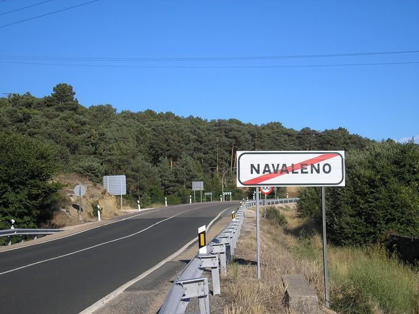

    <h2 class="section-title">{}</h2>
    <ul class="rule-list">
        <li>Domain negaranya .es</li>
        <li>Rambu waspada pejalan kaki menampilkan zebra cross dengan 8 garis—hanya Spanyol dan {} yang memakainya</li>
        <li>Rambu peringatan berbingkai merah (selain STOP) tidak punya garis tepi</li>
        <li>Reflector bollard sering kali berwarna kuning</li>
        <li>“Calle” berarti jalan dalam bahasa Spanyol{}; di Catalonia biasanya tertulis “Carrer”</li>
        <li>Ada rambu chevron dengan latar hitam maupun biru</li>
        <li>Kotak pos berbentuk silinder kuning dengan logo Correos</li>
        <li class="no-evidence">Marka jalan biasanya putih meski terkadang kuning</li>
    </ul>
    {}
    {}

{}
{}

{}
Kotak pos Correos berbentuk silinder kuning dan diberi logo perusahaan{}{}.
{}

{}
“CALLE” berarti jalan; wilayah Catalonia menggunakan “CARRER”. Papan kanan menampilkan Free Software Street di Catalonia{}.
{}

{}
Rambu pejalan kaki hampir selalu memiliki 8 garis{}. Rambu segitiga merah (selain STOP) tanpa bingkai{} dan dipasang pada pipa besi persegi panjang yang ramping{}. Tampak belakangnya bisa dilihat {}.
{}

{}
Bollard pun sering kuning{}. Ada varian dengan bentuk berbeda{}. Bollard serupa juga muncul di {} atau {}{}, jadi jangan menebak hanya dari bollard.
{}

{}
Di tepi jalan, sering ada pelat kilometer kecil berwarna oranye/kuning dengan nomor rute{}.
{}

{}
Chevron berlatar hitam atau biru dapat ditemukan di banyak tikungan{}.
{}

{}
Pada beberapa jalan raya, guardrail pendek diberi cat putih dengan garis hitam{}.
{}

{}
{}

    <h2 class="section-title">{}</h2>
    <ul class="rule-list">
        <li>Castilla y León serta Aragón memiliki hutan pinus luas</li>
        <li>Andalusia dipenuhi kebun zaitun</li>
        <li>Pantai Mediterania menampilkan pinus Aleppo, pinus payung, dan semak pesisir</li>
    </ul>

{}
{}

{}
Hutan pinus sangat luas di Castilla y León dan Aragón{}.
{}

{}
Pinus Aleppo dengan tanah berpasir juga umum di pesisir Mediterania{}.
{}

{}
{}

{}
Andalusia penuh dengan kebun zaitun yang tersusun rapi{}.
{}

{}
{}

{}
Catalonia dan Valencia menampilkan campuran pinus Aleppo, pinus payung, dan semak pantai{}.
{}

{}
{}

    <h2 class="section-title">Kota</h2>
    <ul class="rule-list">
        <li>Madrid dan Barcelona memiliki boulevard lebar dengan pohon palem atau plane tree</li>
        <li>Valencia, Málaga, dan Sevilla menampilkan arsitektur pesisir Mediterania</li>
    </ul>

{}
{}
    <ul class="rule-list">
        <li>Contoh Street View:
            <ul>
                <li>Madrid{}</li>
                <li>Barcelona{}</li>
                <li>Sevilla{}</li>
            </ul>
        </li>
    </ul>
{}
{}

{}
{}

{}
Provinsi Almería dipenuhi rumah kaca; garis pantai tenggara tampak putih karena “Laut Plastik”{}{{% ref "https://en.wikipedia.org/wiki/Province_of_Almer%C3%ADa" "Provinsi Almería" %}}.
{}

{}
{}

{}
Di luar tiga area yang tercantum pada referensi, sawah jarang ditemukan{}.
{}

{}
{}

    <h4 class="section-title">Industri</h4>

{}
{}

{}
Selain ladang fotovoltaik{}, Spanyol memiliki PLTS menara{} dan sistem parabolic trough{}. Banyak yang sulit dijangkau lewat jalan sehingga lebih mudah dikenali lewat citra satelit.
{}

{}
{}

    <h2 class="section-title">{}</h2>
    <ul class="rule-list">
        <li>Rumah kaca menutupi pesisir tenggara Almería{}</li>
        <li>Permukiman diapit tebing kapur muncul di sekitar Taman Nasional Picos de Europa{}{}</li>
        <li>Spanyol juga memiliki eksklave Afrika Utara {} dan {}</li>
    </ul>

{}
{}

Oleh El Jim - <a rel="nofollow" class="external free" href="https://flic.kr/p/4Kwtmh">https://flic.kr/p/4Kwtmh</a>, <a href="https://creativecommons.org/licenses/by/2.0" title="Creative Commons Attribution 2.0">CC BY 2.0</a>, <a href="https://commons.wikimedia.org/w/index.php?curid=36668829">Link</a>

{}
{}

    <h4 class="mb-4">Perusahaan perwakilan</h4>
    <table class="table table-striped table-bordered">
        <thead class="table-light">
            <tr>
                <th scope="col" class="col-width-2">Perusahaan</th>
                <th scope="col" class="col-width-1">Kode</th>
                <th scope="col" class="col-width-7">Ringkasan</th>
                <th scope="col" class="col-width-05">IR</th>
                <th scope="col" class="col-width-05">Dividen</th>
            </tr>
        </thead>
        <tbody class="corp-desc">
            <tr>
                <td>Banco Santander</td>
                <td>{}</td>
                <td>-</td>
                <td>-</td>
                <td>{}</td>
            </tr>
            <tr>
                <td>Banco Bilbao Vizcaya Argentaria (BBVA)</td>
                <td>{}</td>
                <td>-</td>
                <td>-</td>
                <td>{}</td>
            </tr>
        </tbody>
    </table>

