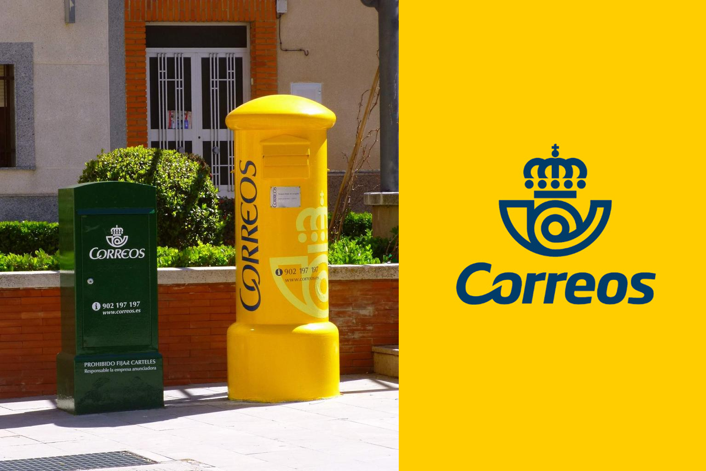
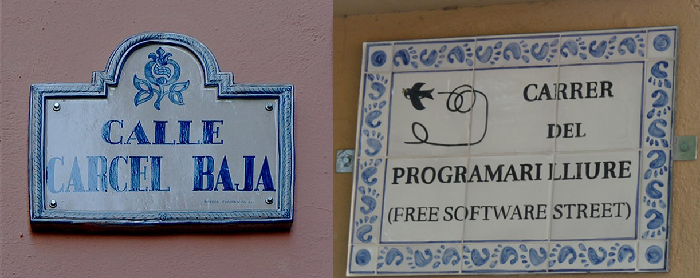
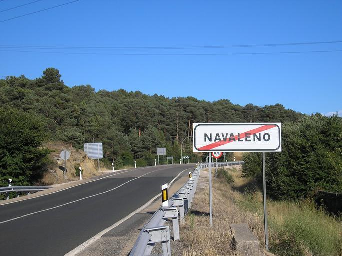
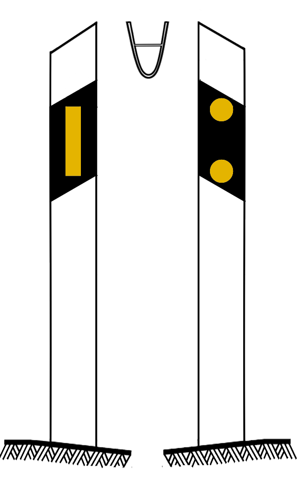
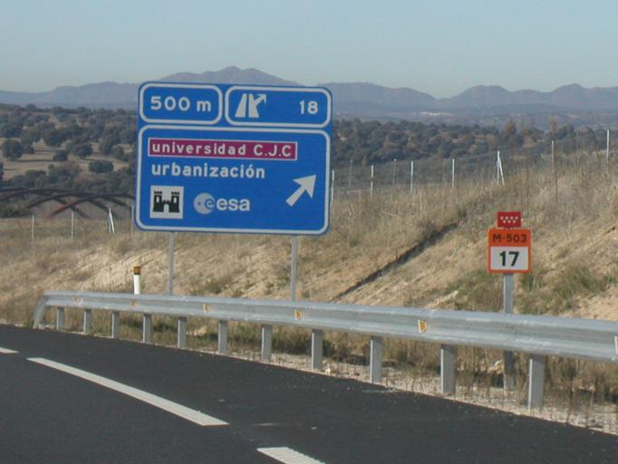
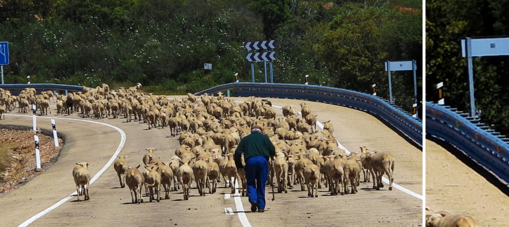
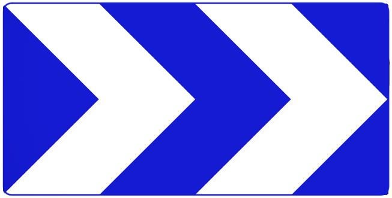
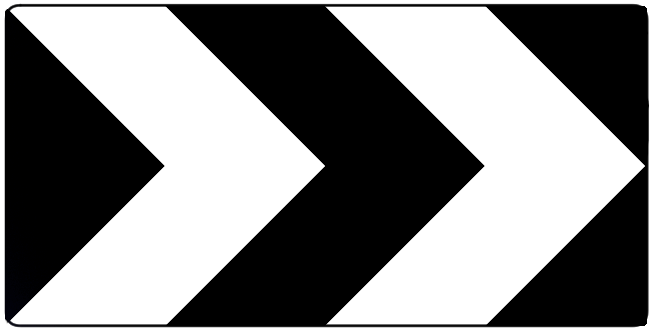
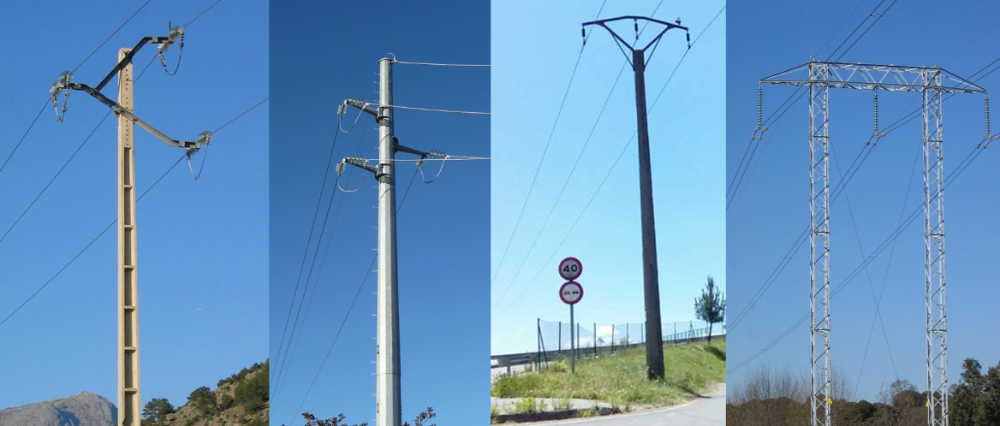
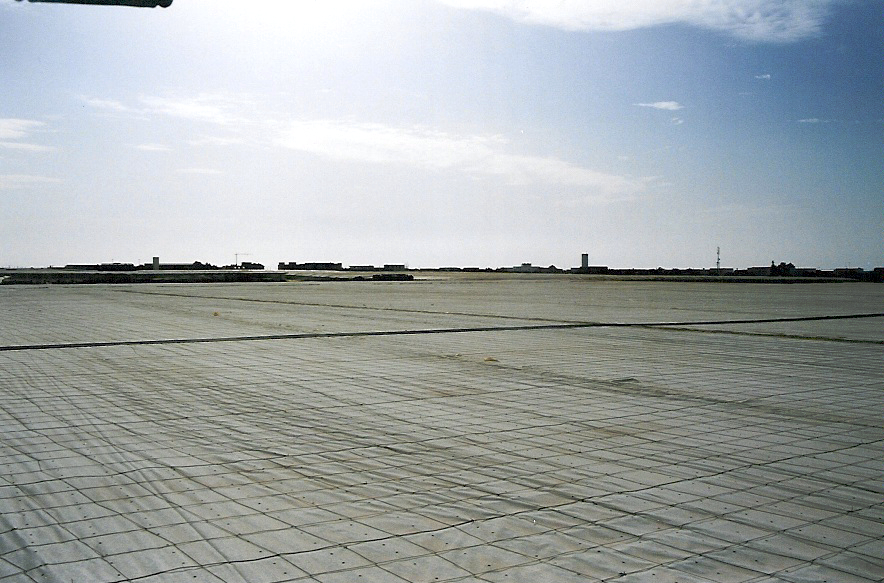

    <h2 class="section-title">{}</h2>
    <ul class="rule-list">
        <li>ドメインは.es</li>
        <li>歩行者注意の看板は横断歩道の縞々が8本なのはスペインと{}のみ</li>
        <li>赤い警告看板はSTOPの看板以外は縁が無い</li>
        <li>ボラードの反射板が黄色のものがある</li>
        <li>「calle」はスペイン語で通り・街路の意味{}</li>
        <li>背景色が黒色・青色のシェブロンがある</li>
        <li>黄色の円柱型のポストがありCorreos社のロゴが描かれているポストがある</li>
        <li class="no-evidence">道路の線は基本的に白が多いけれど稀に黄色もある</li>
    </ul>
    {}

{}
{}

{}
黄色の円柱型のポストがありCorreosのロゴが描かれている{}{}。
{}

{}
『CALLE』はスペイン語で通り・街路の意味。カタルーニャ語を使う地域では『CARRER』と書かれていることも。以下の右はカタルーニャにあるFree Software Streetの看板{}。
{}

{}
歩行者注意の看板は横断歩道の縞々が8本のものが多い{}。赤い警告看板はSTOPの看板以外は縁が無く{}、また細い長方形型の鉄のパイプを使って標識が建てられている{}ことが多い。裏側から見た画像は{}。
{}

{}
ポストのついでにボラードも黄色い{}。稀に少し見た目が異なるものもある{}。また、{}や{}{}にも稀に似たボラードがあるのでボラードだけで即押ししないように。
{}

{}
道端にオレンジや黄色の小さい看板があって道路番号が書かれていることが多い{}。またガードレールやボラードの反射板が黄色{}なのはチリ・{}・{}・{}の場合がほとんど。
{}

{}
<b>白黒</b>と<b>白青</b>のシェブロンがある{}。{}は黒背景に黄色の矢印。他に青と白のシェブロンを使うのは{}のみ。黒背景に白のシェブロンを使うのは{}とイタリア周辺の国{}。この画像のようにシェブロンが<b>白黒</b>かつ標識やシェブロンの棒が四角い長方形ならばスペインか{}を考えてみて良いと思う。
{}

{}
鉄塔がありがち{}。根本がコンクリートで固められていることも多い。
{}

By Enrique Íñiguez Rodríguez (<a href="//commons.wikimedia.org/wiki/User:Qoan" title="User:Qoan">Qoan</a>) - Own work, <a href="https://creativecommons.org/licenses/by-sa/3.0" title="Creative Commons Attribution-Share Alike 3.0">CC BY-SA 3.0</a>, <a href="https://commons.wikimedia.org/w/index.php?curid=10603026">Link</a>

{}
{}

{}
{}
{}
フランス瓦（F形瓦）とスペイン瓦（S形瓦）は製造方法は同じだが、フランス瓦が平板・スペイン瓦は半丸？
{}

<iframe src="https://www.google.com/maps/embed?pb=!4v1681872808112!6m8!1m7!1sj1sdZ0gfBBNo24ibEjDtOQ!2m2!1d41.5222350242145!2d-5.400112792075523!3f13.714528483466092!4f37.75766634751224!5f3.325193203789971" width="295" height="295" style="border:0;" allowfullscreen="" loading="lazy" referrerpolicy="no-referrer-when-downgrade"></iframe>

{}
{}

<iframe src="https://www.google.com/maps/embed?pb=!4v1680824185731!6m8!1m7!1spnVmy--ngogKwQ_Hi8i0yQ!2m2!1d41.8500945148585!2d0.7041109059627206!3f63.13679896898764!4f2.430239303916508!5f0.7820865974627469" width="295" height="295" style="border:0;" allowfullscreen="" loading="lazy" referrerpolicy="no-referrer-when-downgrade"></iframe>
<iframe src="https://www.google.com/maps/embed?pb=!4v1681858620099!6m8!1m7!1seQqQqypAtNIveawD1pd0rA!2m2!1d37.70081022788887!2d-3.72513131649601!3f190.66304440851425!4f-0.2695959691949099!5f0.7820865974627469" width="295" height="295" style="border:0;" allowfullscreen="" loading="lazy" referrerpolicy="no-referrer-when-downgrade"></iframe>

{}
{}

    <h2 class="section-title">{}</h2>
    <ul class="rule-list">
        <li>複数言語が使用されている
            <ul>
                <li>東側ではカタルーニャ語が使用されおり通りが『CARRER』</li>
                <li>西側ではガリシア語が使用されおり通りが『RÚA』</li>
                <li>北側の一部ではバスク語が使用されおり通りが『KALEA』</li>
                <li>最も一般的に見られる通り名は『CALLE』</li>
            </ul>
        </li>
        <li>市外局番の9XXの数字で地域を絞り込める</li>
        <li>ガリシア州{}や北の沿岸付近は緑が多い</li>
        <li>環状道路と高速道路には都市を識別する文字が先頭についていることが多い
            <ul>
                <li>例）BIならばビルバオ付近</li>
            </ul>
        </li>
        <li>スペイン領{}にもスペインの標識とボラードがある</li>
    </ul>

{}
{}

&nbsp;&nbsp;<b><a href="https://ja.wikipedia.org/wiki/%E3%82%AC%E3%83%AA%E3%82%B7%E3%82%A2%E8%AA%9E" class="extiw" title="ja:ガリシア語">ガリシア語</a></b>

&nbsp;&nbsp;<b><a href="https://ja.wikipedia.org/wiki/%E3%82%A2%E3%82%B9%E3%83%88%E3%82%A5%E3%83%AA%E3%82%A2%E3%82%B9%E8%AA%9E" class="extiw" title="ja:アストゥリアス語">アストゥリアス語</a></b>

&nbsp;&nbsp;<b><a href="https://ja.wikipedia.org/wiki/%E3%82%B9%E3%83%9A%E3%82%A4%E3%83%B3%E8%AA%9E" class="extiw" title="ja:スペイン語">スペイン語</a></b>

&nbsp;&nbsp;<b><a href="https://ja.wikipedia.org/wiki/%E3%82%A2%E3%83%A9%E3%82%B4%E3%83%B3%E8%AA%9E" class="extiw" title="ja:アラゴン語">アラゴン語</a></b>

&nbsp;&nbsp;<b><a href="https://ja.wikipedia.org/wiki/%E3%82%AB%E3%82%BF%E3%83%AB%E3%83%BC%E3%83%8B%E3%83%A3%E8%AA%9E" class="extiw" title="ja:カタルーニャ語">カタルーニャ語</a></b>

&nbsp;&nbsp;<b><a href="https://ja.wikipedia.org/wiki/%E3%82%AA%E3%83%83%E3%82%AF%E8%AA%9E" class="extiw" title="ja:オック語">オック語</a></b>

&nbsp;&nbsp;<b><a href="https://ja.wikipedia.org/wiki/%E3%83%90%E3%82%B9%E3%82%AF%E8%AA%9E" class="extiw" title="ja:バスク語">バスク語</a></b>

{}
カタルーニャ語を使う地域では通り看板が『CARRER』と書かれている
{}

{}
{}

By <a href="//commons.wikimedia.org/w/index.php?title=User:Albertocsc&amp;amp;action=edit&amp;amp;redlink=1" class="new" title="User:Albertocsc (page does not exist)">Albertocsc</a> - Own work, <a href="https://creativecommons.org/licenses/by-sa/3.0" title="Creative Commons Attribution-Share Alike 3.0">CC BY-SA 3.0</a>, <a href="https://commons.wikimedia.org/w/index.php?curid=24333469">Link</a>

{}
{}

<iframe src="https://www.google.com/maps/embed?pb=!4v1688877950578!6m8!1m7!1sIDwO-Ds9OGzQ3CMc5PWSjw!2m2!1d43.33149691344886!2d-7.75082183319832!3f163.81277390334435!4f-3.738804773705425!5f0.4000000000000002" width="295" height="295" style="border:0;" allowfullscreen="" loading="lazy" referrerpolicy="no-referrer-when-downgrade"></iframe>
<iframe src="https://www.google.com/maps/embed?pb=!4v1688878210185!6m8!1m7!1sUMxBEAtMYQ81OgRsDWfImg!2m2!1d43.24795337485552!2d-7.965328632639515!3f176.7064228052981!4f-8.633655468871538!5f0.814479964799036" width="295" height="295" style="border:0;" allowfullscreen="" loading="lazy" referrerpolicy="no-referrer-when-downgrade"></iframe>

{}
{}

    <h2 class="section-title">{}</h2>
    <ul class="rule-list">
        <li>アルメリア県では温室農業が盛んであり、とりわけ南東の海岸付近の白い場所はビニールハウスがいっぱいある{}</li>
        <li>ピコス・デ・エウロパ国立公園付近に石灰岩の山塊に挟まれた集落と道路がある{}{{% ref "https://ja.wikipedia.org/wiki/%E3%83%94%E3%82%B3%E3%82%B9%E3%83%BB%E3%83%87%E3%83%BB%E3%82%A8%E3%82%A6%E3%83%AD%E3%83%91%E5%9B%BD%E7%AB%8B%E5%85%AC%E5%9C%92" "ピコス・デ・エウロパ国立公園" %}}</li>
        <li>アフリカ大陸の北岸にスペインの自治都市である{}と{}がある</li>
    </ul>

{}
{}

{}
アルメリア県では温室農業が盛んであり、とりわけ南東の海岸付近の白い場所はビニールハウスがいっぱいある{}。プラスチックの海と呼ばれているらしい{{% ref "https://ja.wikipedia.org/wiki/%E3%82%A2%E3%83%AB%E3%83%A1%E3%83%AA%E3%82%A2%E7%9C%8C" "アルメリア県" %}}。
{}

{}
{}

De El Jim - <a rel="nofollow" class="external free" href="https://flic.kr/p/4Kwtmh">https://flic.kr/p/4Kwtmh</a>, <a href="https://creativecommons.org/licenses/by/2.0" title="Creative Commons Attribution 2.0">CC BY 2.0</a>, <a href="https://commons.wikimedia.org/w/index.php?curid=36668829">Enlace</a>

{}
{}