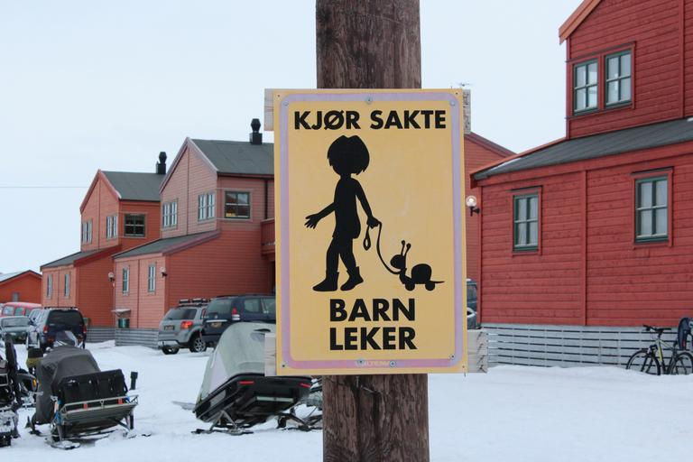
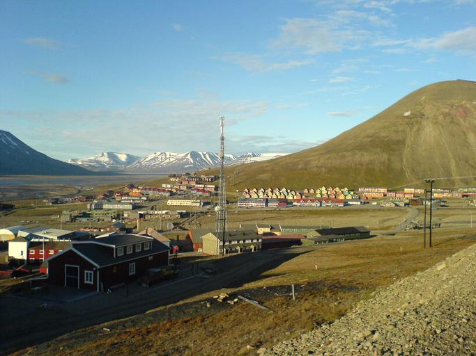
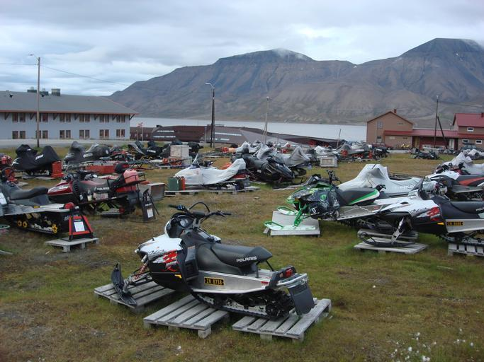
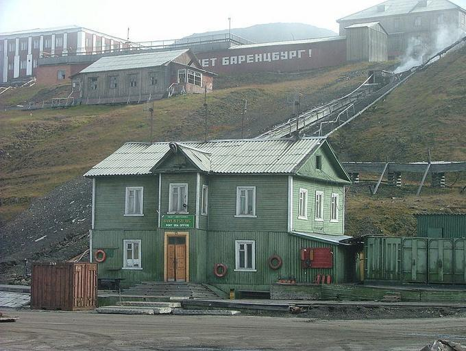
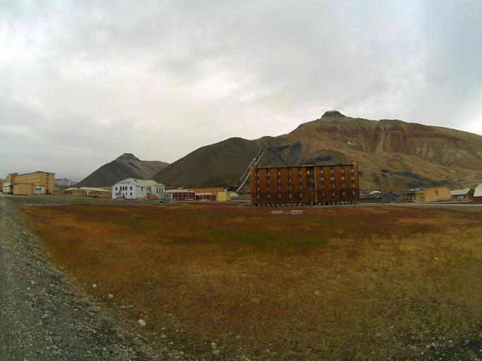

    <h2 class="section-title">{}</h2>
    <ul class="rule-list">
        <li>The country domain is .sj.</li>
        <li>License plates appear on a black background with faint orange characters.</li>
        <li>Buildings use cold-climate architecture and color palettes.</li>
        <li>Boats are a common mode of transport.</li>
    </ul>

{}
{}

{}
Because of the severe tundra climate—similar to {}—homes are rarely built directly on the ground. Gaps often separate the house from the permafrost surface{}. Only short, needle-like grasses grow; trees struggle to survive.
{}

{}
Snowmobiles are sometimes parked right in front of homes{}.
{}

{}
License plates feature orange characters on a black background.
{}

<iframe src="https://www.google.com/maps/embed?pb=!4v1683380604908!6m8!1m7!1s39SmFAyxzzl2Nht0IshIRQ!2m2!1d78.22409211782694!2d15.63796797600673!3f35.42896380071371!4f-15.668135505178128!5f2.8250272445652915" width="295" height="295" style="border:0;" allowfullscreen="" loading="lazy" referrerpolicy="no-referrer-when-downgrade"></iframe>

{}
{}

    <h2 class="section-title">{}</h2>
    <ul class="rule-list">
        <li>Barentsburg is almost entirely Russian, so Russian signage is common.</li>
        <li>Pyramiden has virtually no permanent residents but is being redeveloped for tourism.</li>
    </ul>

{}
{}

{}In 1932 the Dutch sold the coal rights to the Soviet Union, and a Russian state firm has managed the town ever since. After Russia’s invasion of Ukraine, reports say Ukrainians left{}. The town feels dark overall with aging buildings{}.
{}

{}
{}

{}Sweden sold the coal rights to the Soviet Union in 1927. Mining ceased in the 1990s and the town was abandoned, but tourist lodges and hotels are being restored, giving it a slightly tidier appearance{}.
{}

{}
{}

