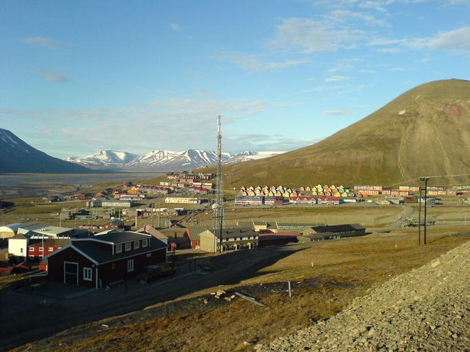
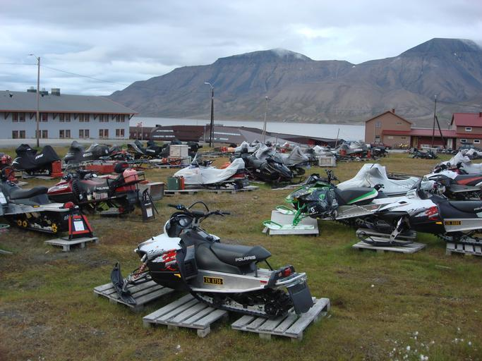
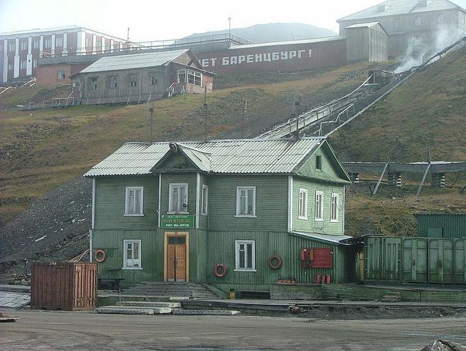

    <h2 class="section-title">{}</h2>
    <ul class="rule-list">
        <li>ドメインは.sj</li>
        <li>ナンバープレートが黒背景にオレンジ色がうっすらと見える</li>
        <li>家の建築や家の色が寒い地域特有のものになっている</li>
        <li>船に乗る場所が多い</li>
    </ul>

{}
{}

{}
非常に寒いツンドラ気候なので{}と同じく地面に直接家を立てることは少ない。地面と家の床の間に隙間があることが多い{}。針状の短い草しか生えておらず木が育つのも厳しい環境。
{}

{}
そりが家の前に停まっていることがある{}。
{}

{}
車のナンバープレートは黒背景にオレンジ色の文字がうっすらと見える。
{}

<iframe src="https://www.google.com/maps/embed?pb=!4v1683380604908!6m8!1m7!1s39SmFAyxzzl2Nht0IshIRQ!2m2!1d78.22409211782694!2d15.63796797600673!3f35.42896380071371!4f-15.668135505178128!5f2.8250272445652915" width="295" height="295" style="border:0;" allowfullscreen="" loading="lazy" referrerpolicy="no-referrer-when-downgrade"></iframe>

{}
{}

    <h2 class="section-title">{}</h2>
    <ul class="rule-list">
        <li>Barentsburgはほぼロシア人しかおらず、ロシア語が見られる</li>
        <li>Pyramidenは定住者はほぼいないが、観光向けの開発が進んでいる</li>
    </ul>

{}
{}

{}1932年にオランダがソ連に炭鉱権を売却して以降、ロシア国営企業が町の管理・運営をしている。ロシアによるウクライナ侵攻後、ウクライナ人はいなくなったと言われる{}。全体的に暗く、建物も古い{}。
{}

{}
{}

{}1927年にスウェーデンがソ連に炭鉱権を売却し、1990年代に廃鉱となり無人となった。現在は観光向けのロッジやホテルが再整備され、見た目はすこし綺麗になっている{}。
{}

{}
{}