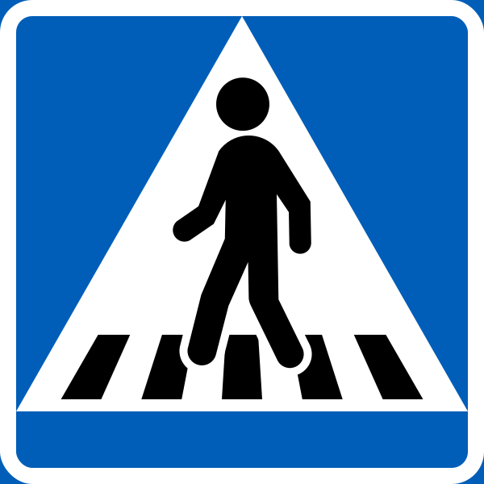
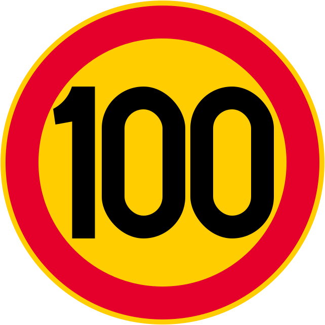

    <h2 class="section-title">{}</h2>
    <ul class="rule-list">
        <li>ドメインは.se</li>
        <li>道路の路側帯の破線が短い{}</li>
        <li>歩行者注意の看板は横断歩道の縞々が4本</li>
        <li>北欧は濃い赤色（ファールン赤）で塗られたログハウスがある</li>
        <li>看板の矢印の形が特徴的で綺麗な▷ではない{}</li>
        <li>通り名にgatan（通り）・vägen（道）が付いている</li>
    </ul>
    {}

{}
{}
{}
横断歩道が4本。左からフィンランド・ノルウェー・スウェーデン。
{}

{}
看板の矢印の形が特徴的で綺麗な▷ではない{}
{}

    

        

            
            
        

        
スウェーデン{}

    

    

        

            
            
        

        
フィンランド{}

    

    

        

            
        

        
ノルウェー{}

    

{}
国旗の色に近い色のシェブロンがある。ノルウェー・フィンランドは黒背景に黄色なので区別が付く{}。
{}

{}
北欧であって警告看板の背景がオレンジで縁に細い黄色線がないならばスウェーデンの可能性が高い。左からノルウェー・スウェーデン{}・フィンランド。
{}

{}
道路の路側帯の破線が短い{}。左からノルウェー・スウェーデン{}・フィンランド{}。ただし同じような破線は{}にもあるので平地である場合は道路以外の要素も要チェック（スウェーデンの例：{} vs エストニアの例：{}）。
{}

{}
左がノルウェー、右がスウェーデン。
{}

{}
{}

{}
北欧は濃い赤色（ファールン赤）で塗られたログハウスが特徴的{{% by "https://ja.wikipedia.org/wiki/%E3%83%95%E3%82%A1%E3%83%BC%E3%83%AB%E3%83%B3%E8%B5%A4" "wiki" "ファールン赤" %}}。
{}

<iframe src="https://www.google.com/maps/embed?pb=!4v1682745621894!6m8!1m7!1spzanVdstKKkZW_y0rpcj9Q!2m2!1d63.92900687925968!2d19.22055359549862!3f55.37899597670119!4f2.674939345200073!5f1.2106999950302133" width="295" height="295" style="border:0;" allowfullscreen="" loading="lazy" referrerpolicy="no-referrer-when-downgrade"></iframe>
<iframe src="https://www.google.com/maps/embed?pb=!4v1682745757637!6m8!1m7!1sTrcO9gwCCqcPEvPe6IjFww!2m2!1d65.6269717125178!2d22.14486672910409!3f190.66619802913607!4f1.4604768883245072!5f3.314058561927098" width="295" height="295" style="border:0;" allowfullscreen="" loading="lazy" referrerpolicy="no-referrer-when-downgrade"></iframe>

{}
{}

{}
「ø」の文字はスウェーデンでは使用されない。フィンランド語はウラル語系、スウェーデン・ノルウェー・デンマーク・アイスランドなどはノルド語系の言語。
{}

<table class="word-list">
<tr>
    <th>言語名</th> <th>表記</th>
</tr>
<tr><td>日本語</td><td>ここは一方通行のゾーンです</td></tr>
<tr><td>英語</td><td>This is a one-way zone.</td></tr>
<tr><td>スウェーデン語</td><td>Det här är en enkelriktad zon.</td></tr>
<tr><td>ノルウェー語</td><td>Dette er en enveiskjøringssone.</td></tr>
<tr><td>デンマーク語</td><td>Dette er en ensrettet zone.</td></tr>
<tr><td>フィンランド語</td><td>Tämä on yksisuuntainen alue.</td></tr>
</table>

{}
{}

<iframe src="https://www.google.com/maps/embed?pb=!4v1685811235797!6m8!1m7!1sN5M5hsx-3IXnRqd5iujZRA!2m2!1d57.88939488932365!2d11.66873519759119!3f347.7985702376789!4f-39.055390607055905!5f1.641423031961403" width="295" height="295" style="border:0;" allowfullscreen="" loading="lazy" referrerpolicy="no-referrer-when-downgrade"></iframe>

{}
{}

    <h2 class="section-title">{}</h2>
    <ul class="rule-list">
        <li>標識についている番号は道路番号{}
            <ul>
                <li>道路番号は2桁は南から9～99、3桁は南から100～400くらい{}</li>
            </ul>
        </li>
        <li>市外局番で地域がわかることがある</li>
        <li>植生や土の色が地域によって異なる
            <ul>
                <li>最南部■：平坦で農業も行われる{}</li>
                <li>南部の針葉樹林地帯■■：針葉樹が生えているがブナやオークのような上が丸い木も生えている</li>
                <li>北部■：針葉樹が大勢を占めていて広葉樹は少なくなる{}</li>
                <li>北部の国境付近■：岩肌が見えたり雪で覆われていたりする{}</li>
            </ul>
        </li>
    </ul>

{}
{}

{}標識についている番号は道路番号{}
{}

{}
{}

By derivative work: <a href="//commons.wikimedia.org/w/index.php?title=User:Coffeeshivers&amp;amp;action=edit&amp;amp;redlink=1" class="new" title="User:Coffeeshivers (page does not exist)">Coffeeshivers</a> (<a href="//commons.wikimedia.org/w/index.php?title=User_talk:Coffeeshivers&amp;amp;action=edit&amp;amp;redlink=1" class="new" title="User talk:Coffeeshivers (page does not exist)">talk</a>)
<a href="//commons.wikimedia.org/wiki/File:SWE-Map_Rike.svg" title="File:SWE-Map Rike.svg">SWE-Map_Rike.svg</a>: <a href="//commons.wikimedia.org/wiki/User:Lokal_Profil" title="User:Lokal Profil">Lokal_Profil</a> - <a href="//commons.wikimedia.org/wiki/File:SWE-Map_Rike.svg" title="File:SWE-Map Rike.svg">SWE-Map_Rike.svg</a>, <a href="https://creativecommons.org/licenses/by-sa/2.5" title="Creative Commons Attribution-Share Alike 2.5">CC BY-SA 2.5</a>, <a href="https://commons.wikimedia.org/w/index.php?curid=4487871">Link</a>

{}
{}

By <a href="//commons.wikimedia.org/wiki/User:Boeing720" title="User:Boeing720">Boeing720</a> - Own work, <a href="https://creativecommons.org/licenses/by-sa/4.0" title="Creative Commons Attribution-Share Alike 4.0">CC BY-SA 4.0</a>, <a href="https://commons.wikimedia.org/w/index.php?curid=63284022">Link</a>

{}
{}
