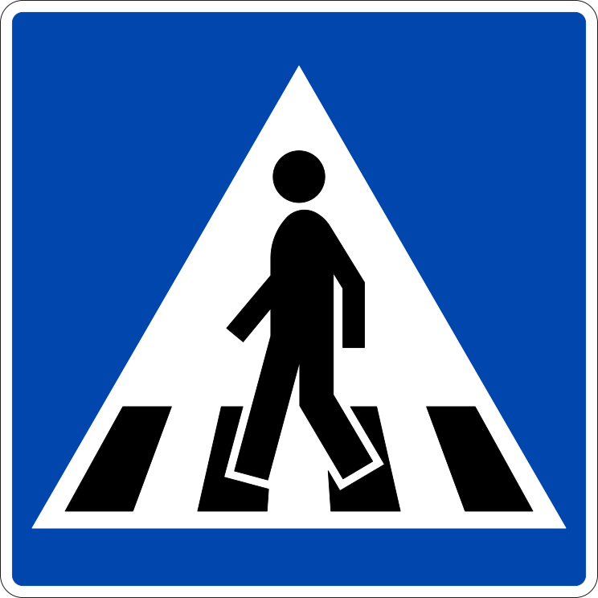
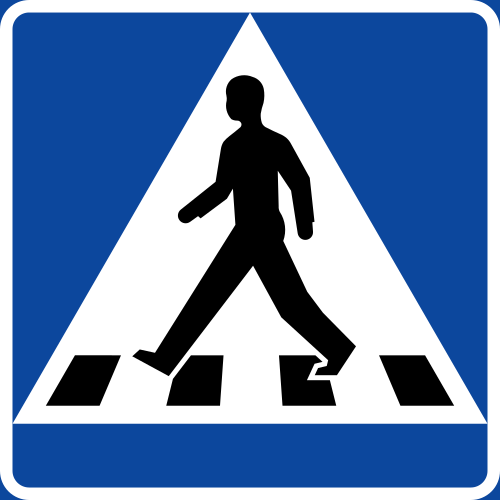

    <h2 class="section-title">{}</h2>
    <ul class="rule-list">
        <li>ドメインは.se</li>
        <li>道路の路側帯の破線が短い{}</li>
        <li>歩行者注意の看板は横断歩道の縞々が4本</li>
        <li>北欧は濃い赤色（ファールン赤）で塗られたログハウスがある</li>
        <li>看板の矢印の形が特徴的で綺麗な▷ではない{}</li>
    </ul>
    {}

{}
{}
{}
横断歩道が4本。左からフィンランド・ノルウェー・スウェーデン。
{}

{}
看板の矢印の形が特徴的で綺麗な▷ではない{}
{}

<iframe src="https://www.google.com/maps/embed?pb=!4v1681520120527!6m8!1m7!1s-plX9mxe_3c-75JrMbFwxw!2m2!1d60.19231843145348!2d12.66952427707943!3f150.08783051938525!4f-8.009418602090491!5f2.8630713791201936" width="295" height="295" style="border:0;" allowfullscreen="" loading="lazy" referrerpolicy="no-referrer-when-downgrade"></iframe>
<iframe src="https://www.google.com/maps/embed?pb=!4v1681519941867!6m8!1m7!1s5MKy4UAEyyWWxlEatUFTgQ!2m2!1d60.67461509324035!2d17.10662236796962!3f321.3257127276216!4f0.6031312557307871!5f3.325193203789971" width="295" height="295" style="border:0;" allowfullscreen="" loading="lazy" referrerpolicy="no-referrer-when-downgrade"></iframe>

{}
国旗の色に近い色のシェブロンがある。ノルウェー・フィンランドは黒背景に黄色なので区別が付く{}。
{}

{}
北欧であって速度表記に背景がオレンジで縁に細い黄色線がないならばスウェーデンの可能性が高い。左からノルウェー・スウェーデン・フィンランド。
{}

{}
{}

{}
北欧は濃い赤色（ファールン赤）で塗られたログハウスが特徴的{{% by "https://ja.wikipedia.org/wiki/%E3%83%95%E3%82%A1%E3%83%BC%E3%83%AB%E3%83%B3%E8%B5%A4" "wiki" "ファールン赤" %}}。
{}

<iframe src="https://www.google.com/maps/embed?pb=!4v1682745621894!6m8!1m7!1spzanVdstKKkZW_y0rpcj9Q!2m2!1d63.92900687925968!2d19.22055359549862!3f55.37899597670119!4f2.674939345200073!5f1.2106999950302133" width="295" height="295" style="border:0;" allowfullscreen="" loading="lazy" referrerpolicy="no-referrer-when-downgrade"></iframe>
<iframe src="https://www.google.com/maps/embed?pb=!4v1682745757637!6m8!1m7!1sTrcO9gwCCqcPEvPe6IjFww!2m2!1d65.6269717125178!2d22.14486672910409!3f190.66619802913607!4f1.4604768883245072!5f3.314058561927098" width="295" height="295" style="border:0;" allowfullscreen="" loading="lazy" referrerpolicy="no-referrer-when-downgrade"></iframe>

{}
{}

{}
「ø」の文字はスウェーデンでは使用されない。フィンランド語はウラル語系、スウェーデン・ノルウェー・デンマーク・アイスランドなどはノルド語系の言語。
{}

<table class="word-list">
<tr>
    <th>言語名</th> <th>表記</th>
</tr>
<tr><td>日本語</td><td>ここは一方通行のゾーンです</td></tr>
<tr><td>英語</td><td>This is a one-way zone.</td></tr>
<tr><td>スウェーデン語</td><td>Det här är en enkelriktad zon.</td></tr>
<tr><td>ノルウェー語</td><td>Dette er en enveiskjøringssone.</td></tr>
<tr><td>デンマーク語</td><td>Dette er en ensrettet zone.</td></tr>
<tr><td>フィンランド語</td><td>Tämä on yksisuuntainen alue.</td></tr>
</table>

{}
{}

<iframe src="https://www.google.com/maps/embed?pb=!4v1685811235797!6m8!1m7!1sN5M5hsx-3IXnRqd5iujZRA!2m2!1d57.88939488932365!2d11.66873519759119!3f347.7985702376789!4f-39.055390607055905!5f1.641423031961403" width="295" height="295" style="border:0;" allowfullscreen="" loading="lazy" referrerpolicy="no-referrer-when-downgrade"></iframe>

{}
{}

    <h2 class="section-title">{}</h2>
    <ul class="rule-list">
        <li>道路番号は2桁は南から9～99、3桁は南から100～400くらい{}</li>
    </ul>

