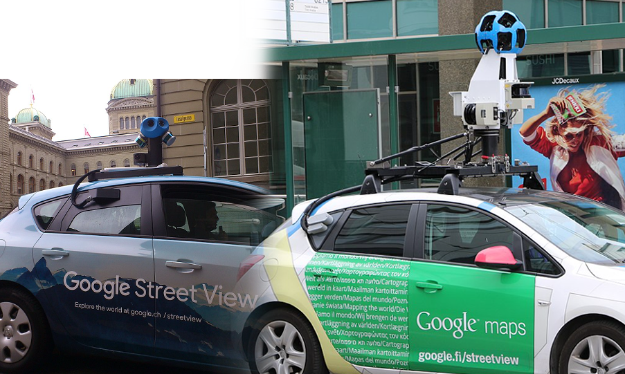
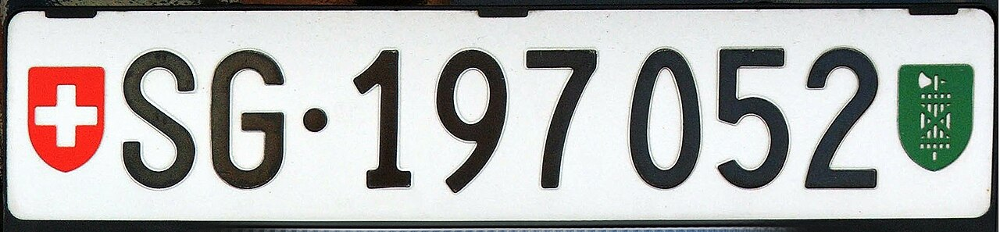

    <h2 class="section-title">{}</h2>
    <ul class="rule-list">
        <li>ドメインは.ch</li>
        <li>カメラの位置が低い</li>
        <li>ボラードの色は白色で、黒いラインが入っている{}</li>
        <li>スイスの西はフランス語、北と中央はドイツ語、南はイタリア語 {}</li>
        <li>ナンバープレートは特徴的だがモザイクが強くわかりにくい</li>
        <li>横断歩道標識は7本</li>
        <li>白黒で円柱型の丸い頭のボラードがある</li>
        <li>消火栓が灰色で上の部分が赤い</li>
    </ul>
    {}

{}
{}
{}
カメラの位置が低い。ボラードがなんとなく大きく感じる。景色を見てカメラが低いか判別するのは慣れが必要で自分もできていない。個人的には『真下を向いて一回だけズーム』→『カメラをぐるぐる回す』→『ぼかされていないエリアが画面端などに一回も表示されなければカメラが低い可能性あり』という判断をしているけど正しいかは不明。
{}

<iframe width="90%" height="300" src="https://www.youtube.com/embed/r0hj_7O90EY" title="YouTube video player" frameborder="0" allow="accelerometer; autoplay; clipboard-write; encrypted-media; gyroscope; picture-in-picture; web-share" allowfullscreen></iframe>

{}
スイスとフィンランドのGoogle Carの比較。
{}

{}
横断歩道標識は7本。標識がパイプで囲われていることが多い。右の場合『limite générale』はフランス語なのでフランス付近だと想像できる。
{}

{}
消火栓が特徴的。色はバリエーションあり（例<a href="https://goo.gl/maps/472YLz5wyCtqreUE8">①</a>・<a href="https://goo.gl/maps/xjVVNnyAbaUHjuXQ8">②</a>・<a href="https://goo.gl/maps/oGdmBox23tRikt388">③</a>）。
{}

{}
ナンバープレートは特徴的だがモザイクが強くわかりにくい。ほとんどの車は青い線がない。
{}

{}

By Krokodyl - Own work, <a href="https://creativecommons.org/licenses/by/3.0" title="Creative Commons Attribution 3.0">CC BY 3.0</a>, <a href="https://commons.wikimedia.org/w/index.php?curid=2717225">Link</a>
{}

{}
スイスや{}の山がちな地域の斜面はこんな感じの場所が多い気がする。
{}

By <a href="//commons.wikimedia.org/wiki/User:Jag9889" title="User:Jag9889">Jag9889</a> - Own work, <a href="https://creativecommons.org/licenses/by-sa/4.0" title="Creative Commons Attribution-Share Alike 4.0">CC BY-SA 4.0</a>, <a href="https://commons.wikimedia.org/w/index.php?curid=133815213">Link</a>

{}
{}

<iframe src="https://www.google.com/maps/embed?pb=!4v1682747509558!6m8!1m7!1sGAihb23_lR7kSq6nxjXYKQ!2m2!1d47.02159076020624!2d7.500673381466769!3f158.77670136091865!4f-0.5498775302401384!5f3.293433733170092" width="295" height="295" style="border:0;" allowfullscreen="" loading="lazy" referrerpolicy="no-referrer-when-downgrade"></iframe>

{}
{}

{}
形は丸いもの・角張っているもの・斜めに切られているのもなどバリエーションあり。
{}

<iframe src="https://www.google.com/maps/embed?pb=!4v1692512272659!6m8!1m7!1sTCLOeaGU-CpSXjJAk62b_g!2m2!1d46.54291377319805!2d6.34447016736597!3f328.7635107216829!4f-1.0726181584187486!5f0.7971086293441451" width="600" height="300" style="border:0;" allowfullscreen="" loading="lazy" referrerpolicy="no-referrer-when-downgrade"></iframe>

{}
{}

    <h2 class="section-title">{}</h2>
    <ul class="rule-list">
        <li>スイスの西はフランス語、北と中央はドイツ語、南はイタリア語 {}</li>
        <li>あまり見かけないものの電話番号の市外局番で地域が分かる。以下はおおまかな範囲。
            <ul>
                <li>08X～09Xと071：東</li>
                <li>05X～06X：北</li>
                <li>03X～04X：中央部</li>
                <li>02X：西</li>
            </ul>
        </li>
        <li class="no-evidence">標高の高い場所に生える花がある？{}</li>
    </ul>

{}
{}
{}
オレンジがドイツ語・緑がフランス語・紫がイタリア語。
{}

 By Marco Zanoli, <a href="https://creativecommons.org/licenses/by-sa/4.0" title="Creative Commons Attribution-Share Alike 4.0">CC BY-SA 4.0</a>, <a href="https://commons.wikimedia.org/w/index.php?curid=875011">Link</a>

{}
{}
{}
072～079は携帯などで使われている点のみ注意する（街中での例<a href="https://goo.gl/maps/Nwu6Mjty1aUw99Ft9">①</a>）。
{}

By <a href="https://de.wikipedia.org/wiki/User:Chumwa" class="extiw" title="de:User:Chumwa">Maximilian Dörrbecker</a> (<a href="https://de.wikipedia.org/wiki/User:Chumwa" class="extiw" title="de:User:Chumwa">Chumwa</a>) - Own work using: <a href="//commons.wikimedia.org/wiki/File:Switzerland_location_map.svg" title="File:Switzerland location map.svg">Switzerland_location_map.svg</a>, <a href="https://creativecommons.org/licenses/by-sa/2.5" title="Creative Commons Attribution-Share Alike 2.5">CC BY-SA 2.5</a>, <a href="https://commons.wikimedia.org/w/index.php?curid=77552482">Link</a>

{}
{}
