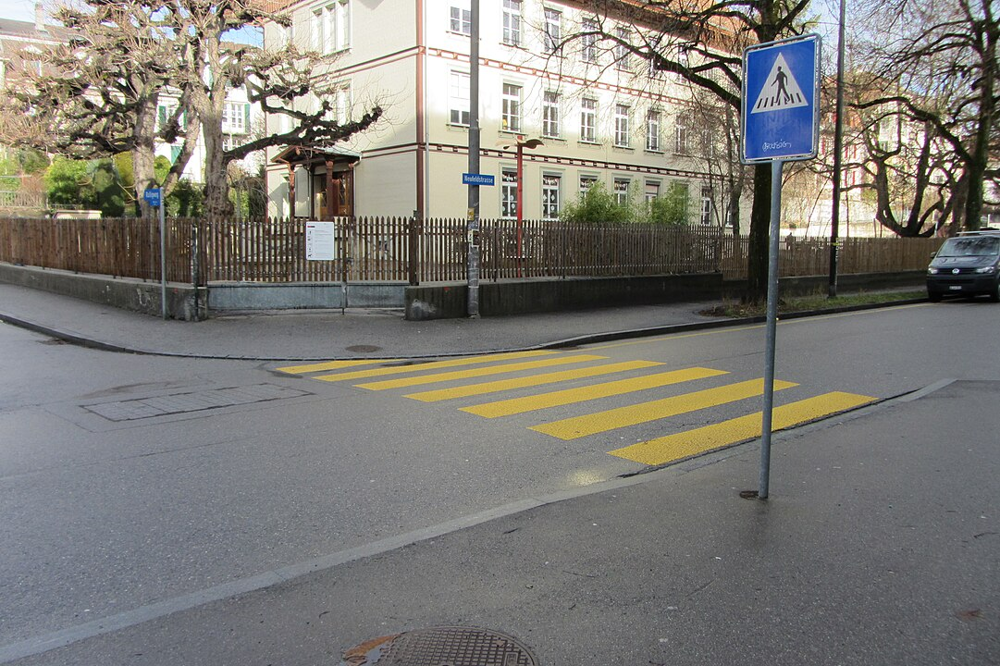
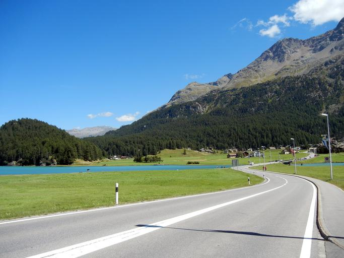
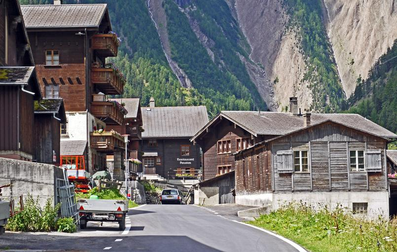
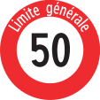
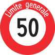

    <h2 class="section-title">{}</h2>
    <ul class="rule-list">
        <li>ドメインは.ch</li>
        <li>カメラの位置が低い</li>
        <li>ボラードの色は白色で、黒いラインが入っている{}</li>
        <li>スイスの西は{}語、北と中央は{}語、南は{}語 {}</li>
        <li>ナンバープレートは特徴的だがモザイクが強くわかりにくい</li>
        <li>横断歩道標識は7本</li>
        <li>白黒で円柱型の丸い頭のボラードがある</li>
        <li>消火栓が灰色で上の部分が赤い</li>
    </ul>
    {}
    {}

{}
{}
{}
スイスと{}はカメラの位置が低い{}。ボラードがなんとなく大きく感じる。
{}

<iframe width="90%" height="300" src="https://www.youtube.com/embed/r0hj_7O90EY" title="YouTube video player" frameborder="0" allow="accelerometer; autoplay; clipboard-write; encrypted-media; gyroscope; picture-in-picture; web-share" allowfullscreen></iframe>

{}
スイスとフィンランドのGoogle Carの比較。
{}

{}
横断歩道標識は7本で横断歩道は黄色い。
{}

{}
{}は横断歩道を含め多くの共通点がある。
{}

{}
標識がパイプで囲われていることが多い。また、下の『limite générale』はフランス語なのでフランス付近だと想像できる。
{}

{}
頭が丸い円柱型のボラードはスイスと{}以外ではまず見られない{}。
{}

{}
ナンバープレートは特徴的だがモザイクが強くわかりにくい。ほとんどの車は青い線がなく白色に見える{}。
{}

By <a href="//commons.wikimedia.org/wiki/User:Roland_zh" title="User:Roland zh">Roland zh</a> - Own work, <a href="https://creativecommons.org/licenses/by-sa/3.0" title="Creative Commons Attribution-Share Alike 3.0">CC BY-SA 3.0</a>, <a href="https://commons.wikimedia.org/w/index.php?curid=10029775">Link</a>

{}

By Krokodyl - Own work, <a href="https://creativecommons.org/licenses/by/3.0" title="Creative Commons Attribution 3.0">CC BY 3.0</a>, <a href="https://commons.wikimedia.org/w/index.php?curid=2717225">Link</a>
{}

{}
消火栓が特徴的。色はバリエーションあり{}。
{}

{}
アルプスにありがちな木造の三角屋根の家{}。
{}

{}
{}

{}
形は丸いもの・角張っているもの・斜めに切られているのもなどバリエーションあり。
{}

<iframe src="https://www.google.com/maps/embed?pb=!4v1692512272659!6m8!1m7!1sTCLOeaGU-CpSXjJAk62b_g!2m2!1d46.54291377319805!2d6.34447016736597!3f328.7635107216829!4f-1.0726181584187486!5f0.7971086293441451" width="600" height="300" style="border:0;" allowfullscreen="" loading="lazy" referrerpolicy="no-referrer-when-downgrade"></iframe>

{}
{}

    <h2 class="section-title">{}</h2>
    <ul class="rule-list">
        <li>スイスの西は{}語、北と中央は{}語、南は{}語 {}
            <ul>
                <li>Limite générale：{}語{}</li>
                <li>GENERELL：{}語</li>
                <li>Limite generale：{}語{}</li>
                <li>Limita generala：ロマンシュ語{}</li>
            </ul>
        </li>
        <li>あまり見かけないものの電話番号の市外局番で地域が分かる。以下はおおまかな範囲。
            <ul>
                <li>08X～09Xと071：東</li>
                <li>05X～06X：北</li>
                <li>03X～04X：中央部</li>
                <li>02X：西</li>
            </ul>
        </li>
        <li class="no-evidence">標高の高い場所に生える花がある？{}</li>
    </ul>

{}
{}
{}
オレンジがドイツ語・緑がフランス語・紫がイタリア語。
{}

 By Marco Zanoli, <a href="https://creativecommons.org/licenses/by-sa/4.0" title="Creative Commons Attribution-Share Alike 4.0">CC BY-SA 4.0</a>, <a href="https://commons.wikimedia.org/w/index.php?curid=875011">Link</a>

{}
{}
{}
072～079は携帯などで使われている点のみ注意する（街中での例<a href="https://goo.gl/maps/Nwu6Mjty1aUw99Ft9">①</a>）。
{}

By <a href="https://de.wikipedia.org/wiki/User:Chumwa" class="extiw" title="de:User:Chumwa">Maximilian Dörrbecker</a> (<a href="https://de.wikipedia.org/wiki/User:Chumwa" class="extiw" title="de:User:Chumwa">Chumwa</a>) - Own work using: <a href="//commons.wikimedia.org/wiki/File:Switzerland_location_map.svg" title="File:Switzerland location map.svg">Switzerland_location_map.svg</a>, <a href="https://creativecommons.org/licenses/by-sa/2.5" title="Creative Commons Attribution-Share Alike 2.5">CC BY-SA 2.5</a>, <a href="https://commons.wikimedia.org/w/index.php?curid=77552482">Link</a>

{}
{}

    <h4 class="mb-4">代表的な企業の説明</h4>
    <table class="table table-striped table-bordered">
        <thead class="table-light">
            <tr>
                <th scope="col" class="col-width-2">企業名</th>
                <th scope="col" class="col-width-1">コード</th>
                <th scope="col" class="col-width-7">説明</th>
                <th scope="col" class="col-width-05">決算</th>
                <th scope="col" class="col-width-05">配当履歴</th>
            </tr>
        </thead>
        <tbody class="corp-desc">
            <tr>
                <td>Nestlé</td>
                <td>-</td>
                <td>食品・飲料加工のコングロマリット企業であり売上や収益の基準で世界最大の食品会社。ニューヨーク証券取引所には上場していないが、欧州メインのETFや投資信託に含まれていることは多い{{% ref "https://www.sbiam.co.jp/fund/pdf/8931C242_european%20high%20dividend%20equity4_koufumr_2403.pdf" "SBI欧州高配当株式分配ファンド（年4回決算型）月次レポート" %}}。</td>
                <td>{}</td>
                <td>-</td>
            </tr>
            <tr>
                <td>Chubb</td>
                <td>{}</td>
                <td>世界最大級の損害保険会社。</td>
                <td>{}</td>
                <td>{}</td>
            </tr>
            <tr>
                <td>GARMIN</td>
                <td>{}</td>
                <td>GNSS受信機メーカー最大手であり、GPSなどを使用する自動車・航空関連機器・ウェアラブル機器を開発している。</td>
                <td>{}</td>
                <td>{}</td>
            </tr>
            <tr>
                <td>On</td>
                <td>{}</td>
                <td>ランニングシューズを代表とするスポーツウェアの大手。</td>
                <td>{}</td>
                <td>{}</td>
            </tr>
            <tr>
                <td>Logitech</td>
                <td>{}</td>
                <td>コンピュータ周辺機器大手。日本ではロジクールとして知られている。ちなみに、個人的に<u><a href="https://amzn.to/3CpsEqv">Ergoシリーズ(リンク)</a></u>を使用していますがかなりおススメです。仕事・プライベートで3年以上使っていますが全く壊れないのとトラックボールの抵抗も少なく指も痛くならないです。</td>
                <td>{}</td>
                <td>{}</td>
            </tr>
        </tbody>
    </table>

