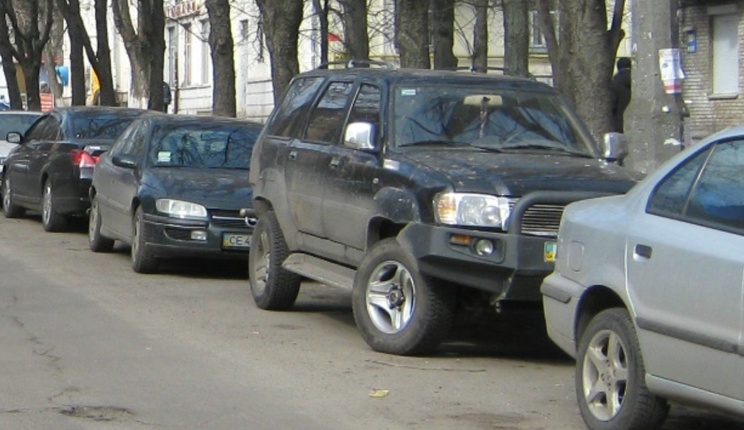
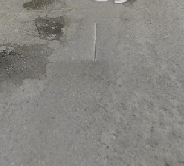
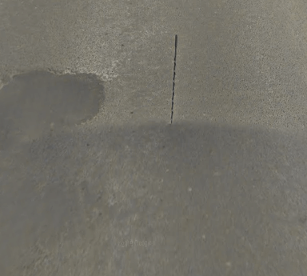
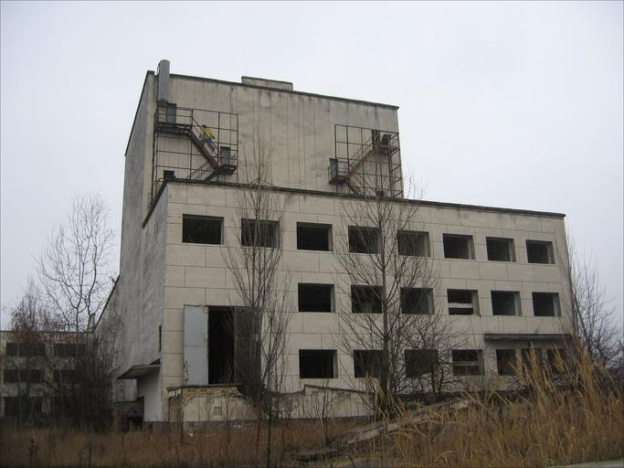

    <h2 class="section-title">{}</h2>
    <ul class="rule-list">
        <li>ドメインは.ua</li>
        <li>横断歩道の標識は3本</li>
        <li>GoogleCarは赤色がぼんやりと見えるかも？{}</li>
        <li>i・ Ї ・є・Ґなどの文字はウクライナ語にはあるがロシア語には無い</li>
        <li>ナンバープレートの左が水色と黄色</li>
    </ul>
    {}

{}
{}

{}
i・ Ї ・є・Ґなどの文字はウクライナ語にはあるが{}語には無い。逆にы・ёはロシア語にはあるがウクライナ語にはない。
{}

{}
ナンバープレートの左が水色と黄色になっているものが多いがモザイクが強いと視認が難しい。
{}

{}

By Andrii crimea ua at Ukrainian WikipediaW - Own work by the original uploader, <a href="https://creativecommons.org/licenses/by-sa/3.0/deed.ja">CC BY-SA 3.0</a>, <a href="https://commons.wikimedia.org/w/index.php?curid=25121030">Wikimedia Commons</a>
{}

{}
GoogleCarは赤色がぼんやりと見えるかも{}{}？ただし{}や{}にも赤い車がいるのと、画質の良い（Gen4）の赤い車がヨーロッパの各地に稀にいるので赤色だけで即決してはいけない。
{}

<iframe src="https://www.google.com/maps/embed?pb=!4v1680191638496!6m8!1m7!1ssQiJDGJBfcR4IpeZIjQ2fA!2m2!1d48.51702190147009!2d25.05659520551288!3f111.51058610408954!4f-30.043874499404446!5f0.550023968866" width="495" height="295" style="border:0;" allowfullscreen="" loading="lazy" referrerpolicy="no-referrer-when-downgrade"></iframe>

左がウクライナ、右がロシアの一例（※Chrome開発者ツールから「Enumerate vision deficiencies」で表示設定を変えてます）。赤が認識しづらい人はほぼ参考にならないので他のヒントを探してみる。

{}
{}

<iframe src="https://www.google.com/maps/embed?pb=!4v1688113054597!6m8!1m7!1sJqJdB7KcCkKDQDn6rIBBaA!2m2!1d48.28687499702905!2d22.62744194286989!3f160.66667917390123!4f-14.849354604980533!5f3.325193203789971" width="295" height="295" style="border:0;" allowfullscreen="" loading="lazy" referrerpolicy="no-referrer-when-downgrade"></iframe>
<iframe src="https://www.google.com/maps/embed?pb=!4v1688106486244!6m8!1m7!1s24mPC6W61kNlMkGQjq_OxA!2m2!1d50.97721009879685!2d38.99316028610959!3f148.69257015202035!4f-13.829817729885633!5f3.1364456078609173" width="295" height="295" style="border:0;" allowfullscreen="" loading="lazy" referrerpolicy="no-referrer-when-downgrade"></iframe>

{}
{}

<iframe src="https://www.google.com/maps/embed?pb=!4v1688106345287!6m8!1m7!1sKEhS4c6UF2XWjMvJK2EnmQ!2m2!1d50.19268989677923!2d27.03176581922643!3f181.33510528125612!4f-11.953835176874563!5f3.2604282418864625" width="295" height="295" style="border:0;" allowfullscreen="" loading="lazy" referrerpolicy="no-referrer-when-downgrade"></iframe>
<iframe src="https://www.google.com/maps/embed?pb=!4v1688106811478!6m8!1m7!1siJbbYkNrjRjROKTWAOso4Q!2m2!1d49.6611766037447!2d32.0757726662418!3f247.62779069340655!4f21.85575893064015!5f2.8138097047695227" width="295" height="295" style="border:0;" allowfullscreen="" loading="lazy" referrerpolicy="no-referrer-when-downgrade"></iframe>

{}
{}

    <h2 class="section-title">{}</h2>
    <ul class="rule-list">
        <li>北部及び西部は冷帯湿潤大陸性気候（Dfb）で比較的降水量が多く，南東部は乾燥したステップ気候（BS）。そのため北西部ほど木の密度が高く木の背も高い。南東部ほど畑が多く木の密度も薄く背も低いイメージ{}。</li>
    </ul>

{}
{}

{}
北西と南の道路。ただし北西であっても木があまり生えてない場所はあるので地域の絞り込みはかなり難しい印象。
{}

<iframe src="https://www.google.com/maps/embed?pb=!4v1690710477346!6m8!1m7!1shhb-KAgb4Ris5LhVZpn34Q!2m2!1d51.29377393912948!2d26.80427695640606!3f121.7882933483822!4f2.9500286648700325!5f0.7820865974627469"width="295" height="295" style="border:0;" allowfullscreen="" loading="lazy" referrerpolicy="no-referrer-when-downgrade"></iframe>
<iframe src="https://www.google.com/maps/embed?pb=!4v1690710532220!6m8!1m7!1su9dCNzhy3SgGgw8v5_e0Ag!2m2!1d46.9045723925484!2d31.46296796845545!3f203.70834828386205!4f3.210290488874108!5f0.7820865974627469"width="295" height="295" style="border:0;" allowfullscreen="" loading="lazy" referrerpolicy="no-referrer-when-downgrade"></iframe>

{}
{}

    <h2 class="section-title">{}</h2>
    <ul class="rule-list">
        <li>チェルノブイリ原子力発電所周辺にもストリートビューがある{{% ref "https://ja.wikipedia.org/wiki/%E3%83%81%E3%82%A7%E3%83%AB%E3%83%8E%E3%83%96%E3%82%A4%E3%83%AA%E5%8E%9F%E5%AD%90%E5%8A%9B%E7%99%BA%E9%9B%BB%E6%89%80" "Чорнобильська АЕС" %}}</li>
    </ul>

{}
{}

{}
建物が荒廃しているエリアが多い{}。
{}

{}
{}

