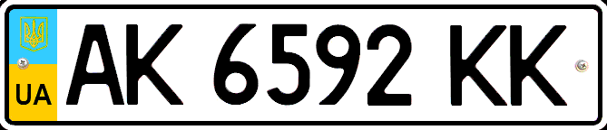

    <h2 class="section-title">{}</h2>
    <ul class="rule-list">
        <li>ドメインは.ua</li>
        <li>横断歩道の標識は3本</li>
        <li>GoogleCarは赤色がぼんやりと見えるかも？{}</li>
        <li>i・ Ї ・Ґなどの文字はウクライナ語にはあるがロシア語には無い。逆にёはロシア語にはあるがウクライナ語にはない。</li>
        <li>ナンバープレートの左が水色と黄色</li>
    </ul>
    {}

{}
{}

{}
i・ Ї ・Ґなどの文字はウクライナ語にはあるがロシア語には無い。逆にы・ёはロシア語にはあるがウクライナ語にはない。
{}

<iframe src="https://www.google.com/maps/embed?pb=!4v1682127124387!6m8!1m7!1s7phCvKMFQkaP4MP4h-ZgqA!2m2!1d50.43962636201115!2d30.35756628098528!3f15.13235220885578!4f20.804524714932057!5f3.325193203789971" width="590" height="300" style="border:0;" allowfullscreen="" loading="lazy" referrerpolicy="no-referrer-when-downgrade"></iframe>

{}
ナンバープレートの左が水色と黄色になっているものが多いがモザイクが強いと視認が難しい。
{}

<iframe src="https://www.google.com/maps/embed?pb=!4v1681805615936!6m8!1m7!1syoj7DiLCVVq1Vzrt3NugAw!2m2!1d49.55090212512901!2d25.59325705332986!3f43.186933268865374!4f-18.120414923058107!5f3.325193203789971" width="295" height="295" style="border:0;" allowfullscreen="" loading="lazy" referrerpolicy="no-referrer-when-downgrade"></iframe>
<iframe src="https://www.google.com/maps/embed?pb=!4v1681805639737!6m8!1m7!1syoj7DiLCVVq1Vzrt3NugAw!2m2!1d49.55090212512901!2d25.59325705332986!3f332.3586578080156!4f-19.063004617122957!5f3.325193203789971" width="295" height="295" style="border:0;" allowfullscreen="" loading="lazy" referrerpolicy="no-referrer-when-downgrade"></iframe>

{}

By Andrii crimea ua at Ukrainian WikipediaW - Own work by the original uploader, <a href="https://creativecommons.org/licenses/by-sa/3.0/deed.ja">CC BY-SA 3.0</a>, <a href="https://commons.wikimedia.org/w/index.php?curid=25121030">Wikimedia Commons</a>
{}

{}
GoogleCarは赤色がぼんやりと見えるかも{}？ただしロシアやベルギーなどにも赤い車がいるのと、アンテナが短いときもある気がするのでこの情報に依存しすぎないほうがいいかも。
{}

<iframe src="https://www.google.com/maps/embed?pb=!4v1680191638496!6m8!1m7!1ssQiJDGJBfcR4IpeZIjQ2fA!2m2!1d48.51702190147009!2d25.05659520551288!3f111.51058610408954!4f-30.043874499404446!5f0.550023968866" width="295" height="295" style="border:0;" allowfullscreen="" loading="lazy" referrerpolicy="no-referrer-when-downgrade"></iframe>

左がウクライナ、右がロシアの一例（※Chrome開発者ツールから「Enumerate vision deficiencies」で表示設定を変えてます）。赤が認識しづらい人はほぼ参考にならない。

{}
{}

<iframe src="https://www.google.com/maps/embed?pb=!4v1688113054597!6m8!1m7!1sJqJdB7KcCkKDQDn6rIBBaA!2m2!1d48.28687499702905!2d22.62744194286989!3f160.66667917390123!4f-14.849354604980533!5f3.325193203789971" width="295" height="295" style="border:0;" allowfullscreen="" loading="lazy" referrerpolicy="no-referrer-when-downgrade"></iframe>
<iframe src="https://www.google.com/maps/embed?pb=!4v1688106486244!6m8!1m7!1s24mPC6W61kNlMkGQjq_OxA!2m2!1d50.97721009879685!2d38.99316028610959!3f148.69257015202035!4f-13.829817729885633!5f3.1364456078609173" width="295" height="295" style="border:0;" allowfullscreen="" loading="lazy" referrerpolicy="no-referrer-when-downgrade"></iframe>

{}
{}

<iframe src="https://www.google.com/maps/embed?pb=!4v1688106345287!6m8!1m7!1sKEhS4c6UF2XWjMvJK2EnmQ!2m2!1d50.19268989677923!2d27.03176581922643!3f181.33510528125612!4f-11.953835176874563!5f3.2604282418864625" width="295" height="295" style="border:0;" allowfullscreen="" loading="lazy" referrerpolicy="no-referrer-when-downgrade"></iframe>
<iframe src="https://www.google.com/maps/embed?pb=!4v1688106811478!6m8!1m7!1siJbbYkNrjRjROKTWAOso4Q!2m2!1d49.6611766037447!2d32.0757726662418!3f247.62779069340655!4f21.85575893064015!5f2.8138097047695227" width="295" height="295" style="border:0;" allowfullscreen="" loading="lazy" referrerpolicy="no-referrer-when-downgrade"></iframe>

{}
{}
