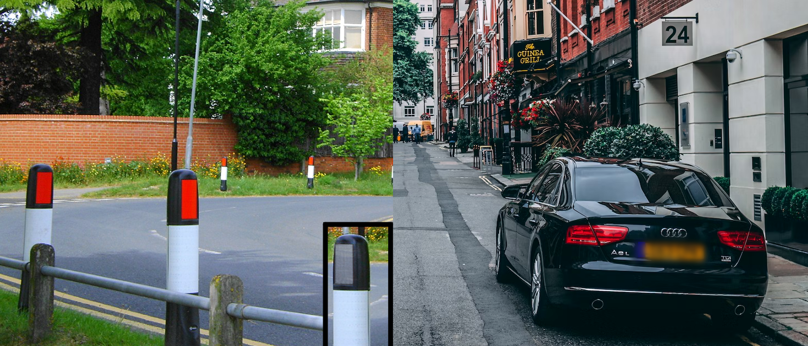
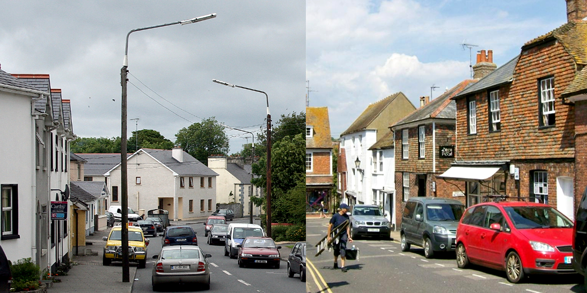
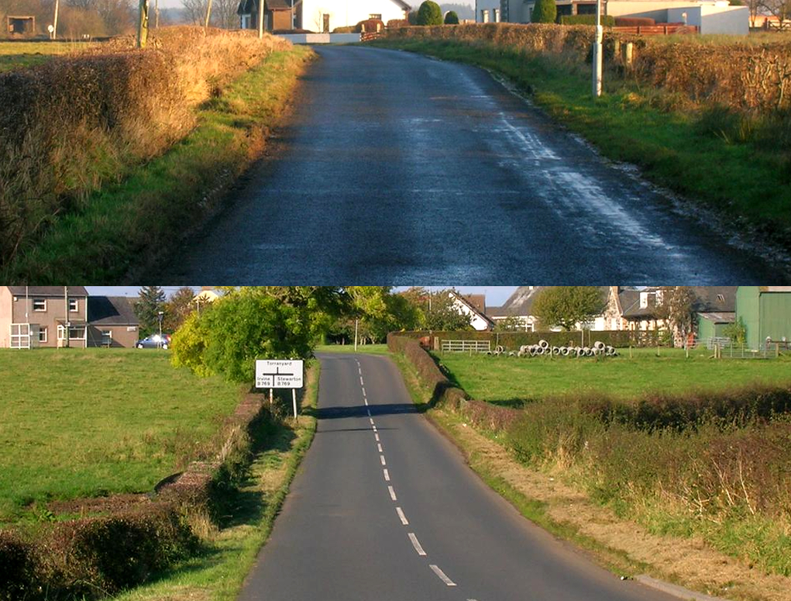
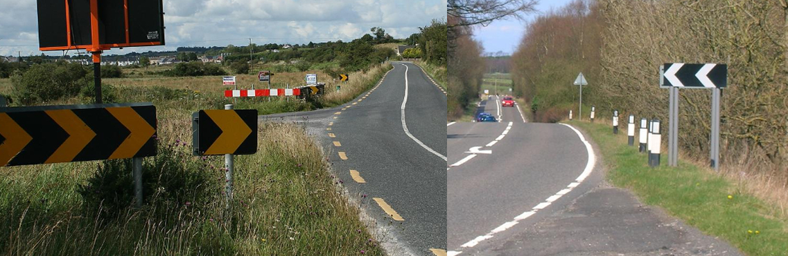
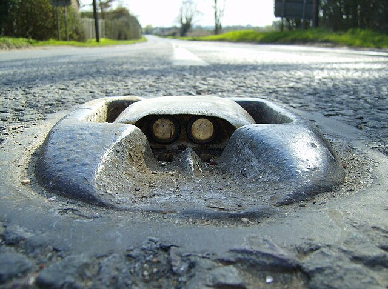
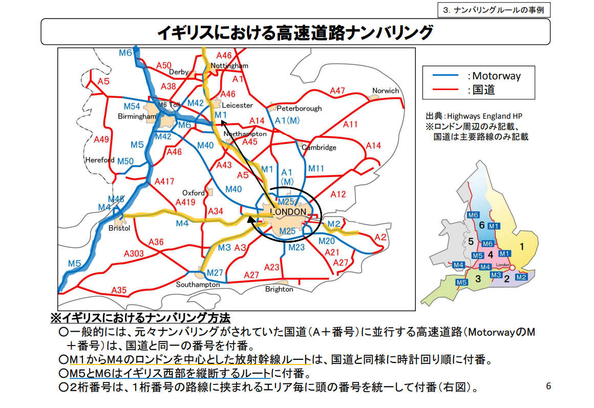
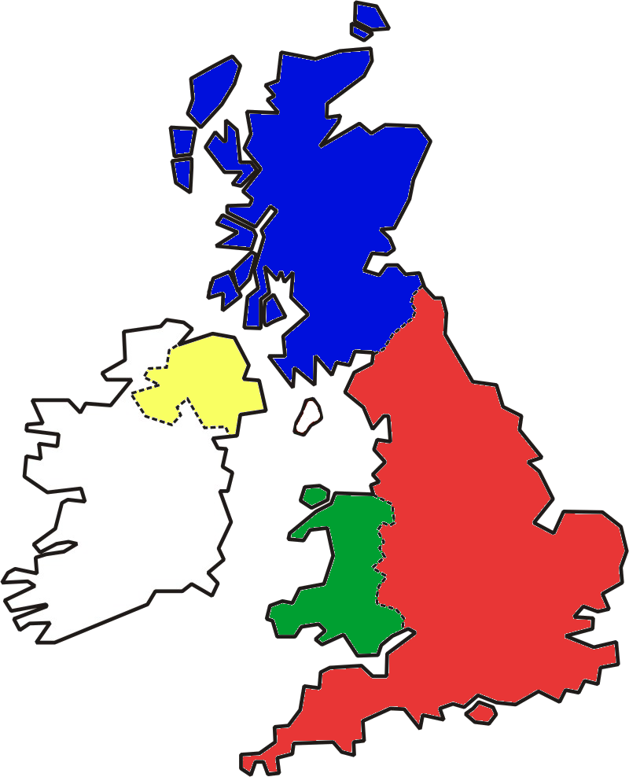
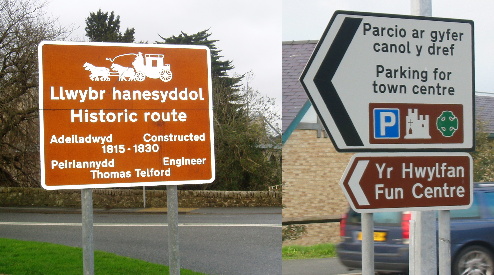

    <h2 class="section-title">{}</h2>
    <ul class="rule-list">
        <li>ドメインは.gbか.uk</li>
        <li>車は左側通行</li>
        <li>ボラードは太目の白黒のストライプで特徴的</li>
        <li>車のナンバープレートが正面は白色でうしろは黄色</li>
        <li>レンガ造りの家が多いならイギリスだが、白っぽい壁が多い場合はアイルランドを検討する{}</li>
        <li>ヘッジロウ（低木や草本類などが植栽された垣根）が道端や家の周りに存在する</li>
        <li>黒背景に白色のシェブロンを使う</li>
    </ul>
    {}

{}
{}
{}
ボラードは太目の白黒のストライプで特徴的{}。車は左側通行かつ車のナンバープレートが正面は白色でうしろは黄色。
{}

By Maxwell Hamilton, <a href="https://creativecommons.org/licenses/by-sa/3.0" title="Creative Commons Attribution-Share Alike 3.0">CC BY-SA 3.0</a>, <a href="https://commons.wikimedia.org/w/index.php?curid=52560349">Link</a>, 画像加工あり

 

{}

Public Domain
{}

{}
レンガ造りの家が多いならイギリスだが白っぽい壁が多い場合はアイルランドを検討してみる。以下の左がアイルランド{}、右がイギリス{}{}。
{}

{}
ヘッジロウと呼ばれる低木や草本類などが植栽された垣根が道端や家の周りに存在する{}{}。19世紀より前に作られた古いものやちゃんと手入れされていないものも存在する{}。
{}

{}
この図は左がアイルランドで右がイギリス。
黒背景に白色のシェブロンを使う。北海周辺の寒い地域で白黒のシェブロンを使う国はない。同じ色のものを用いるのはヨーロッパでは{}・{}・{}・{}が多い。{}は矢印が黄色{}。
{}

{}
{}
{}
イギリスと{}は道路にキャッツアイが多い{}。1934 年にイギリスで発明され、イギリス・アイルランド・ニュージーランドなどで使用される。しかし他のヨーロッパの国ではほとんど使用されない{{% ref "https://en.wikipedia.org/wiki/Cat%27s_eye_(road)" "キャッツアイ（道路）" %}}。
{}

{}
{}
{}
Alexandra Palace Theatreはロンドンの北側にある
{}

<iframe width="590" height="345" src="https://www.youtube.com/embed/VrP3lO3aGDg?start=300" title="YouTube video player" frameborder="0" allow="accelerometer; autoplay; clipboard-write; encrypted-media; gyroscope; picture-in-picture; web-share" allowfullscreen></iframe>

{}
{}

    <h2 class="section-title">{}</h2>
    <ul class="rule-list">
        <li>道路番号の先頭の数字で地域が分かる{}</li>
        <li>市外局番で地域がわかるがかなり複雑なので覚えるのは難しい</li>
        <li class="no-evidence">菜種の生産は南東を中心に多い{}</li>
    </ul>

{}
{}

{}
{}
{}
020はロンドン。画像が非常に細かいのでオリジナル画像を要参照。
{}

By <a href="https://de.wikipedia.org/wiki/User:Chumwa" class="extiw" title="de:User:Chumwa">Maximilian Dörrbecker</a> (<a href="https://de.wikipedia.org/wiki/User:Chumwa" class="extiw" title="de:User:Chumwa">Chumwa</a>) - Own work, <a href="https://creativecommons.org/licenses/by-sa/2.5" title="Creative Commons Attribution-Share Alike 2.5">CC BY-SA 2.5</a>, <a href="https://commons.wikimedia.org/w/index.php?curid=79071050">Link</a>

{}
{}
{}
道端に黄色い花が生えていたら南東の方に行ってみる？北は寒く、西のウェールズは耕作に適した土壌ではないためこのような畑はあまり存在しない。
{}

<iframe src="https://www.google.com/maps/embed?pb=!4v1684569216795!6m8!1m7!1sw8Awq84Ne-0ufWNVXCf0Cg!2m2!1d52.66179235114208!2d0.3351630211269436!3f332.6578965340652!4f-4.955434271809068!5f2.9119385570937717" width="550" height="250" style="border:0;" allowfullscreen="" loading="lazy" referrerpolicy="no-referrer-when-downgrade"></iframe>

{}
{}

    <ul class="rule-list">
        <li>イギリスは４つのCountyで構成されている
            <ul>
                <li>イングランド：全体的に平坦でウォッシュ湾{}周りに農地が広がる</li>
                <li>スコットランド：都市部以外は岩場や牧畜が見られる。スコットランド・ゲール語が見つかる。</li>
                <li>ウェールズ：かつての工業地域であり農業はあまり行われていない。ウェールズ語の標識があるかも。</li>
            </ul>
        </li>
        <li>白と赤のボラードは本土側のスコットランドに多い</li>
        <li>Passing placeは{}を含むスコットランド全域に多い</li>
    </ul>

{}
{}

&nbsp;
 イングランド

&nbsp;
 スコットランド

&nbsp;
 ウェールズ

&nbsp;
 北アイルランド

{}
{}
{}
英語で発音できないような綴りなのでわかりやすい{{% ref "https://ja.wikipedia.org/wiki/%E3%82%A6%E3%82%A7%E3%83%BC%E3%83%AB%E3%82%BA%E8%AA%9E" "ウェールズ語" %}}。
{}

{}
{}
{}
白と赤のボラードはスコットランドに多いが全域には無いと思われ、{}などの離島にはないように思う。
{}

<iframe src="https://www.google.com/maps/embed?pb=!4v1684320325087!6m8!1m7!1s-XmG1Ud5SwPSJ42bx2yJww!2m2!1d56.259023568906!2d-2.7268946362317!3f243.4400609150221!4f-19.690911157766536!5f2.9046987489043916" width="295" height="295" style="border:0;" allowfullscreen="" loading="lazy" referrerpolicy="no-referrer-when-downgrade"></iframe>
<iframe src="https://www.google.com/maps/embed?pb=!4v1693874488464!6m8!1m7!1sb4iVOdTdmds1aX1FhrZX-g!2m2!1d57.9931356161939!2d-5.110323916262388!3f4.517879950646488!4f-3.9193610935373755!5f3.325193203789971" width="295" height="295" style="border:0;" allowfullscreen="" loading="lazy" referrerpolicy="no-referrer-when-downgrade"></iframe>

{}
{}

<iframe src="https://www.google.com/maps/embed?pb=!4v1688227126921!6m8!1m7!1syofFVgdq1-fd9DGss0iduA!2m2!1d58.44655991316099!2d-3.893121403030823!3f322.36298640402805!4f-5.778153559772477!5f3.325193203789971" width="295" height="295" style="border:0;" allowfullscreen="" loading="lazy" referrerpolicy="no-referrer-when-downgrade"></iframe>
<iframe src="https://www.google.com/maps/embed?pb=!4v1688227164609!6m8!1m7!1s7YQ74A3AAU4Q2xHvEjy7YQ!2m2!1d59.11186451519226!2d-3.116200828392647!3f294.6126345763391!4f-16.277346726225005!5f3.0286041996955686" width="295" height="295" style="border:0;" allowfullscreen="" loading="lazy" referrerpolicy="no-referrer-when-downgrade"></iframe>

{}
{}
