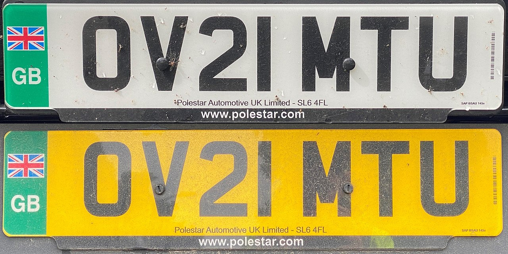

    <h2 class="section-title">{}</h2>
    <ul class="rule-list">
        <li>ドメインは.gb</li>
        <li>車は左側通行</li>
        <li>車のナンバープレートが正面は白色でうしろは黄色</li>
    </ul>

{}
{}
{}
車は左側通行かつ、車のナンバープレートが正面は白色でうしろは黄色。ボラードや通り名の看板も多く存在する。
{}

<iframe src="https://www.google.com/maps/embed?pb=!4v1679667191685!6m8!1m7!1stzUNJgeyhSXxUfcCABuD9A!2m2!1d53.45816716317874!2d-1.169975428590934!3f186.57080581179196!4f-18.171506480954193!5f3.325193203789971" width="295" height="295" style="border:0;" allowfullscreen="" loading="lazy" referrerpolicy="no-referrer-when-downgrade"></iframe>
<iframe src="https://www.google.com/maps/embed?pb=!4v1679910265333!6m8!1m7!1ssx9zUlN6LPT7xOhGuO7faA!2m2!1d53.80077195835273!2d-1.53210151821876!3f231.25961345054426!4f-8.007779915657679!5f3.3181257949307925" width="295" height="295" style="border:0;" allowfullscreen="" loading="lazy" referrerpolicy="no-referrer-when-downgrade"></iframe>

{}

By ZElsb - Own work, CC BY-SA 4.0, https://commons.wikimedia.org/w/index.php?curid=107443706
{}

{}
{}
{}
2020年以降、ゼロエミッションの車両で緑色のプレートが存在する。Google Map上にはまだいないはず。{}
{}
{}

By ZakNelson1995 - Own work, CC BY-SA 4.0, https://commons.wikimedia.org/w/index.php?curid=107420456
{}

{}
{}
{}
Alexandra Palace Theatreはロンドンの北側にある
{}

<iframe width="590" height="345" src="https://www.youtube.com/embed/VrP3lO3aGDg?start=300" title="YouTube video player" frameborder="0" allow="accelerometer; autoplay; clipboard-write; encrypted-media; gyroscope; picture-in-picture; web-share" allowfullscreen></iframe>

{}
{}

    <h2 class="section-title">州・地域の絞り込み</h2>
    <ul class="rule-list">
        <li>道路番号の先頭の数字で地域が分かる{}。２桁番号は、１桁番号の路線に挟まれるエリア毎に頭の番号を統一して付番。画像出典：{}</li>
    </ul>

{}
{}

{}
{}

    <h2 class="section-title">都市・町の絞り込み</h2>
    <ul class="rule-list">
        <li>ゴミ箱に都市名が書いてあることがある。ぼやけて読みづらいことが多いけど意識すれば読めることもある？（紫：リヴァプール、茶：シェフィールド）</li>
    </ul>

{}
{}

<iframe src="https://www.google.com/maps/embed?pb=!4v1679571437362!6m8!1m7!1sJd8ZnR7mP3RPS7FnYSW9_Q!2m2!1d53.39061787848632!2d-2.927909681070305!3f285.8927513127508!4f-18.067507337726752!5f3.3189598438815993" width="295" height="295" style="border:0;" allowfullscreen="" loading="lazy" referrerpolicy="no-referrer-when-downgrade"></iframe>
<iframe src="https://www.google.com/maps/embed?pb=!4v1680200757257!6m8!1m7!1sQ2Iqcnxz761OHd2L2SD6rw!2m2!1d53.36407651796604!2d-1.465387540718546!3f18.751888530194126!4f-11.51422017626156!5f3.325193203789971" width="295" height="295" style="border:0;" allowfullscreen="" loading="lazy" referrerpolicy="no-referrer-when-downgrade"></iframe>

{}
{}