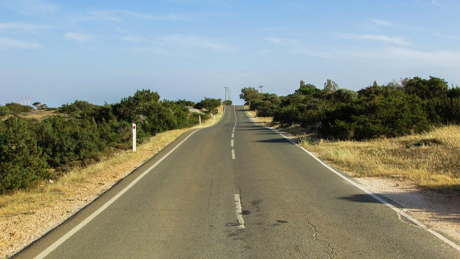

    <h2 class="section-title">{}</h2>
    <ul class="rule-list">
        <li>The domain is .cy.</li>
        <li>As of January 2024, there is no official Google Street View coverage.</li>
        <li>Unique white bollards can be found.</li>
    </ul>
    {}

{}
{}

{}
Unique white bollards are found.{}
{}

{}
Signs often feature English, Greek, and Turkish text. Due to ongoing conflict, the island has been divided between the north and south since 1974.{}.
{}

{}
License plates are primarily white, but vehicles older than 10 years might have yellow plates.
{}

{}

[Do What the Fxxk You Want to Public License](http://www.wtfpl.net/about/)

Public Domain
{}

{}
{}
