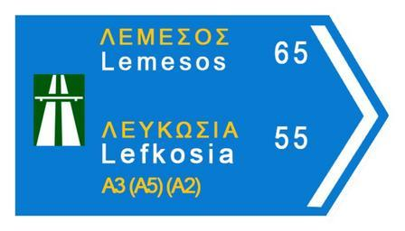
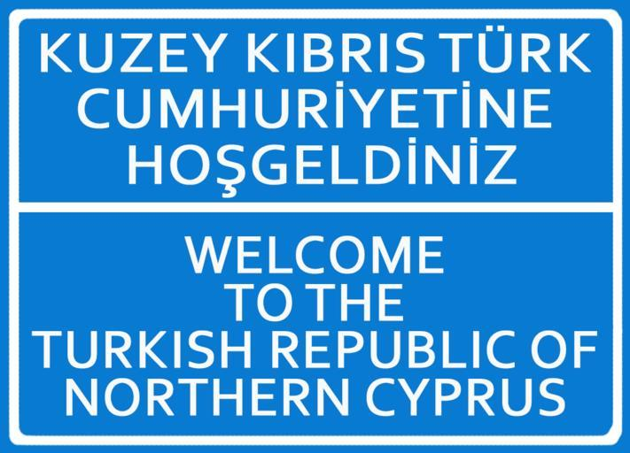

    <h2 class="section-title">{}</h2>
    <ul class="rule-list">
        <li>ドメインは.cy</li>
        <li>2024年1月時点では公式カバレッジはない</li>
        <li>白色の独特なボラードが見つかる</li>
    </ul>
    {}

{}
{}
{}
白色の独特なボラードが見つかる{}
{}

{}
英語・ギリシャ語・トルコ語の表記がある。紛争状態であり、1974年から南北に分断された状態になっている{}。
{}

{}
{}
