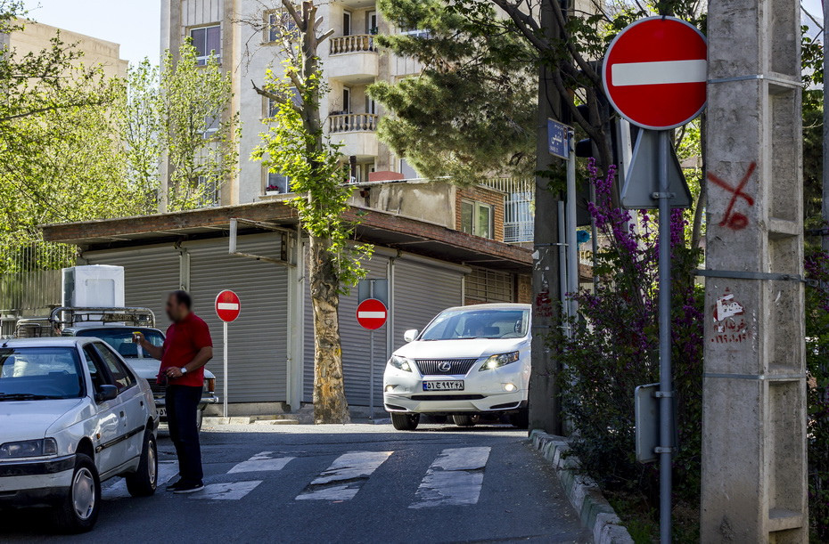
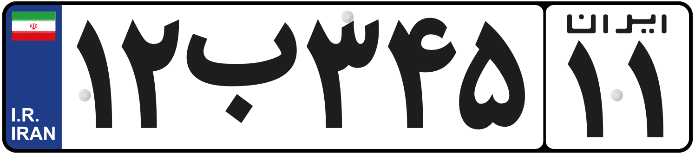
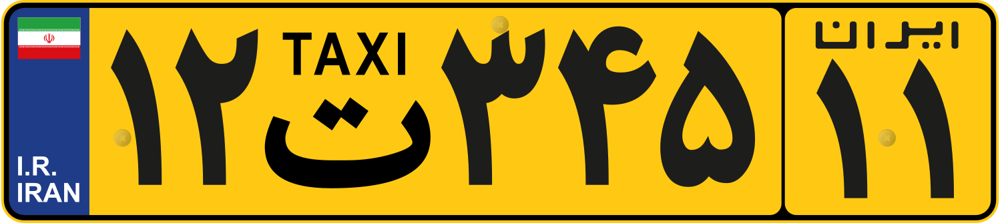

    <h2 class="section-title">{}</h2>
    <ul class="rule-list">
        <li>The domain is .ir</li>
        <li>As of June 2024, there is no official coverage</li>
    </ul>

{}
{}
{}
License plates with designs similar to those in the EU region can be found.
{}

{}

CC0

CC0
{}

{}
{}
