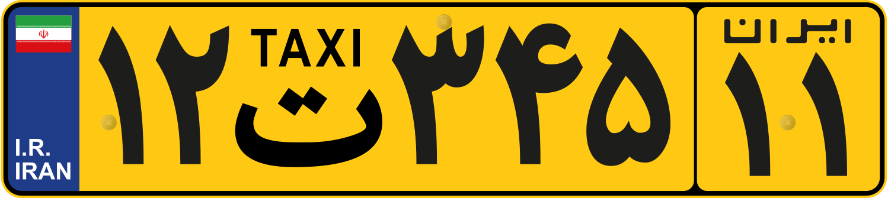

    <h2 class="section-title">{}</h2>
    <ul class="rule-list">
        <li>El dominio es .ir</li>
        <li>A junio de 2024, no hay cobertura oficial</li>
    </ul>

{}
{}
{}
Se pueden encontrar matrículas con un diseño similar al de la UE.
{}

{}

CC0

CC0
{}

{}
{}
