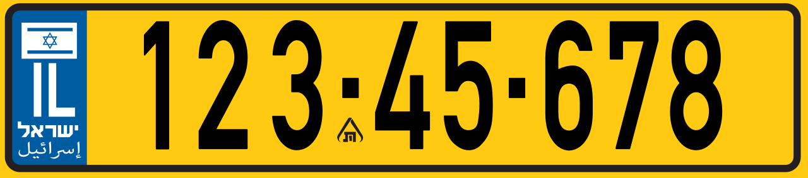

    <h2 class="section-title">{}</h2>
    <ul class="rule-list">
        <li>Domain negara adalah .il</li>
        <li>Huruf Ibrani(מְדִינַת יִשְׂרָאֵל) terlihat di banyak tempat</li>
        <li>Pinggiran trotoar dan dasar tiang lampu dicat hitam-putih; ada juga pola kuning-merah atau putih-merah</li>
        <li>Pelat nomor biasanya berwarna kuning</li>
        <li>Utara beriklim Mediterania dengan lebih banyak hujan, sedangkan selatan kering seperti gurun atau stepa</li>
        <li>Banyak struktur mirip menara listrik di area perkotaan</li>
    </ul>
    {}

{}
{}
{}
Huruf Ibrani (מְדִינַת יִשְׂרָאֵל) langsung mencolok.
{}

{}
Pelat nomor Israel biasanya kuning{}.
{}

{}

By <a href="//commons.wikimedia.org/wiki/User:%D0%AE%D0%BA%D0%B0%D1%82%D0%B0%D0%BD" title="User:Юкатан">Юкатан</a> - Own work, <a href="https://creativecommons.org/licenses/by-sa/4.0" title="Creative Commons Attribution-Share Alike 4.0">CC BY-SA 4.0</a>,  <a href="https://commons.wikimedia.org/w/index.php?curid=71043295">Wikimedia Commons</a>
{}

{}
Struktur seperti menara dapat dilihat di berbagai sudut kota{}.
{}

{}
{}
{}
Pinggiran jalan serta dasar tiang sering dicat hitam-putih, dan trotoar juga bisa bergaris kuning-merah atau putih-merah.
{}

<iframe src="https://www.google.com/maps/embed?pb=!4v1681580144448!6m8!1m7!1sMAtaEWsGD74rQk1VrM6eSQ!2m2!1d32.59570958854372!2d34.94919604891632!3f328.89875840248897!4f-16.092416823878523!5f3.325193203789971" width="295" height="295" style="border:0;" allowfullscreen="" loading="lazy" referrerpolicy="no-referrer-when-downgrade"></iframe>
<iframe src="https://www.google.com/maps/embed?pb=!4v1681580064224!6m8!1m7!1sS8tRWEHZHgPVwj11oWWxAQ!2m2!1d32.5947257017415!2d34.94869143841581!3f141.61533957771198!4f-13.232745030899054!5f2.8680619965777536" width="295" height="295" style="border:0;" allowfullscreen="" loading="lazy" referrerpolicy="no-referrer-when-downgrade"></iframe>

{}
{}
{}
Jumlah perusahaan yang terdaftar di NASDAQ dan startup tahunan sangat tinggi. Banyak perusahaan kesehatan dan teknologi (Ayala Pharmaceuticals, Mobileye, Monday.com, Inmode, WIX.com, dsb).
{}

<iframe src="https://www.google.com/maps/embed?pb=!4v1681531573606!6m8!1m7!1si_HE-yj_qD9Yst1oOoa1Fw!2m2!1d32.79017313161648!2d34.95902336733948!3f231.5685724468239!4f36.14297523205643!5f3.2932218757552056" width="295" height="295" style="border:0;" allowfullscreen="" loading="lazy" referrerpolicy="no-referrer-when-downgrade"></iframe>

{}
{}

    <h2 class="section-title">{}</h2>
    <ul class="rule-list">
        <li>Israel National Trail membentang dari ujung utara sampai ujung selatan dengan cakupan Street View pejalan kaki{}{}</li>
    </ul>

{}
{}
{}
Israel National Trail mencakup seluruh negeri dengan rute hiking, dan kadang topi pejalan kaki terlihat di kamera{}.
{}

{}
{}
