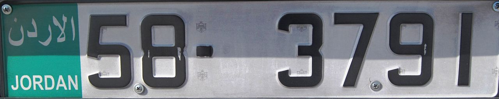

    <h2 class="section-title">{}</h2>
    <ul class="rule-list">
        <li>ドメインは.jo</li>
        <li>言語はアラビア語</li>
        <li>アンマンでは黄色と緑のタクシーがたくさん走っている{}</li>
        <li>ナンバープレートの左側が緑色の時がある</li>
        <li>都会ならばアンマンが多くストリートビューからも丘の斜面に白い建物がびっしりと並んで見える</li>
        <li>中東でGoogle Carが黒いのはここだけ{}</li>
    </ul>

{}
{}
{}
黄色と緑色のタクシーや黄色のタクシーが多い。またナンバープレートの左側が緑色の時がある。
{}

<iframe src="https://www.google.com/maps/embed?pb=!4v1681094697072!6m8!1m7!1sd-h5yd0V8XJWn4-ZBJUiSw!2m2!1d31.949280430027!2d35.92735348612007!3f222.53963663389982!4f-10.02674401750987!5f2.807657372735314" width="295" height="295" style="border:0;" allowfullscreen="" loading="lazy" referrerpolicy="no-referrer-when-downgrade"></iframe>
<iframe src="https://www.google.com/maps/embed?pb=!4v1683883692963!6m8!1m7!1sPFr_DloBmu_V3fxuu9sBuw!2m2!1d31.96863607728284!2d35.91920486669675!3f272.50907716253903!4f-22.43347618490202!5f2.7049426341867746" width="295" height="295"style="border:0;" allowfullscreen="" loading="lazy" referrerpolicy="no-referrer-when-downgrade"></iframe>

{}

By Dickelbers - Own work, <a href="https://creativecommons.org/licenses/by-sa/3.0/deed.ja">CC BY-SA 3.0</a>, <a href="https://commons.wikimedia.org/w/index.php?curid=18916267">Wikimedia Commons(Link)</a>
{}

{}
都会ならばアンマンが多くストリートビューからも丘の斜面に白い建物がびっしりと並んで見える
{}

{}
{}

<iframe src="https://www.google.com/maps/embed?pb=!4v1680697181749!6m8!1m7!1sj4ryVG2p2VEd1blVPykA8Q!2m2!1d31.92887003707388!2d35.90284423945281!3f87.52964547662853!4f-16.311462691550062!5f2.5433479492835356" width="295" height="295" style="border:0;" allowfullscreen="" loading="lazy" referrerpolicy="no-referrer-when-downgrade"></iframe>
<iframe src="https://www.google.com/maps/embed?pb=!4v1680697230684!6m8!1m7!1s3SAjCDY5dPifCcFZP6hWHw!2m2!1d31.93137184373966!2d35.9060438437035!3f64.18694884398134!4f-10.730702044874533!5f3.325193203789971" width="295" height="295" style="border:0;" allowfullscreen="" loading="lazy" referrerpolicy="no-referrer-when-downgrade"></iframe>

{}
{}

<iframe src="https://www.google.com/maps/embed?pb=!4v1680697259299!6m8!1m7!1sG6VnPWi2HGoBzgcBonfI8A!2m2!1d31.93266828158922!2d35.90788618015867!3f37.72079618202169!4f0.15692954114270208!5f3.325193203789971" width="295" height="295" style="border:0;" allowfullscreen="" loading="lazy" referrerpolicy="no-referrer-when-downgrade"></iframe>

{}
{}
