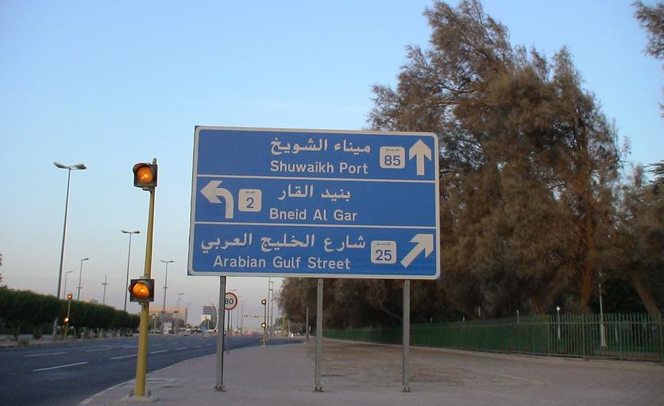
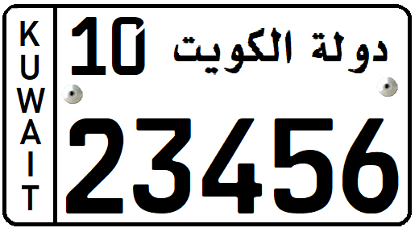
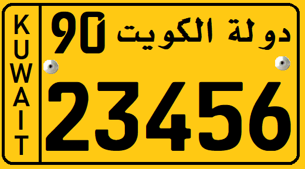

    <h2 class="section-title">{}</h2>
    <ul class="rule-list">
        <li>ドメインは.com.kw</li>
        <li>2024年6月時点では公式カバレッジはない</li>
    </ul>
    {}

{}
{}
{}
アラビア語が使用されている。
{}

{}
一般車は白色、交通機関は黄色のナンバープレート。
{}

{}
{}
