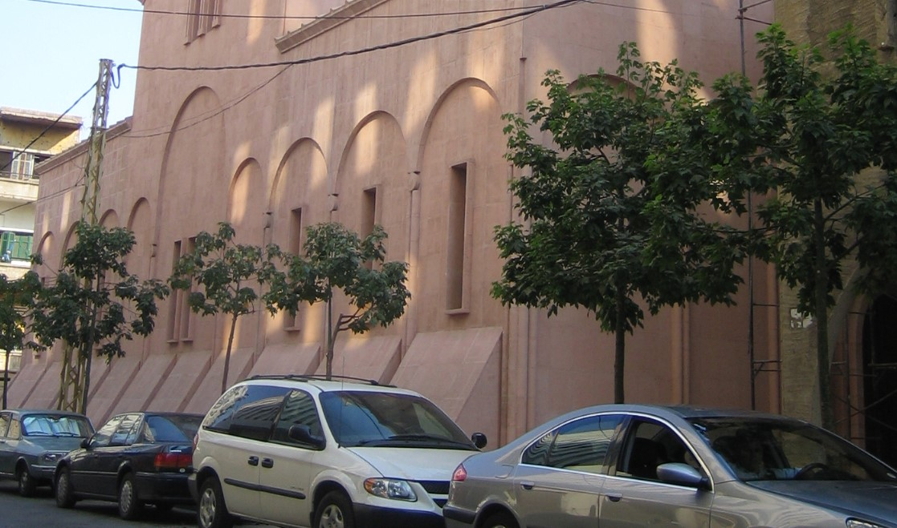
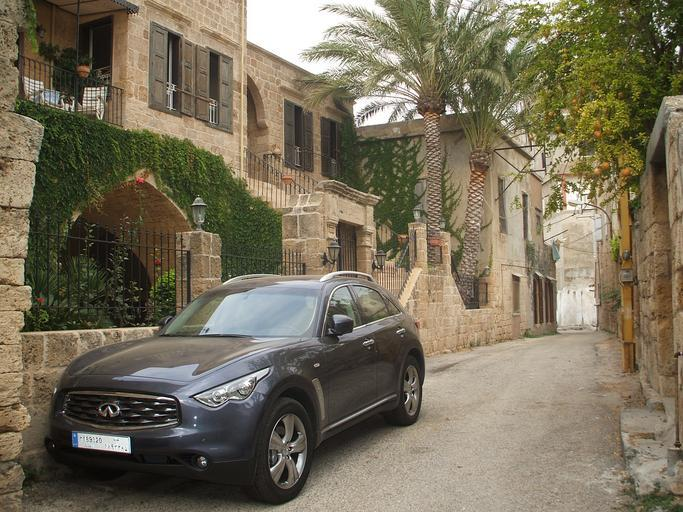
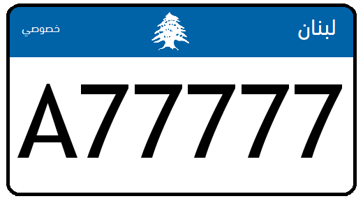
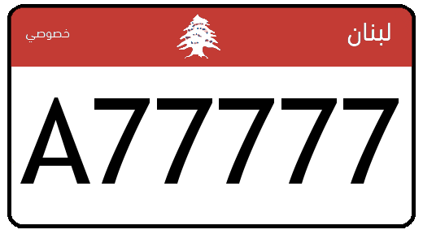
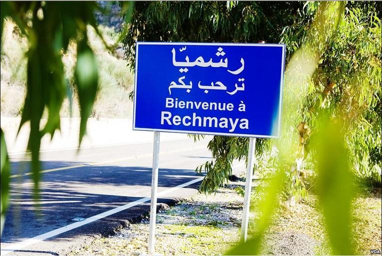
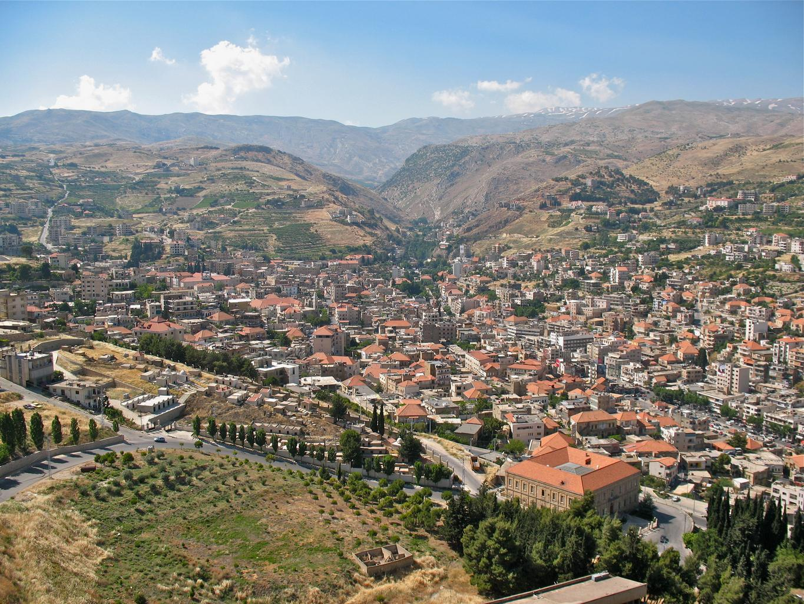

    <h2 class="section-title">{}</h2>
    <ul class="rule-list">
        <li>ドメインは.lb</li>
        <li>黄色や灰色の鉄塔が街中でもよく見つかる</li>
        <li>アラビア語が用いられているが英語やフランス語も使用される</li>
        <li>画質が悪く、移動やカメラの向きもおかしい時がある</li>
    </ul>

{}
{}
{}
黄色い電柱や黄色い鉄塔は経験上レバノン以外ではあまり見ない{}。普通の灰色の鉄塔も多い{}。
{}

{}
歩道や大学構内を歩ていることが多い。ナンバープレートは参考文献にあるようにさまざまな色があり{}、上部や左側が青い{}。
{}

{}

{}

{}

{}

{}
地中海性気候であり少し乾燥した山脈と大地が広がっている{}。
{}

By <a href="//commons.wikimedia.org/wiki/User:Peripitus" title="User:Peripitus">Peripitus</a> - Own work, <a href="https://creativecommons.org/licenses/by-sa/3.0" title="Creative Commons Attribution-Share Alike 3.0">CC BY-SA 3.0</a>, <a href="https://commons.wikimedia.org/w/index.php?curid=8331762">Link</a>

{}
アラビア語・英語・フランス語が街中で見つかる{}。
{}

{}
{}

    <h2 class="section-title">{}</h2>
    <ul class="rule-list">
        <li>レバノン山脈とアンチレバノン山脈の間にベッカー渓谷があり、ベッカー県の首都Zahléがある{{% ref "https://en.wikipedia.org/wiki/Zahl%C3%A9" "और देखें" %}}</li>
    </ul>

{}
{}

{}
レバノン山脈とアンチレバノン山脈に挟まれているので東西に山脈が見える{}はずだがカメラの向きが変だったりするので正確な向きは判断が難しい。またベッカー渓谷全体で農業が盛んにおこなわれている{}。
{}

{}
{}
