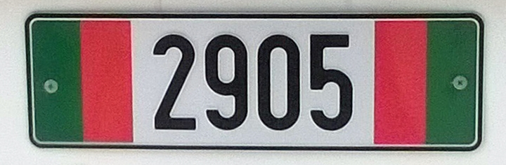
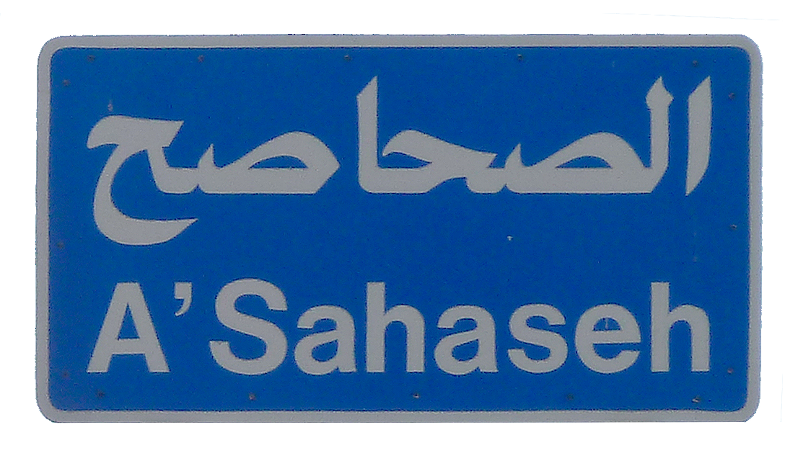
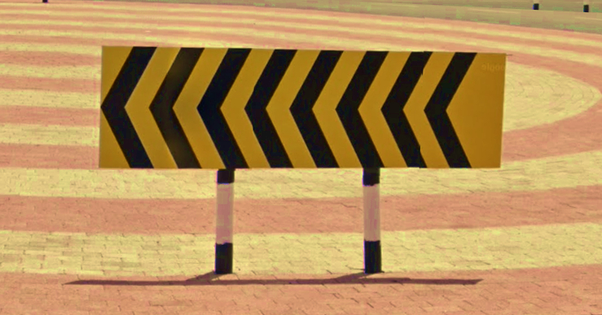

    <h2 class="section-title">{}</h2>
    <ul class="rule-list">
        <li>ドメインは.om</li>
        <li>右側通行</li>
        <li>ナンバープレートは黄色</li>
        <li>標識の棒白黒のストライプがある</li>
    </ul>

{}
{}
{}
町中は黄色ナンバーが特に多い{}。
{}

{}

By <a href="//commons.wikimedia.org/wiki/User:Ji-Elle" title="User:Ji-Elle">Ji-Elle</a> - Own work, <a href="https://creativecommons.org/licenses/by-sa/3.0" title="Creative Commons Attribution-Share Alike 3.0">CC BY-SA 3.0</a>, <a href="https://commons.wikimedia.org/w/index.php?curid=12980300">Link</a>

CC0
{}

{}
標識の棒白黒のストライプがある{}のはオマーンか{}。普通の灰色の鋼管の場合もある。町名や次の町への距離を書いた看板などは青色。
{}

By Toppazz, <a href="https://creativecommons.org/licenses/by/3.0" title="Creative Commons Attribution 3.0">CC BY 3.0</a>, <a href="https://commons.wikimedia.org/w/index.php?curid=53507761">Link</a>

{}
オレンジと黒のシェブロン{}。
{}

{}
ナツメヤシが植えられており{}ナツメヤシ農園もある。The Million Date Palm Plantation Project(意訳：ナツメ​​ヤシ100万本プロジェクト)により全国的にナツメヤシの栽培が進められた{{% ref "http://nakheel.om/?page_id=841#:~:text=The%20Million%20Date%20Palm%20Plantation,social%20development%20and%20environmental%20awareness." "Million Date Palm Plantation Project" %}}。
{}

{}
{}

    <h2 class="section-title">{}</h2>
    <ul class="rule-list">
        <li>北部と南部に山岳地帯があり、間には平坦な砂漠が広がっている
            <ul>
                <li>北部 {}</li>
                <li>中央部 {} {}ほど完全な平坦ではない</li>
                <li>南部 {} ドファール山脈周りのみ雨が降りやすく緑も多い{}</li>
            </ul>
        </li>
    </ul>

{}
{}

<a href="//commons.wikimedia.org/wiki/User:Dr_Brains" title="User:Dr Brains">Dr Brains</a> - 投稿者自身による著作物 by <a href="//commons.wikimedia.org/wiki/User:NordNordWest" title="User:NordNordWest">NordNordWest</a>, <a href="http://www.gnu.org/licenses/old-licenses/fdl-1.2.html" title="GNU Free Documentation License 1.2">GFDL 1.2</a>, <a href="https://commons.wikimedia.org/w/index.php?curid=19957804">リンク</a>による

{}
{}

{}
{}

    <h2 class="section-title">{}</h2>
    <ul class="rule-list">
        <li>ドファール山脈周辺はモンスーン（Khareef）により雨が降りやすく緑に覆われている</li>
        <li>マシーラ島という離島がある。岩と砂漠しかなく木は生えていない{}{}</li>
    </ul>

{}
{}

{}
モンスーンが発生する場所で他の地域より雨が多い。辺り一面が緑に覆われている場所もある{}。
{}

By <a rel="nofollow" class="external text" href="https://www.flickr.com/photos/marypaulose/">May Paulose</a> - <a rel="nofollow" class="external text" href="https://www.flickr.com/photos/marypaulose/288487162/sizes/o/">Flickr</a>, <a href="https://creativecommons.org/licenses/by/2.0" title="Creative Commons Attribution 2.0">CC BY 2.0</a>, <a href="https://commons.wikimedia.org/w/index.php?curid=3503976">Link</a>

{}
{}

By <a href="//commons.wikimedia.org/w/index.php?title=User:ELSIRIDERMOTO&amp;action=edit&amp;redlink=1" class="new" title="User:ELSIRIDERMOTO (page does not exist)">ELSIRIDERMOTO</a> - Own work, <a href="https://creativecommons.org/licenses/by-sa/4.0" title="Creative Commons Attribution-Share Alike 4.0">CC BY-SA 4.0</a>, <a href="https://commons.wikimedia.org/w/index.php?curid=94647403">Link</a>

{}
{}